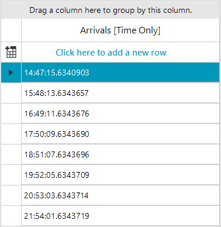
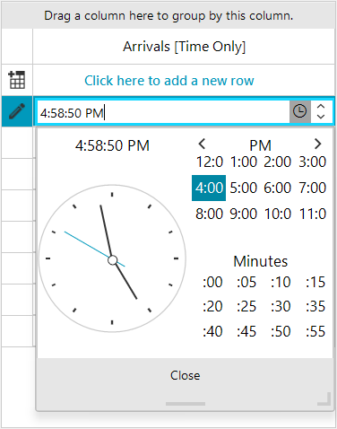

# GridViewTimeOnlyColumn

**GridViewTimeOnlyColumn** can display and edit values of TimeOnly type. TimeOnly structures was introduced with .NET 6 and represent a specific time-of-day value, such as a daily alarm clock. TimeOnly is limited to the range of 00:00:00.0000000 - 23:59:59.9999999, showing a specific time of day.

Prior to the TimeOnly type being introduced, programmers typically used either the [GridViewDateTimeColumn]() (using DateTime type)  or the [GridViewTimeSpanColumn]() (using TimeSpan type) to represent a specific time of day. Now, the **GridViewTimeOnlyColumn** enables users to manage TimeOnly values effectively and organize their tasks precisely in a time format.

>important GridViewTimeOnlyColumn requires .NET 6 or later. [TymeOnly](https://learn.microsoft.com/en-us/dotnet/api/system.timeonly?view=net-9.0) type isn't available for .NET Framework.


>caption Figure 1: GridViewTimeOnlyColumn



#### Add GridViewTimeOnlyColumn to the grid.

````C#
GridViewTimeOnlyColumn timeOnlyColumn = new GridViewTimeOnlyColumn();
timeOnlyColumn.Format = "T";
timeOnlyColumn.FormatString = "{0:O}";
timeOnlyColumn.FieldName = "ArrivalTime";
timeOnlyColumn.HeaderText = "Arrivals [Time Only]"; 
timeOnlyColumn.ExcelExportType = Telerik.WinControls.UI.Export.DisplayFormatType.LongTime;
this.radGridView1.Columns.Add(timeOnlyColumn);

````
````VB.NET
Dim timeOnlyColumn As GridViewTimeOnlyColumn = New GridViewTimeOnlyColumn()
timeOnlyColumn.Format = "T"
timeOnlyColumn.FormatString = "{0:O}"
timeOnlyColumn.FieldName = "ArrivalTime"
timeOnlyColumn.HeaderText = "Arrivals [Time Only]"
timeOnlyColumn.ExcelExportType = Telerik.WinControls.UI.Export.DisplayFormatType.LongTime
Me.radGridView1.Columns.Add(timeOnlyColumn)

````

#### Editing GridViewTimeOnlyColumn 

When the user starts editing a GridTimeOnlyCellElement, **RadTimeOnlyEditor** activates automatically. RadTimeOnlyEditor shows a time picker element in a popup allowing free time entry. It also offers up/down arrow buttons to allow fast navigation.

>caption Figure 2: RadTimeOnlyEditor



To customize the behavior of RadTimeOnlyEditor, you need to subsribe to **CellEditorInitialized** event. RadTimeOnlyEditor exposes several useful properties that would come in handy if you need to change the current editor behavior or customize it. For example you can limit the users from picking any time and define specific time range. 

* **Value**: Gets or sets the editor value.
* **MinValue**: Gets or sets the minimum time that can be selected in the editor.
* **MaxValue**: Gets or sets the maximum time that can be selected in the editor.
* **Format**: Gets or sets the time format string for the editor.
* **IsModified**: Indicate whether the editor is modified.

## Define time range in RadTimeOnlyEditor

````C#
 private void RadGridView1_CellEditorInitialized(object sender, GridViewCellEventArgs e)
 {
     RadTimeOnlyEditor timeOnlyEditor = e.ActiveEditor as RadTimeOnlyEditor;
     if (timeOnlyEditor != null)
     {
         RadTimeOnlyEditorElement timeOnlyEditorElement = timeOnlyEditor.EditorElement as RadTimeOnlyEditorElement;
         timeOnlyEditorElement.ForeColor = Color.Red;
         //define time range when the user picks time
         timeOnlyEditor.MinValue = new TimeOnly(9,30);
         timeOnlyEditor.MaxValue = new TimeOnly(17,30);
     }
 }

````
````VB.NET
Private Sub RadGridView1_CellEditorInitialized(ByVal sender As Object, ByVal e As GridViewCellEventArgs)
    Dim timeOnlyEditor As RadTimeOnlyEditor = TryCast(e.ActiveEditor, RadTimeOnlyEditor
    If timeOnlyEditor IsNot Nothing Then
        Dim timeOnlyEditorElement As RadTimeOnlyEditorElement = TryCast(timeOnlyEditor.EditorElement, RadTimeOnlyEditorElement)
        timeOnlyEditorElement.ForeColor = Color.Red
        'define time range when the user picks time
        timeOnlyEditor.MinValue = New TimeOnly(9, 30)
        timeOnlyEditor.MaxValue = New TimeOnly(17, 30)
    End If
End Sub

````

## FilteringTimePrecision

**GridViewTimeOnlyColumn** offers **FilteringTimePrecision** property that determines the time part weight of the TimeOnly value while filtering. GridViewTimeOnlyPrecisionMode enum determines how the time part is evaluated. You can choose from the following options:

* **Hour**: Hours part is taken into account.
* **Minute**: Minutes part are taken into account.
* **Second**: Seconds part are taken into account.
* **MilliSecond**: MilliSeconds part are taken into account.

>note FilteringTimePrecision allows to combine time parts using the '|' operator.

#### Set FilteringTimePrecision

````C#
timeOnlyColumn.FilteringTimePrecision = GridViewTimeOnlyPrecisionMode.Hour | GridViewTimeOnlyPrecisionMode.Minute;

````
````VB.NET
timeOnlyColumn.FilteringTimePrecision = GridViewTimeOnlyPrecisionMode.Hour Or GridViewTimeOnlyPrecisionMode.Minute

````

            
# See Also
* [GridViewDateOnlyColumn]()

* [GridViewDateTimeColumn]()

* [GridViewTimeSpanColumn]()

* [GridViewDecimalColumn]()

* [GridViewComboBoxColumn]()
