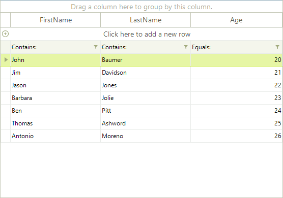
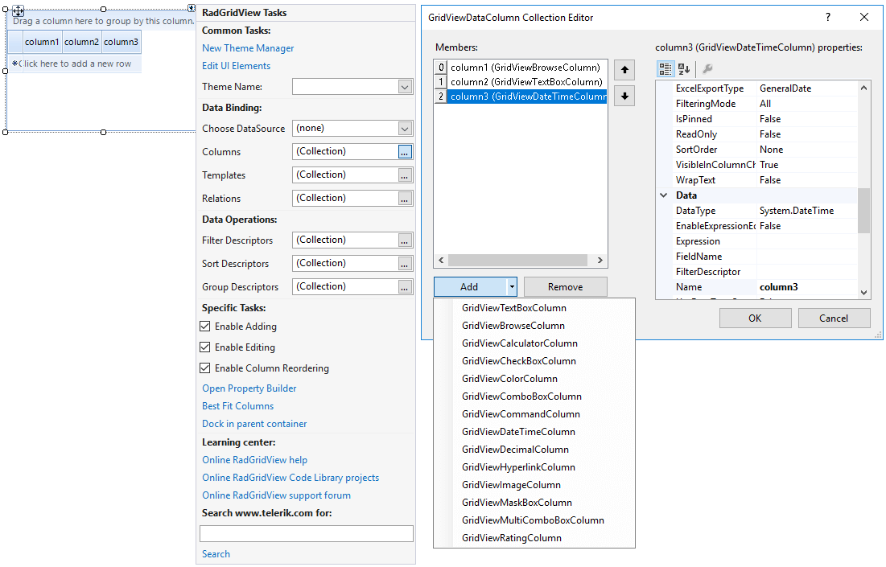

# Generating Columns

You can generate columns for **RadGridView** in two ways:

* Automatically, according to the columns in the data source

* Manually, with columns added by the user

The two modes can be switched using the template's __AutoGenerateColumns__ property. The default value of the property is *true*, indicating the columns will be generated from the data source. If additional control is required at compile time over the columns to be shown in the grid, columns can be added manually.

## Automatic Column Generation

Auto-generation of columns means that when you set the __DataSource__ property of the **RadGridView** control to a collection of employees for example, a separate column will be created for each one of the public properties of your *Employee* object. This is the default behavior and it does not require any additional efforts from your side. Just set the __DataSource__ of your __RadGridView__ and you are ready.

However, if you wish to prevent the creation of a column for it, use the __System.ComponentModel.BrowsableAttribute__, as it is shown in the sample below:

#### Automatic column generation

<snippet id='gridview-generatingcolumns-autogeneratecolumns-cs' />
<snippet id='gridview-generatingcolumns-autogeneratecolumns-vb' />

>note Ensure that your property is browsable in order to show the respective bound data. The **Browsable** attribute set to *false* will make the property on which it is used not bindable. This will prevent other controls which use the [CurrencyManager](https://msdn.microsoft.com/en-us/library/system.windows.forms.currencymanager(v=vs.110).aspx) for extracting properties to bind to such a class.

And here is the result:

## Manual Column Generation 

Setting the __AutoGenerateColumns__ property to *false* allows the developer to add unbound or bound columns from the data source. Columns are added to using the __Columns__ collection of a template. While the type of auto-generated columns is strictly defined by the data layer, manually added columns are defined by the developer. When defining a column you are able to choose between [several column types]()

#### Adding Columns in Code at Run Time

<snippet id='gridview-generatingcolumns2-manualcolumngeneration-cs' />
<snippet id='gridview-generatingcolumns2-manualcolumngeneration-vb' />

#### Adding Columns at Design time

Select **RadGridView** and click the small arrow at the top right position in order to open the *Smart Tag*. Click the Columns' browse button which opens a dialog that displays **GridViewDataColumn Collection Editor**. This editor lets you add different kind of columns to your table.

# See Also

* [Data Formatting]()
* [Property Builder]()
