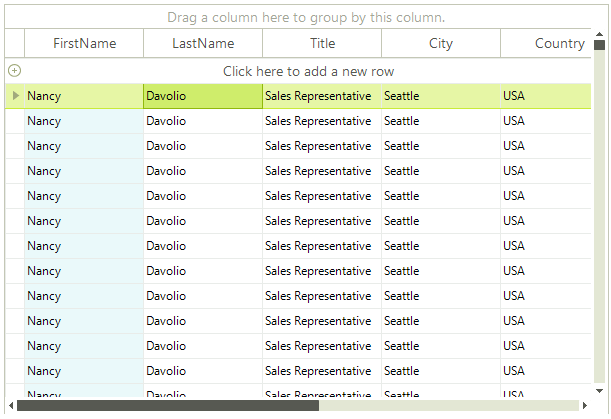
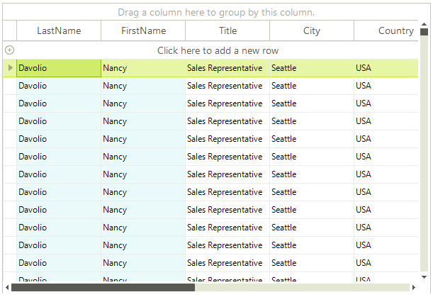
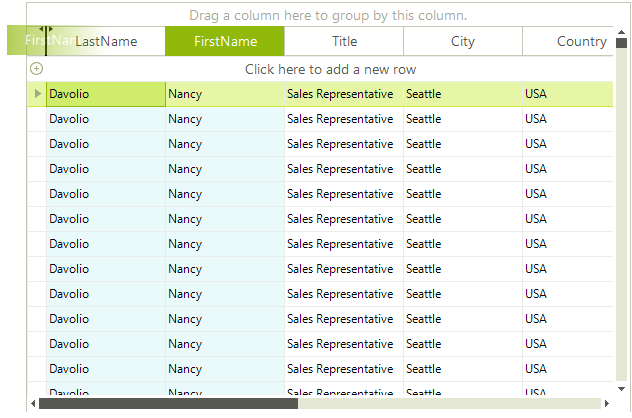
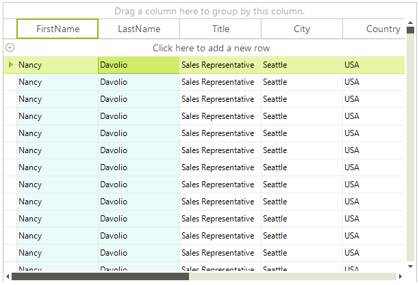

# Pinning and Unpinning Columns

## Pinning single column

Columns in RadGridView can be pinned which will result in the pinned columns being anchored to the left or right side of the grid. To pin a particular column, set its __IsPinned__ property of the __Columns collection item__ to *True* (*False* if you want to unpin it). This will pin the column to the left side of RadGridView. In order to change the position where the column should be pinned you have to use the __PinPosition__ property of the particular column and choose a value from the provided enumeration. The code block below shows pinning the third column (called "FirstName") in the RadGridView:

#### Pinning a single columns

<snippet id='gridview-pinningandunpinningcolumns-pinningcolumns-cs' />
<snippet id='gridview-pinningandunpinningcolumns-pinningcolumns-vb' />

>caption Figure 1: The left-most column is pinned.

## Pinning multiple columns 

Multiple column pinning is also possible. Simply set either the __IsPinned__ property or the __PinPosition__ property for all columns that you want to pin: 

#### Pinning multiple columns

<snippet id='gridview-pinningandunpinningcolumns-pinmultiplecolumns-cs' />
<snippet id='gridview-pinningandunpinningcolumns-pinmultiplecolumns-vb' />

>caption Figure 2: More than one column can be pinned as well.

>note All pinned columns appear in the selected pinned section ordered by their original column index in the Columns collection. After pinning multiple columns you can drag each of them to the desired position in the pin section.
>

>caption Figure 3: Reordering pinned columns. 

# See Also
* [Accessing and Iterating through Columns]()

* [Calculated Columns (Column Expressions)]()

* [Converting Data Types]()

* [Data Formatting]()

* [Generating Columns]()

* [GridViewColumn]()

* [GridViewDataColumn]()

