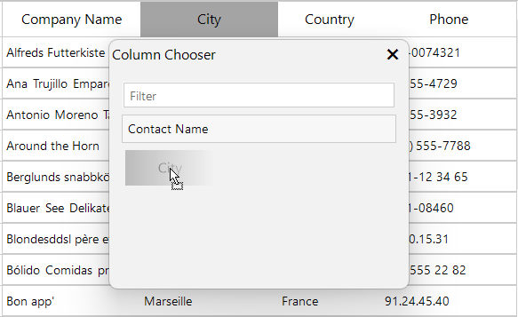
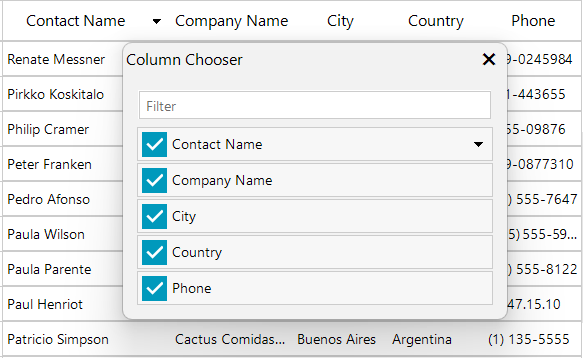

# Working with ColumnChooser

The ColumnChooser in **RadGridView** is a built-in feature that allows end-users to manage column visibility at runtime. Users can hide or show columns dynamically, providing a flexible way to customize the grid layout according to their preferences without requiring developer intervention. `GridViewColumnChooser` class represents a dialog used to manage columns in RadGridView. 

## Allow ColumnChooser

The **AllowColumnChooser** property determines whether the ColumnChooser is available for a grid template. When set to *true* (default), users can access the ColumnChooser through the grid's context menu. When set to *false*, the ColumnChooser functionality is completely disabled for that template.

>note Column Chooser is enabled by default in RadGridView. To disable it, set **AllowColumnChooser** property to false.

{{source=..\SamplesCS\GridView\Columns\WorkingWithColumnChooser.cs region=AllowColumnChooser}} 
{{source=..\SamplesVB\GridView\Columns\WorkingWithColumnChooser.vb region=AllowColumnChooser}} 

````C#
radGridView1.MasterTemplate.AllowColumnChooser = false;

````
````VB.NET
RadGridView1.MasterTemplate.AllowColumnChooser = False

````

{{endregion}}

## Opening the ColumnChooser

End-users can access the Column Chooser through the grid's context menu by right-clicking on any column header and selecting **"Column Chooser"** from the menu. Alternatively, developers can show the Column Chooser programmatically.

#### Show ColumnChooser Programmatically

````C#
radGridView1.ShowColumnChooser();

````
````VB.NET
RadGridView1.ShowColumnChooser()

````

### Display Modes for Columns in ColumnChooser

To allow more flexibility, ColumnChooser supports two interaction modes:

* **Drag and Drop** - Users can drag column headers from the grid to the Column Chooser dialog in order to hide them, and drag them back to restore visibility. This is the traditional simpler interface when screen space is limited. Columns can be sorted by using the context menu.

* **Checkbox Selection** - Users can toggle column visibility using checkboxes next to each column name in the Column Chooser dialog. The mode comes with sort indicators (ascending/descending). The user can easily change the sort order by clicking on the `ColumnChooserItem`. This mode is suitable when users need to see all available columns, offering modern, comprehensive view by quickly manage column's visibility through a checkbox.

This flexibility allows users to focus on relevant data by temporarily hiding unnecessary columns while maintaining the ability to restore them later, when needed.

The **ColumnsDisplayMode** property controls the display mode which defines which columns are displayed in the Column Chooser and how users interact with them - via drag and drop or via checkboxes. `ColumnChooserColumnsDisplayMode` enum specifies the modes for displaying columns in a column chooser:
* **All**: Show all columns in the column chooser with a check box.
* **Hidden**: Show only columns that are hidden 


>caption Figure 1: Column Chooser dialog allows hiding and showing columns.

|Drag and Drop Selection|Checkbox Selection|
|----|----|
 | 

#### To use Checkboxes in Column Chooser use `ColumnChooserColumnsDisplayMode.All`

````C#
radGridView1.ColumnChooser.ColumnsDisplayMode = ColumnChooserColumnsDisplayMode.All;

````
````VB.NET
RadGridView1.ColumnChooser.ColumnsDisplayMode = ColumnChooserColumnsDisplayMode.All

````

#### To use drag and drop selection in Column Chooser use `ColumnChooserColumnsDisplayMode.Hidden`

````C#
radGridView1.ColumnChooser.ColumnsDisplayMode = ColumnChooserColumnsDisplayMode.Hidden;

````
````VB.NET
RadGridView1.ColumnChooser.ColumnsDisplayMode = ColumnChooserColumnsDisplayMode.Hidden

````

## ColumnChooser Properties

The following properties control the behavior of columns when used with the Column Chooser:

__AllowColumnChooser:__ This property determines whether the Column Chooser is available in the template. By default this property is set to true for all templates


__AllowHide:__ This property determines whether the column is allowed to be moved to the Column Chooser. By default this property is set to *true* for all columns 

#### Determines if the specified column is allowed to be dragged to the column chooser dialog

{{source=..\SamplesCS\GridView\Columns\WorkingWithColumnChooser.cs region=AllowHide}} 
{{source=..\SamplesVB\GridView\Columns\WorkingWithColumnChooser.vb region=AllowHide}} 

````C#
radGridView1.Columns["CategoryName"].AllowHide = false;

````
````VB.NET
RadGridView1.Columns("CategoryName").AllowHide = False

````

{{endregion}}

__VisibleInColumnChooser:__ By setting this property for each column you determine whether the column will be visible in the Column Chooser when dragged to it. By default this property is set to *true* for all columns:

#### Determines if the specified column is going to be visible in the column chooser dialog

{{source=..\SamplesCS\GridView\Columns\WorkingWithColumnChooser.cs region=VisibleInColumnChooser}} 
{{source=..\SamplesVB\GridView\Columns\WorkingWithColumnChooser.vb region=VisibleInColumnChooser}} 

````C#
radGridView1.Columns["Picture"].VisibleInColumnChooser = false;

````
````VB.NET
RadGridView1.Columns("Picture").VisibleInColumnChooser = False

````

{{endregion}}

__ColumnChooserSortOrder:__ Gets or sets the column chooser sort order.

### Accessing the column chooser instance

In order to customize the Column Chooser you can access it directly from the instance of RadGridView, as shown in the following example:

#### Accessing and customizing the column chooser

{{source=..\SamplesCS\GridView\Columns\WorkingWithColumnChooser.cs region=customizeColumnChooser}} 
{{source=..\SamplesVB\GridView\Columns\WorkingWithColumnChooser.vb region=customizeColumnChooser}} 

````C#
radGridView1.ColumnChooser.DesktopLocation = new Point(100,100);
radGridView1.ColumnChooser.Font = new Font("Segoe", 15, FontStyle.Bold);

````
````VB.NET
RadGridView1.ColumnChooser.DesktopLocation = New Point(100, 100)
RadGridView1.ColumnChooser.Font = New Font("Segoe", 15, FontStyle.Bold)

````

{{endregion}}

### Enable the filtering functionality

If the grid contains many hidden columns it is convenient to filter them so you can easily find the desired column. This is supported out of the box and can be enabled by setting the **EnableFilter** property to *true* in the **ColumnChooserCreated** event handler.

#### Enable filtering in the Column Chooser

{{source=..\SamplesCS\GridView\Columns\WorkingWithColumnChooser.cs region=EnableChooserFiltering}} 
{{source=..\SamplesVB\GridView\Columns\WorkingWithColumnChooser.vb region=EnableChooserFiltering}}
````C#
private void RadGridView1_ColumnChooserCreated(object sender, ColumnChooserCreatedEventArgs e)
{
    e.ColumnChooser.EnableFilter = true;
}

````
````VB.NET
Private Sub RadGridView1_ColumnChooserCreated(ByVal sender As Object, ByVal e As ColumnChooserCreatedEventArgs)
    e.ColumnChooser.EnableFilter = True
End Sub

```` 

 

{{endregion}}


# See Also

* [Accessing and Iterating through Columns]()

* [Calculated Columns (Column Expressions)]()

* [Converting Data Types]()

* [Data Formatting]()

* [Generating Columns]()

* [GridViewColumn]()

* [GridViewDataColumn]()

