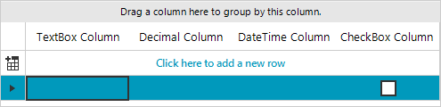
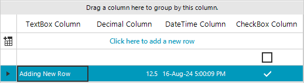
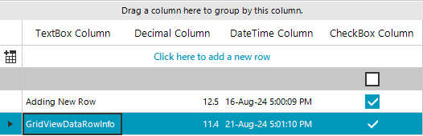
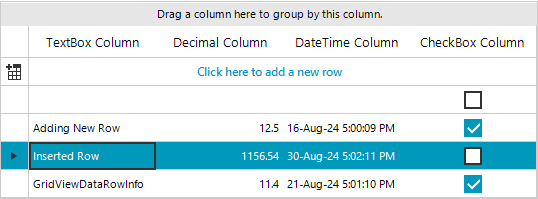

# Adding and Inserting Rows In Unbound Mode

When **RadGridView** is in **unbound mode**, you can add new rows to the **Rows** collection.

>caution Adding a **GridViewDataRowInfo** to the **Rows** collection is supported only when RadGridView is in unbound mode. If the grid is data-bound, an **InvalidOperationException** is thrown with the message: "Rows cannot be programmatically added to the RadGridView's rows collection when the control is data-bound." To add rows in bound mode, add the data item to the underlying data source instead.

## Adding rows to RadGridView

For example, if the grid control contains four columns – [GridViewTextBoxColumn](), [GridViewDecimalColumn](), [GridViewDateTimeColumn]() and [GridViewCheckBoxColumn]() you can add an empty row as it is demonstrated in the code snippet below.

````C#
public RadForm1()
{
    InitializeComponent();
    this.radGridView1.AutoSizeColumnsMode = GridViewAutoSizeColumnsMode.Fill;
    this.radGridView1.Columns.Add(new GridViewTextBoxColumn(){ HeaderText="TextBox Column" });
    this.radGridView1.Columns.Add(new GridViewDecimalColumn(){ HeaderText="Decimal Column" });
    this.radGridView1.Columns.Add(new GridViewDateTimeColumn(){ HeaderText="DateTime Column" });
    this.radGridView1.Columns.Add(new GridViewCheckBoxColumn(){ HeaderText="CheckBox Column" });
}

````
````VB.NET
Public Sub New()
    InitializeComponent()
    Me.radGridView1.AutoSizeColumnsMode = GridViewAutoSizeColumnsMode.Fill
    Me.radGridView1.Columns.Add(New GridViewTextBoxColumn() With {
        .HeaderText = "TextBox Column"
    })
    Me.radGridView1.Columns.Add(New GridViewDecimalColumn() With {
        .HeaderText = "Decimal Column"
    })
    Me.radGridView1.Columns.Add(New GridViewDateTimeColumn() With {
        .HeaderText = "DateTime Column"
    })
    Me.radGridView1.Columns.Add(New GridViewCheckBoxColumn() With {
        .HeaderText = "CheckBox Column"
    })
End Sub

````
The RadGridView.Rows.__AddNew()__ method adds an empty row and allows the user to enter a value for each column cells’:

#### Add an empty row

<snippet id='gridview-addingandinsertingrows-addnewrow-cs' />
<snippet id='gridview-addingandinsertingrows-addnewrow-vb' />

>caption Figure 1: Add a blank new row



The RadGridView.Rows.__Add(value-for-first-column, value-for-second-column, value-for-third-column)__ method adds a new row with the specified values. You can use the following code snippet to add values for each column:

#### Add a new row with values

<snippet id='gridview-addingandinsertingrows-addrow-cs' />
<snippet id='gridview-addingandinsertingrows-addrow-vb' />

>caption Figure 2: Add new row with data in it



You can also add rows by creating an instance of __GridViewDataRowInfo__ and adding it to the __Rows__ collection of __RadGridView__:

#### Add a GridViewDataRowInfo

<snippet id='gridview-addingandinsertingrows-addrowwithrowinfo-cs' />
<snippet id='gridview-addingandinsertingrows-addrowwithrowinfo-vb' />

>caption Figure 3: Add new row by creating an instance first



## Inserting rows in RadGridView

Rows can be inserted at a specified position by using the __Insert__ method of the __Rows__ collection. Below you can see an example of this functionality:

#### Insert a GridViewDataRowInfo

<snippet id='gridview-addingandinsertingrows-insertrow-cs' />
<snippet id='gridview-addingandinsertingrows-insertrow-vb' />

>caption Figure 4: Insert row to a specific position



## See Also
* [Conditional Formatting Rows]()

* [Creating custom rows]()

* [Drag and Drop]()

* [Formatting Rows]()

* [GridViewRowInfo]()

* [Iterating Rows]()

* [New Row]()

* [Painting Rows]()

