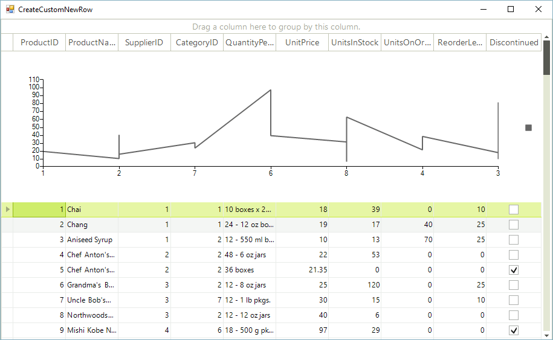

# Creating custom rows

__RadGridView__ provides a variety of visual cells per row with different functionality and purpose. However, in some cases you may need to display custom elements, not a single cell per column. This article demonstrates a sample approach how to create a custom row element.

## Custom new row

Consider the __RadGridView__ is populated with data form Northwind.Products table. 

<snippet id='gridview-createcustomnewrow-populatedata-cs' />
<snippet id='gridview-createcustomnewrow-populatedata-vb' />

>note In order to enlarge the new row's height, you can set the TableElement.ViewInfo.TableAddNewRow. __Height__ property.
>

On the new row we will display a __RadChartViewElement__ visualizing the Products data. For this purpose we should follow the steps below:

>note You can replace the __RadChartViewElement__ with any __RadElement__ or a set of elements.
>

>caption Figure 1: The new row is replaced with the custom one 

1\. Create a descendant of the __GridRowElement__ and override its __CreateChildElements__ where you should add a single __GridCellElement__ that contains the chart. The __IsCompatible__ method  determines for which __GridViewRowInfo__ the custom row element is applicable:

<snippet id='gridview-createcustomnewrow-rowelement-cs' />
<snippet id='gridview-createcustomnewrow-rowelement-vb' />

2\. Create a descendant of the __GridViewNewRowInfo__ and specify that it uses the row element from the previous step by overriding its __RowElementType__ property.

<snippet id='gridview-createcustomnewrow-rowinfo-cs' />
<snippet id='gridview-createcustomnewrow-rowinfo-vb' />

3\. The last step is to subscribe to the __CreateRowInfo__ event and replace the default __GridViewNewRowInfo__ with your custom one.

>important You should subscribe to the **CreateRowInfo** event at design time in order to ensure that the event will be fired when a data row have to be created.

<snippet id='gridview-createcustomnewrow-replacerow-cs' />
<snippet id='gridview-createcustomnewrow-replacerow-vb' />

# See Also
* [Adding and Inserting Rows]()

* [Conditional Formatting Rows]()

* [Drag and Drop]()

* [Formatting Rows]()

* [GridViewRowInfo]()

* [Iterating Rows]()

* [New Row]()

* [Painting Rows]()

* [How to Create a Custom Data Row Element in RadGridView]()

