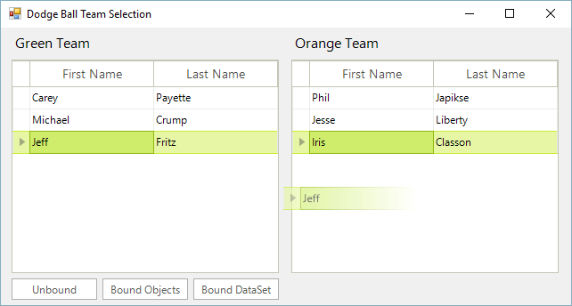
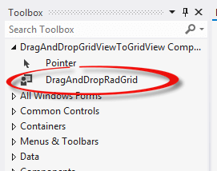
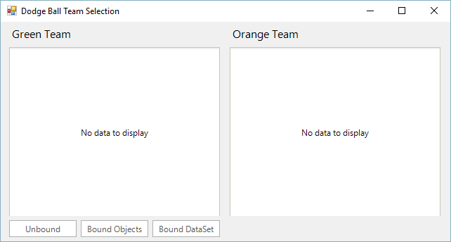

# Drag and Drop

Sometimes applications need to allow users to split items up into separate groupings. One way to handle this scenario is through moving data back and forth between several RadGridView controls. In order to achieve a better user experience, you can implement drag and drop functionality between the grids.

This help article demonstrates how to extend the RadGridView control to enable drag and drop functionality between two grids, whether it be an unbound grid, bound to a binding list of objects, or bound to a DataSet. It supports the ability to drag and drop multiple rows at a time.

>tip A complete solution providing a C# and VB.NET project is available [here](https://github.com/telerik/winforms-sdk/tree/master/GridView/DragAndDropBetweenGrids).

## Getting started

To get started:

1. Open Visual Studio 2012 and create a new Telerik UI for WinForms project.

2. Add a new class called “DragAndDropRadGrid.cs”.

3. Modify the class to extend the RadGridView control through inheritance.

<snippet id='gridview-draganddropradgrid-definition-cs' />
<snippet id='gridview-draganddropradgrid-definition-vb' />

The drag and drop functionality is made easy using the built-in __RadGridViewDragDropService__ as the plumbing code is already handled, you only need to handle events emanating from this service. Create a default constructor for the __DragAndDropRadGrid__ class. In this constructor we will grab a reference to the __RadDragDropService__ and generate event handler stubs for a few of the service’s events.

<snippet id='gridview-draganddropradgrid-constructor-cs' />
<snippet id='gridview-draganddropradgrid-constructor-vb' />

## Starting the Drag and Drop Service using behaviors

In order to start the drag and drop service when the user clicks on a row with the left mouse button, it is necessary to create a custom grid behavior. To do this, create a new class that inherits the __GridDataRowBehavior__ class. In addition the drag and drop service allows you to disable the auto scrolling while dragging functionality:

<snippet id='gridview-draganddropradgrid-gridbehavior-cs' />
<snippet id='gridview-draganddropradgrid-gridbehavior-vb' />

It is important to register this behavior in our grid. Build the solution and our custom grid is now setup and ready to use. You can locate it in the Visual Studio toolbox when in the design view of a form.

## Drag and Drop events

The __PreviewDragStart__ event is fired once the Drag and Drop service on the grid is started. In this case, we simply want to tell the drag and drop service if the drag operation can move forward. Implement the __PreviewDragStart__ event handler as follows:

<snippet id='gridview-draganddropradgrid-previewdragstart-cs' />
<snippet id='gridview-draganddropradgrid-previewdragstart-vb' />

The next event we will handle is the __PreviewDragOver__ event. This event allows you to control on what targets the row being dragged can be dropped on. In this case, as long as it’s being dropped somewhere on the target grid, we are good with it. Implement the handler as follows:

<snippet id='gridview-draganddropradgrid-previewdragover-cs' />
<snippet id='gridview-draganddropradgrid-previewdragover-vb' />

The last event we want to handle in our implementation is the __PreviewDragDrop__ event. This event allows you to get a handle on all the aspects of the drag and drop operation, the source (drag) grid, the destination (target) grid, as well as the row being dragged. This is where we will initiate the actual physical move of the row(s) from one grid to the other. Implement the handler as follows:

<snippet id='gridview-draganddropradgrid-previewdragdrop-cs' />
<snippet id='gridview-draganddropradgrid-previewdragdrop-vb' />

## Moving the data from one source to the other

You will notice at the end of the __PreviewDragDrop__ handler that we need to create a __MoveRows__ function that will handle the actual moving the data from the source to the destination. As mentioned at the beginning of the article, three distinct data scenarios will be handled:

* Unbound

* Bound to Objects (through a BindingList)

* Bound to a DataSet

It is in the __MoveRows__ method where the physical moving of the data happens. Basically what we need in this method is to add the data into the target data source, and remove it from the source data source in order to complete the drag and drop operation under the covers. Implement the MoveRows method as follows:

<snippet id='gridview-draganddropradgrid-moverows-cs' />
<snippet id='gridview-draganddropradgrid-moverows-vb' />

## Using our new control

Open the designer for Form1 and layout your form by dragging two instances of our __DragAndDropRadGrid__ control (name them leftGrid and rightGrid respectively). Then drag three RadButton instances and name them `btnUnbound`, `btnBoundObjects`, and `btnBoundDataSet`. Visually layout the form and label your form elements in the designer as follows:

Initialize some settings of the grids in the default constructor of the form as follows, we’ll also add a method to reset the grids:

<snippet id='gridview-draganddropradgridform1-form1-cs' />
<snippet id='gridview-draganddropradgridform1-form1-vb' />

First we will implement the usage of our custom grid in an unbound scenario. To do this, double-click on the Unbound button to implement its click event handler as follows:

<snippet id='gridview-draganddropradgridform1-unbound-cs' />
<snippet id='gridview-draganddropradgridform1-unbound-vb' />

Next we will implement the usage of our grid when it is bound to a BindingList. Double-click on the Bound to Objects button, and implement it as follows:

<snippet id='gridview-draganddropradgridform1-boundobjects-cs' />
<snippet id='gridview-draganddropradgridform1-boundobjects-vb' />

Add a Player class to the Form1.cs source file to support this scenario defined as the following:

<snippet id='gridview-draganddropradgridform1-player-cs' />
<snippet id='gridview-draganddropradgridform1-player-vb' />

Lastly we will implement the scenario of when the grids are bound to a DataSet. Implement the click event handler of the Bound to DataSet button as follows:

<snippet id='gridview-draganddropradgridform1-dataset-cs' />
<snippet id='gridview-draganddropradgridform1-dataset-vb' />

Go ahead and build and run the application. You are now able to use drag and drop functionality in bound and unbound modes. You are also able to select multiple rows using either the shift or control key, and holding the key down while you drag the rows between the grids.
# See Also
* [RadGridViewDragDropService]()

* [Adding and Inserting Rows]()

* [Conditional Formatting Rows]()

* [Creating custom rows]()

* [Formatting Rows]()

* [GridViewRowInfo]()

* [Iterating Rows]()

* [New Row]()

* [Painting Rows]()

* [RadGridView to RadDiagram Drag and Drop]()

* [How to Scroll the Target Grid while Dragging a Row]()

