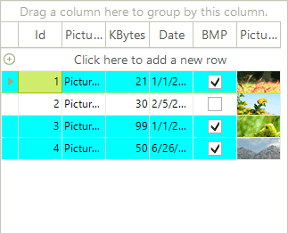
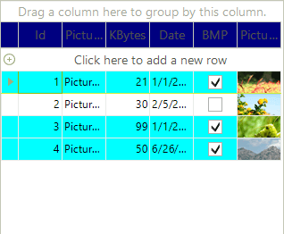

# Formatting Rows

## Customize the appearance of data rows

Use the __RowFormatting__ event to apply custom formatting to __RadGridView's__ data rows.

The code snippet below demonstrates changing the background color of rows, which *"BMP"* cell value is set to *true*:

<snippet id='gridview-formattingrows-rowformatting-cs' />
<snippet id='gridview-formattingrows-rowformatting-vb' />

>note An *if-else* statement is used to reset the value of __BackColorProperty__ if no drawing is required.
>

>note You should set __DrawFill__ to *true* to turn on the fill for the row (depends on the used theme).
>

>note Please refer to the Fundamentals [topic]() for more information about the UI Virtualization.
>  

## Customize the Non-Data Rows Appearance

To customize the non-data rows (header row, new row, filtering row, etc) of **RadGridView**, you need to handle the __ViewRowFormatting__ event.

<snippet id='gridview-formattingrows-viewrowformatting-cs' />
<snippet id='gridview-formattingrows-viewrowformatting-vb' />

# See Also
* [Adding and Inserting Rows]()

* [Conditional Formatting Rows]()

* [Creating custom rows]()

* [Drag and Drop]()

* [GridViewRowInfo]()

* [Iterating Rows]()

* [New Row]()

* [Painting Rows]()

* [Change the row hot tracking color in RadGridView by using VSB]()

