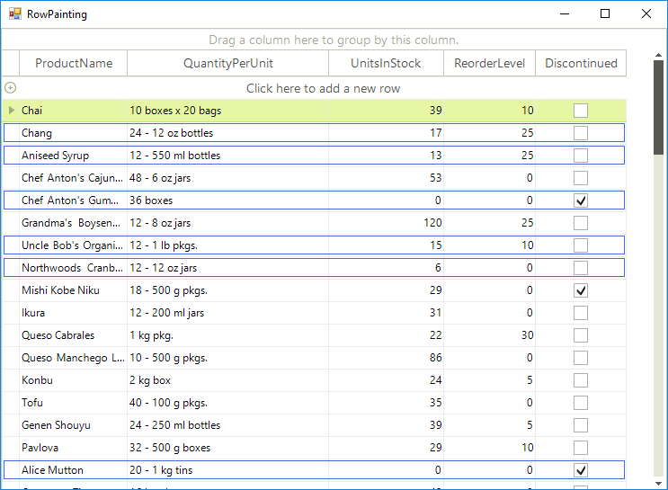

# Painting Rows

__RowPaint__ event occurs when a row needs to be painted. If you want to allow the event to fire, you should set the __EnableCustomDrawing__ to *true*. The scenario for using the __RowPaint__ event is applied when you want to apply custom painting to extend the row appearance.  

<snippet id='gridview-rowpainting-enablecustomdrawing-cs' />
<snippet id='gridview-rowpainting-enablecustomdrawing-vb' />

The following example demonstrates how to use the __RowPaint__ event to set up the row appearance depending on *"UnitsInStock"* cell value. If the cell value is more than *20*, no custom painting is applied and the row is drawn as it is by default. Otherwise an additional border is drawn inside the row to show that this product units in stock is getting lower (less than *20*).

>important When handling this event, you should access the row through the parameters of the event handler rather than access the row directly.
>

#### Paint border when specific criteria is met.

<snippet id='gridview-rowpainting-handlingrowpaint-cs' />
<snippet id='gridview-rowpainting-handlingrowpaint-vb' />

# See Also
* [Adding and Inserting Rows]()

* [Conditional Formatting Rows]()

* [Creating custom rows]()

* [Drag and Drop]()

* [Formatting Rows]()

* [GridViewRowInfo]()

* [Iterating Rows]()

* [New Row]()

