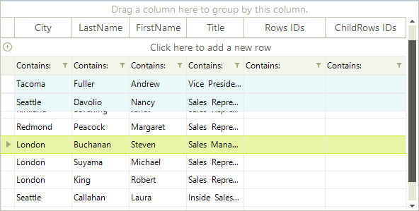

# Pinned Rows

RadGridView rows can be pinned so that the rows appear anchored to the top or bottom of the grid. To pin a particular row, set the row __PinPosition__ to one of the enumerated options -PinnedRowPosition.__Bottom__ or PinnedRowPosition.__Top__:

<snippet id='gridview-pinnedrows-pinnedrows-cs' />
<snippet id='gridview-pinnedrows-pinnedrows-vb' />

By using this code the __IsPinned__ property automatically gets a value true for the desired row.

Another way of pinning a row is to set directly the __IsPinned__ property of a Rows collection item to True. Please note that doing so will pin the row to the top of RadGridView.

<snippet id='gridview-pinnedrows-ispinned-cs' />
<snippet id='gridview-pinnedrows-ispinned-vb' />

The example below shows pinning all selected rows in the grid:

<snippet id='gridview-pinnedrows-pinallrows-cs' />
<snippet id='gridview-pinnedrows-pinallrows-vb' />

__RadGridView__ rows can be pinned so that the rows appear anchored to the top of the grid. To pin a particular row, set the __IsPinned__ property of a __Rows__ collection item to  *true*.

The example below shows pinning rows in the grid.  

# See Also
* [Adding and Inserting Rows]()

* [Conditional Formatting Rows]()

* [Creating custom rows]()

* [Drag and Drop]()

* [Formatting Rows]()

* [GridViewRowInfo]()

* [Iterating Rows]()

* [New Row]()

