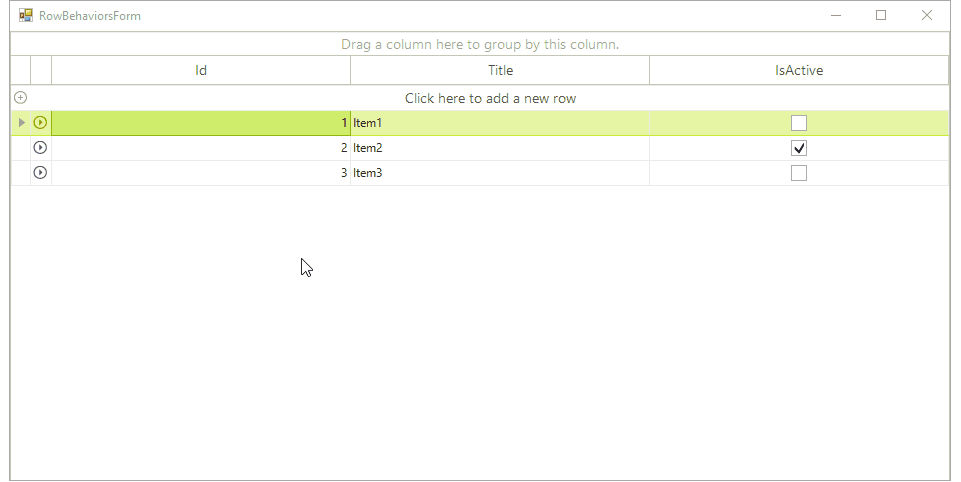
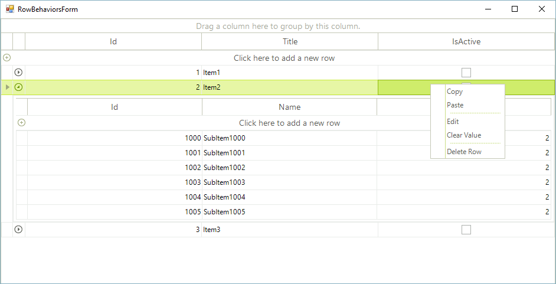

# Row behaviors

__RadGridView__ manages user *mouse* and *keyboard* input over its rows by __GridRowBehavior__. Depending on the row type, __RadGridView__ introduces different behaviors, listed on the table below: 

| Row behavior | Row type |
| ------ | ------ |
|GridDataRowBehavior|GridViewDataRowInfo|
|GridHierarchyRowBehavior|GridViewHierarchyRowInfo|
|GridNewRowBehavior|GridViewNewRowInfo|
|GridGroupRowBehavior|GridViewGroupRowInfo|
|GridFilterRowBehavior|GridViewFilteringRowInfo|
|GridHeaderRowBehavior|GridViewTableHeaderRowInfo|
|GridDetailViewRowBehavior|GridViewDetailsRowInfo|

By implementing a specific custom row behavior, developers can change the default row functionality or supplement the existing one. 

Let’s start with constructing a hierarchical __RadGridView__ and populate it with data.

<snippet id='gridview-rowbehaviorsform-fillhierarchicaldata-cs' />
<snippet id='gridview-rowbehaviorsform-fillhierarchicaldata-vb' />

By default, when the user hits the __Delete__ key over a certain row, the row is deleted. We will extend this functionality by notifying the user when he tries to delete a parent row, which __ChildRows__ collection is not empty. For this purpose, it is necessary to create a custom grid behavior. To do this, create a new class named __CustomGridHierarchyRowBehavior__. As we are currently using a hierarchical grid, our class should inherit the __GridHierarchyRowBehavior__. Override the __ProcessDeleteKey__ method in order to display a MessageBox and proceed with the delete operation after confirmation only: 

<snippet id='gridview-rowbehaviorsform-processdeletekey-cs' />
<snippet id='gridview-rowbehaviorsform-processdeletekey-vb' />

Next we will register this behavior in our grid. Add the following code after populating the grid with data:

<snippet id='gridview-rowbehaviorsform-registerbehavior-cs' />
<snippet id='gridview-rowbehaviorsform-registerbehavior-vb' />

The next modification we are going to introduce is to override the __OnMouseDownLeft__ method and show the context menu for the  __GridCheckBoxCellElement__, associated with the mouse location. First, it is necessary to use the grid navigator to process selection of the cell element, positioned at the mouse location. Afterwards, show the context menu for the specific cell:

<snippet id='gridview-rowbehaviorsform-mousedownleft-cs' />
<snippet id='gridview-rowbehaviorsform-mousedownleft-vb' />

__RadGridView__ supports rows/cells navigation by default, using the arrow keys. It is possible to customize this behavior as well. In the __CustomGridHierarchyRowBehavior__ class override the __ProcessKey__ method and stop the base grid logic for navigation upwards/downwards if the current row belongs to the __MasterTemplate__ and its *“IsActive”* cell value is set to *false*:

<snippet id='gridview-rowbehaviorsform-processkey-cs' />
<snippet id='gridview-rowbehaviorsform-processkey-vb' />

Following the demonstrated approach, developers can customize not only the hierarchy rows, but the new row for example, implementing a custom __GridNewRowBehavior__ and registering it for the __GridViewNewRowInfo__.
# See Also
* [Adding and Inserting Rows]()

* [Conditional Formatting Rows]()

* [Creating custom rows]()

* [Drag and Drop]()

* [Formatting Rows]()

* [GridViewRowInfo]()

* [Iterating Rows]()

* [New Row]()

* [How to Improve Scrolling Performance with Down Arrow Key in RadGridView]()

