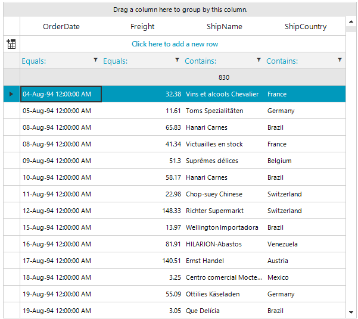
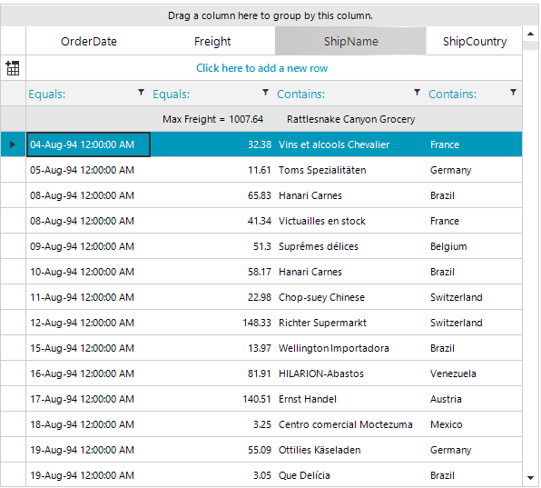
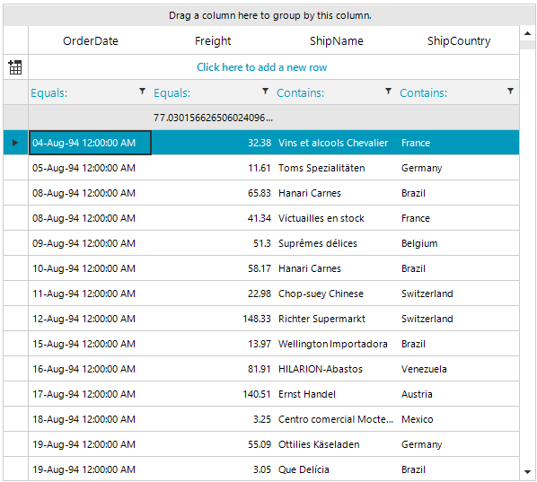
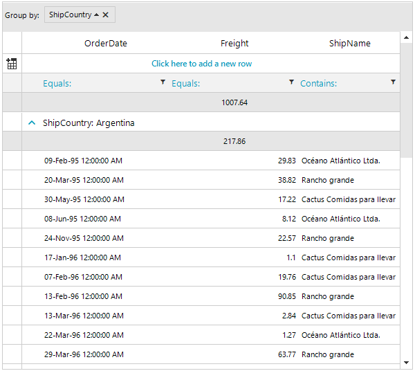
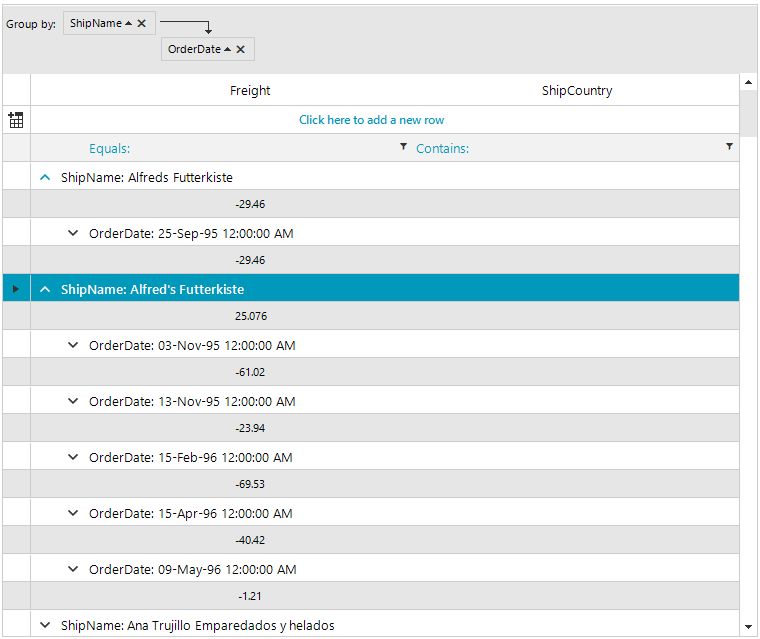
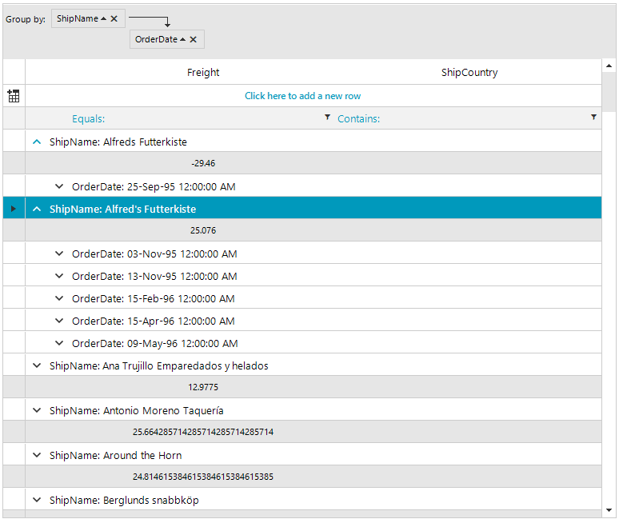
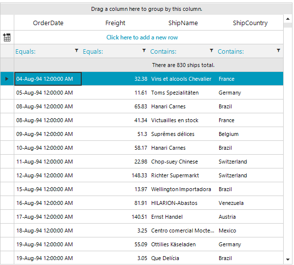
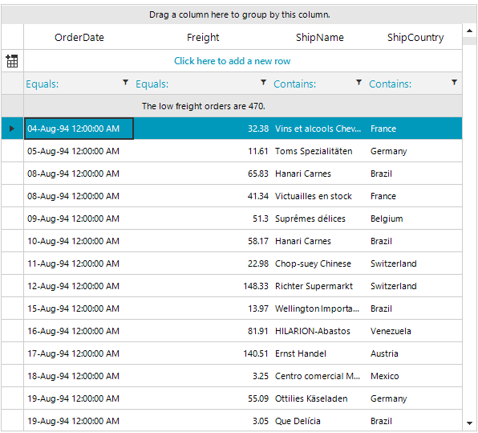
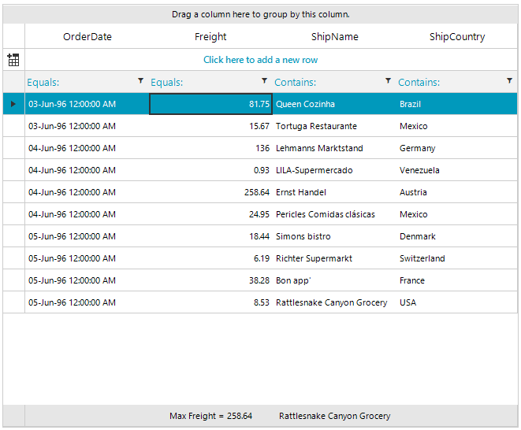
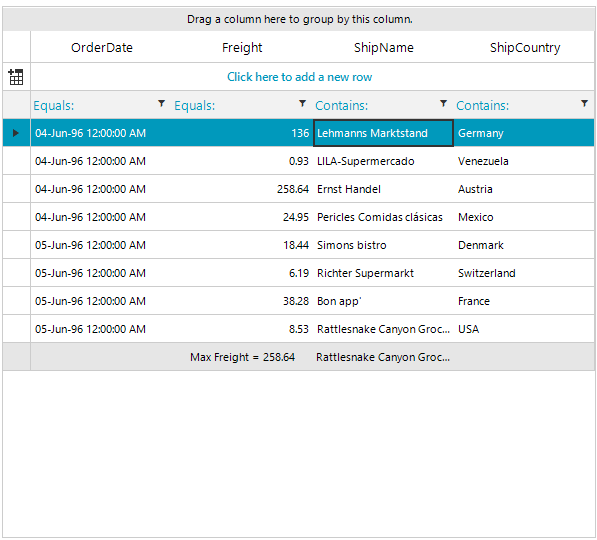

# Summary Rows

You can use summary rows to show summary information about the displayed data, such as first item, last item, count, etc. The summary rows can be top and bottom pinned. You can use them in a flat **RadGridView**, or in groups and hierarchical views.
      
## Basic Example

To add summary rows to your application, start by initializing a new instance of **GridViewSummaryItem**.

The following example demonstrates the steps to create a top pinned summary row that shows the count of the **RadGridView** rows:

<snippet id='gridview-summaryrows-addingsummaryrow-cs' />
<snippet id='gridview-summaryrows-addingsummaryrow-vb' />

>caption Figure 1: Top pinned summary row

## SummaryItem properties

The following list represents the most used SummaryItem properties:

* __Name:__ The name of the column for which you display summary information.

* __Aggregate:__ The function that will be evaluated, for example, __Sum__, __Count__, __Max__, etc.

* __AggregateExpression:__ The expression that will be evaluated. This property allows you to use advanced expressions instead of a simple __Aggregate__ function.

* __FormatString:__ The formatting string that is applied to the calculated value of the summary item.

## Predefined aggregates

You can use the following predefined aggregates for the __Aggregate__ property:

* __None:__ No expression is evaluated.

* __Sum:__ Returns the sum of all values.

* __Min:__ Returns the minimum value.

* __Max:__ Returns the maximum value.

* __Last:__ Returns the last value.

* __First:__ Returns the first value.

* __Count:__ Returns the count of all values.

* __Avg:__ Returns the average of all values.

* __StDev:__ Returns the standard deviation of all values.

* __Var:__ Returns the sample variance of all values.

## Using the FormatString

The following example demonstrates how to add several summary items to a summary row and how to use the __FormatString__:

<snippet id='gridview-summaryrows-formatstring-cs' />
<snippet id='gridview-summaryrows-formatstring-vb' />

>caption Figure 2: Format the Summary Item

## Using an AggregateExpression

The next example demonstrates how to use __AggregateExpression__ to calculate an average value by excluding the __Max__ and __Min__ values:

<snippet id='gridview-summaryrows-aggregateexpression-cs' />
<snippet id='gridview-summaryrows-aggregateexpression-vb' />

>caption Figure 3: Using AggregateExpression

## Summary rows in a grouped RadGridView

When you use grouping, SummaryItem calculates the aggregate values individually for each group and then displays the summary rows for each group. To show a total summary for all groups, you can use the __ShowTotals__ template property. The totals are calculated for the child rows of all groups. You can control if the summary rows are top or bottom pinned even in grouped RadGridView.

As of the **R1 2020** version, the template in **RadGridView** offers the **ShowSubTotals** property. Its value indicates whether summary rows will be shown for each group. The property is only relevant when the grid is grouped.

The next example demonstrates how to use summary rows in grouping:

<snippet id='gridview-summaryrows-grouping-cs' />
<snippet id='gridview-summaryrows-grouping-vb' />

>caption Figure 4: Summary rows in a grouped RadGridView

As of the **2024 Q1** version, the template in **RadGridView** offers the **ShowCollapsedGroupSummaries** property. Its value indicates whether summary rows will be shown for each group when they are **collapsed**. The property is only relevant when the grid is grouped.

In a scenario in which we have nested grouping, the group summary row will appear for each nested group and its parent group when **ShowParentGroupSummaries** property is set to true. To show the group summary row on a specific group, we can set the same **ShowCollapsedGroupSummaries** property which was exposed on a group row level. It has higher priority than the **ShowCollapsedGroupSummaries** that comes from the template. The group row **ShowCollapsedGroupSummaries** property can be set in the CreateRowInfo event handler. However, an important moment here is that first the **ShowCollapsedGroupSummaries** property of the template needs to be set to true, then we can use the below example to remove the group summary row on a nested group.

<snippet id='gridview-summaryrows-summarygroup-cs' />
<snippet id='gridview-summaryrows-summarygroup-vb' />

## Summary rows in a hierarchical RadGridView

You can add summary rows in hierarchical views. They are calculated for the child rows in the current view.   
The following example demonstrates how to add a summary row to the first level of a **RadGridView** hierarchy:

<snippet id='gridview-summaryrows-hierarchy-cs' />
<snippet id='gridview-summaryrows-hierarchy-vb' />

## Customizing the summary row

The **GroupSummaryEvaluate** event is fired after a summary item is calculated and before the summary row is displayed. You can use this event to apply custom formatting to the summary row. The same event is used to format the group header, so it is important to check the __Parent__ in the event arguments, as shown in the example:

<snippet id='gridview-summaryrows-customformatting-cs' />
<snippet id='gridview-summaryrows-customformatting-vb' />

>caption Figure 5: Customizing the summary row

        
## Extending the SummaryItem

You can write your own logic for summary items evaluation by inheriting the **GridViewSummaryItem** class and overriding the __Evaluate__ method.

The following example demonstrates how to create a custom summary item that calculates the orders count with *Freight* less than *50*:

<snippet id='gridview-summaryrows-customsummaryitemusage-cs' />
<snippet id='gridview-summaryrows-customsummaryitemusage-vb' />

## BottomPinnedRowsMode 

You can control the location of the bottom summary rows through the **BottomPinnedRowsMode** property. The available options are:

* *Float*: The bottom pinned rows will stay below the scrollable rows. If there are not enough rows to fill the viewport, there will be no gap between the scrollable and pinned rows.
* *Fixed*: The bottom pinned rows will remain at the bottom of the viewport no matter how many scrollable rows there are in the viewport.

|GridViewBottomPinnedRowsMode.Fixed|GridViewBottomPinnedRowsMode.Float|
|----|----|
|||

>note When you use the *Fixed* mode, it is necessary to pin the summary row accessing them by the MasterView.SummaryRows collection. Make sure to set the __IsPinned__ property before setting the __PinPosition__.

# See Also
* [Adding and Inserting Rows]()

* [Conditional Formatting Rows]()

* [Creating custom rows]()

* [Drag and Drop]()

* [Formatting Rows]()

* [GridViewRowInfo]()

* [Iterating Rows]()

* [New Row]()

* [Show Summary Values for Collapsed Groups in RadGridView ]()

