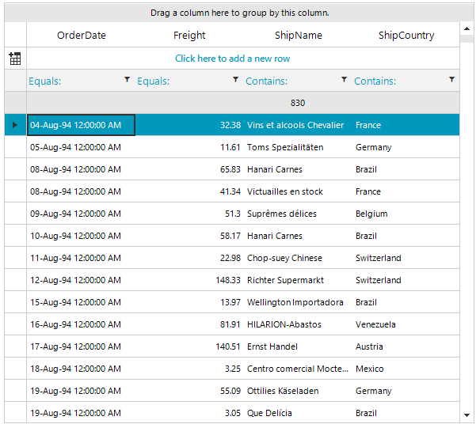
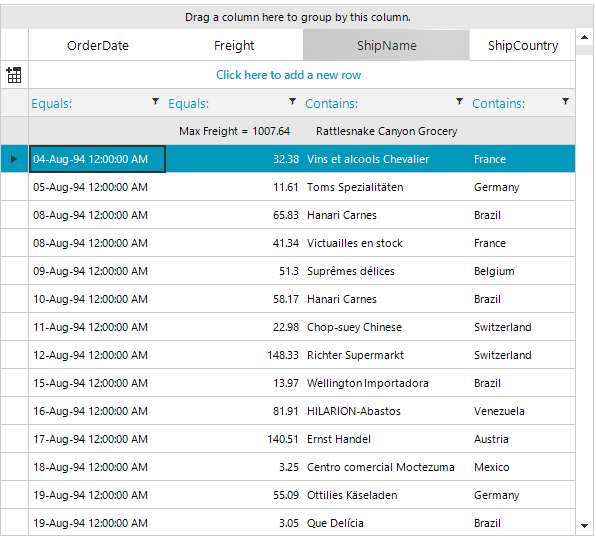
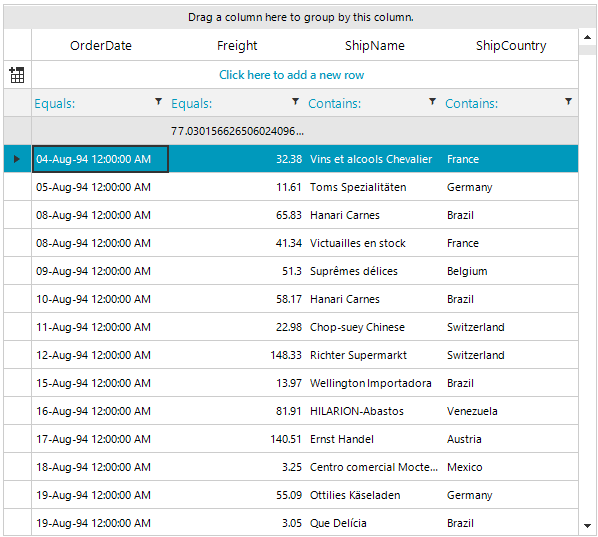
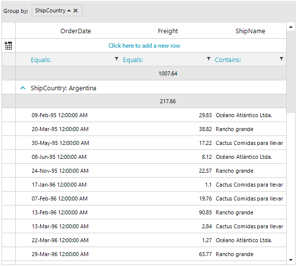
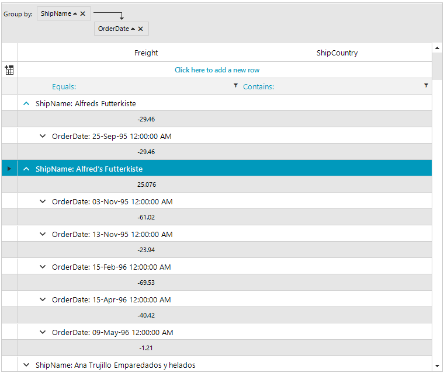
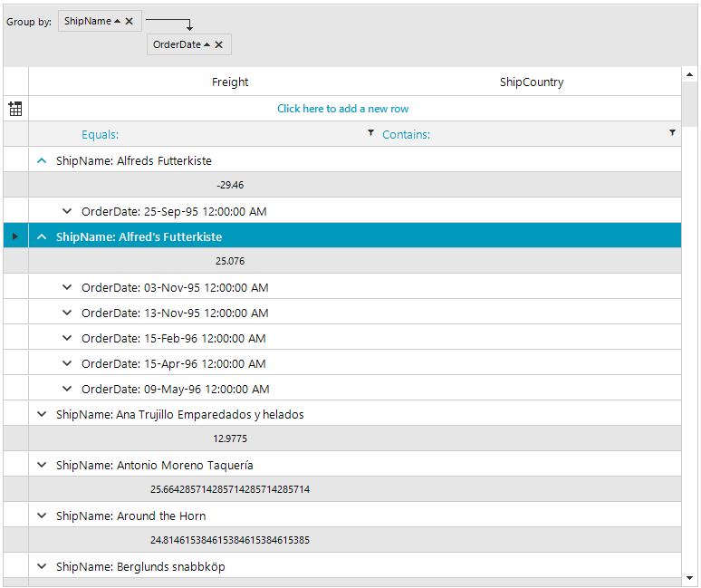
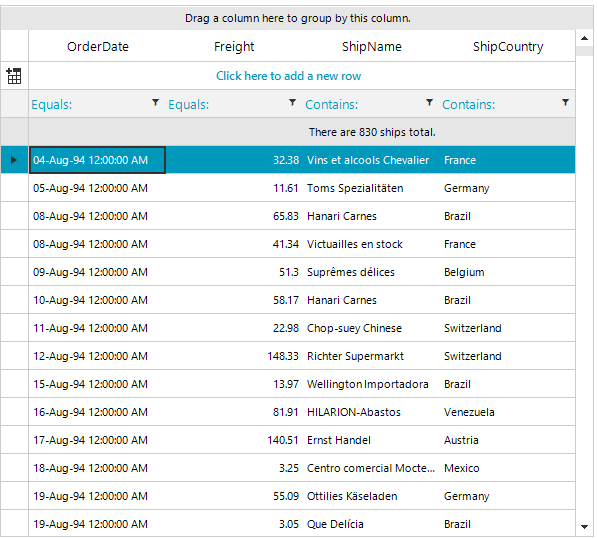
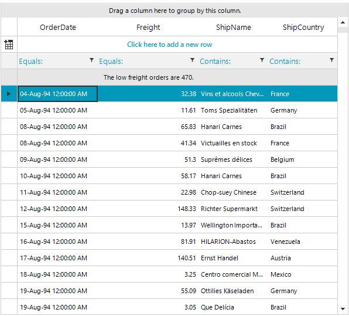
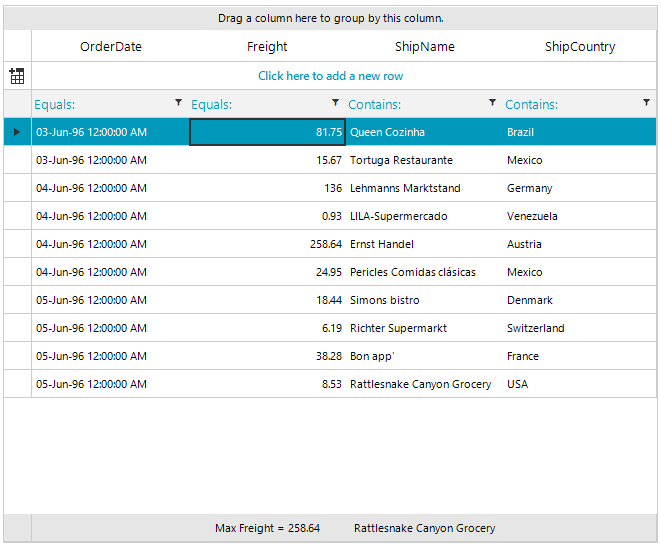
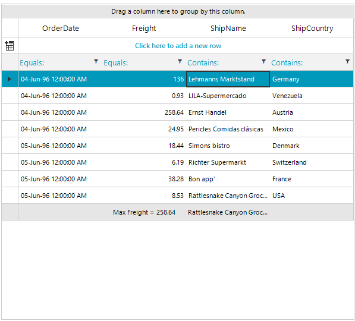

# Summary Rows

You can use summary rows to show summary information about the displayed data, such as first item, last item, count, etc. The summary rows can be top and bottom pinned. You can use them in a flat **RadGridView**, or in groups and hierarchical views.
      
## Basic Example

To add summary rows to your application, start by initializing a new instance of **GridViewSummaryItem**.

The following example demonstrates the steps to create a top pinned summary row that shows the count of the **RadGridView** rows:

{{source=..\SamplesCS\GridView\Rows\SummaryRows.cs region=addingSummaryRow}} 
{{source=..\SamplesVB\GridView\Rows\SummaryRows.vb region=addingSummaryRow}} 

````C#
GridViewSummaryItem summaryItem = new GridViewSummaryItem();
summaryItem.Name = "ShipName";
summaryItem.Aggregate = GridAggregateFunction.Count;
GridViewSummaryRowItem summaryRowItem = new GridViewSummaryRowItem();
summaryRowItem.Add(summaryItem);
this.radGridView1.SummaryRowsTop.Add(summaryRowItem);
this.radGridView1.SummaryRowsBottom.Add(summaryRowItem);

````
````VB.NET
Dim summaryItem As New GridViewSummaryItem()
summaryItem.Name = "ShipName"
summaryItem.Aggregate = GridAggregateFunction.Count
Dim summaryRowItem As New GridViewSummaryRowItem()
summaryRowItem.Add(summaryItem)
Me.RadGridView1.SummaryRowsTop.Add(summaryRowItem)
Me.RadGridView1.SummaryRowsBottom.Add(summaryRowItem)

````

{{endregion}} 

>caption Figure 1: Top pinned summary row



## SummaryItem properties

The following list represents the most used SummaryItem properties:

* __Name:__ The name of the column for which you display summary information.

* __Aggregate:__ The function that will be evaluated, for example, __Sum__, __Count__, __Max__, etc.

* __AggregateExpression:__ The expression that will be evaluated. This property allows you to use advanced expressions instead of a simple __Aggregate__ function.

* __FormatString:__ The formatting string that is applied to the calculated value of the summary item.

## Predefined aggregates

You can use the following predefined aggregates for the __Aggregate__ property:

* __None:__ No expression is evaluated.

* __Sum:__ Returns the sum of all values.

* __Min:__ Returns the minimum value.

* __Max:__ Returns the maximum value.

* __Last:__ Returns the last value.

* __First:__ Returns the first value.

* __Count:__ Returns the count of all values.

* __Avg:__ Returns the average of all values.

* __StDev:__ Returns the standard deviation of all values.

* __Var:__ Returns the sample variance of all values.

## Using the FormatString

The following example demonstrates how to add several summary items to a summary row and how to use the __FormatString__:

{{source=..\SamplesCS\GridView\Rows\SummaryRows.cs region=formatString}} 
{{source=..\SamplesVB\GridView\Rows\SummaryRows.vb region=formatString}} 

````C#
GridViewSummaryItem summaryItemShipName = new GridViewSummaryItem("ShipName", "{0}", GridAggregateFunction.Last);
GridViewSummaryItem summaryItemFreight = new GridViewSummaryItem("Freight", "Max Freight = {0}", GridAggregateFunction.Max);
GridViewSummaryRowItem summaryRowItem = new GridViewSummaryRowItem(
    new GridViewSummaryItem[] { summaryItemShipName, summaryItemFreight });
this.radGridView1.SummaryRowsTop.Add(summaryRowItem);

````
````VB.NET
Dim summaryItemShipName As New GridViewSummaryItem("ShipName", "{0}", GridAggregateFunction.Last)
Dim summaryItemFreight As New GridViewSummaryItem("Freight", "Max Freight = {0}", GridAggregateFunction.Max)
Dim summaryRowItem As New GridViewSummaryRowItem(New GridViewSummaryItem() {summaryItemShipName, summaryItemFreight})
Me.RadGridView1.SummaryRowsTop.Add(summaryRowItem)

````

{{endregion}} 

>caption Figure 2: Format the Summary Item



## Using an AggregateExpression

The next example demonstrates how to use __AggregateExpression__ to calculate an average value by excluding the __Max__ and __Min__ values:

{{source=..\SamplesCS\GridView\Rows\SummaryRows.cs region=aggregateExpression}} 
{{source=..\SamplesVB\GridView\Rows\SummaryRows.vb region=aggregateExpression}} 

````C#
GridViewSummaryItem summaryItem = new GridViewSummaryItem();
summaryItem.Name = "Freight";
summaryItem.AggregateExpression = "(Sum(Freight) - Max(Freight) - Min(Freight)) / Count(Freight)";
GridViewSummaryRowItem summaryRowItem = new GridViewSummaryRowItem();
summaryRowItem.Add(summaryItem);
this.radGridView1.SummaryRowsTop.Add(summaryRowItem);

````
````VB.NET
Dim summaryItem As New GridViewSummaryItem()
summaryItem.Name = "Freight"
summaryItem.AggregateExpression = "(Sum(Freight) - Max(Freight) - Min(Freight)) / Count(Freight)"
Dim summaryRowItem As New GridViewSummaryRowItem()
summaryRowItem.Add(summaryItem)
Me.RadGridView1.SummaryRowsTop.Add(summaryRowItem)

````

{{endregion}} 


>caption Figure 3: Using AggregateExpression



## Summary rows in a grouped RadGridView

When you use grouping, SummaryItem calculates the aggregate values individually for each group and then displays the summary rows for each group. To show a total summary for all groups, you can use the __ShowTotals__ template property. The totals are calculated for the child rows of all groups. You can control if the summary rows are top or bottom pinned even in grouped RadGridView.

As of the **R1 2020** version, the template in **RadGridView** offers the **ShowSubTotals** property. Its value indicates whether summary rows will be shown for each group. The property is only relevant when the grid is grouped.

The next example demonstrates how to use summary rows in grouping:

{{source=..\SamplesCS\GridView\Rows\SummaryRows.cs region=grouping}} 
{{source=..\SamplesVB\GridView\Rows\SummaryRows.vb region=grouping}} 

````C#
this.radGridView1.MasterTemplate.ShowTotals = true;
GridViewSummaryItem summaryItem = new GridViewSummaryItem("Freight", "{0}", GridAggregateFunction.Max);
GridViewSummaryRowItem summaryRowItem = new GridViewSummaryRowItem();
summaryRowItem.Add(summaryItem);
this.radGridView1.SummaryRowsTop.Add(summaryRowItem);

````
````VB.NET
Me.RadGridView1.MasterTemplate.ShowTotals = True
Dim summaryItem As New GridViewSummaryItem("Freight", "{0}", GridAggregateFunction.Max)
Dim summaryRowItem As New GridViewSummaryRowItem()
summaryRowItem.Add(summaryItem)
Me.RadGridView1.SummaryRowsTop.Add(summaryRowItem)

````

{{endregion}} 

>caption Figure 4: Summary rows in a grouped RadGridView



As of the **2024 Q1** version, the template in **RadGridView** offers the **ShowCollapsedGroupSummaries** property. Its value indicates whether summary rows will be shown for each group when they are **collapsed**. The property is only relevant when the grid is grouped.



In a scenario in which we have nested grouping, the group summary row will appear for each nested group and its parent group when **ShowParentGroupSummaries** property is set to true. To show the group summary row on a specific group, we can set the same **ShowCollapsedGroupSummaries** property which was exposed on a group row level. It has higher priority than the **ShowCollapsedGroupSummaries** that comes from the template. The group row **ShowCollapsedGroupSummaries** property can be set in the CreateRowInfo event handler. However, an important moment here is that first the **ShowCollapsedGroupSummaries** property of the template needs to be set to true, then we can use the below example to remove the group summary row on a nested group.

{{source=..\SamplesCS\GridView\Rows\SummaryRows.cs region=summaryGroup}} 
{{source=..\SamplesVB\GridView\Rows\SummaryRows.vb region=summaryGroup}} 

````C#
private void RadGridView1_CreateRowInfo(object sender, GridViewCreateRowInfoEventArgs e)
{
    if (e.RowInfo is GridViewGroupRowInfo)
    {
        GridViewGroupRowInfo groupRowInfo = e.RowInfo as GridViewGroupRowInfo;      
        groupRowInfo.ShowCollapsedGroupSummaries = groupRowInfo.GroupLevel == 0;
    }
}

````
````VB.NET
Private Sub RadGridView1_CreateRowInfo(ByVal sender As Object, ByVal e As GridViewCreateRowInfoEventArgs)
    If TypeOf e.RowInfo Is GridViewGroupRowInfo Then
        Dim groupRowInfo As GridViewGroupRowInfo = TryCast(e.RowInfo, GridViewGroupRowInfo)
        groupRowInfo.ShowCollapsedGroupSummaries = groupRowInfo.GroupLevel = 0
    End If
End Sub

````

{{endregion}} 



## Summary rows in a hierarchical RadGridView

You can add summary rows in hierarchical views. They are calculated for the child rows in the current view.   
The following example demonstrates how to add a summary row to the first level of a **RadGridView** hierarchy:

{{source=..\SamplesCS\GridView\Rows\SummaryRows.cs region=hierarchy}} 
{{source=..\SamplesVB\GridView\Rows\SummaryRows.vb region=hierarchy}} 

````C#
GridViewSummaryItem summaryItem = new GridViewSummaryItem("Quantity", "Max quantity = {0}", GridAggregateFunction.Max);
GridViewSummaryRowItem summaryRowItem = new GridViewSummaryRowItem();
summaryRowItem.Add(summaryItem);
this.radGridView1.MasterTemplate.Templates[0].SummaryRowsTop.Add(summaryRowItem);

````
````VB.NET
Dim summaryItem As New GridViewSummaryItem("Quantity", "Max quantity = {0}", GridAggregateFunction.Max)
Dim summaryRowItem As New GridViewSummaryRowItem()
summaryRowItem.Add(summaryItem)
Me.RadGridView1.MasterTemplate.Templates(0).SummaryRowsTop.Add(summaryRowItem)

````

{{endregion}}


## Customizing the summary row

The **GroupSummaryEvaluate** event is fired after a summary item is calculated and before the summary row is displayed. You can use this event to apply custom formatting to the summary row. The same event is used to format the group header, so it is important to check the __Parent__ in the event arguments, as shown in the example:


{{source=..\SamplesCS\GridView\Rows\SummaryRows.cs region=customFormatting}} 
{{source=..\SamplesVB\GridView\Rows\SummaryRows.vb region=customFormatting}}

````C#
private void radGridView1_GroupSummaryEvaluate(object sender, GroupSummaryEvaluationEventArgs e)
{
    if (e.SummaryItem.Name == "ShipName")
    {
        e.FormatString = String.Format("There are {0} ships total.", e.Value);
    }
}

````
````VB.NET
Private Sub radGridView1_GroupSummaryEvaluate(ByVal sender As Object, ByVal e As GroupSummaryEvaluationEventArgs)
    If e.SummaryItem.Name = "ShipName" Then
        e.FormatString = String.Format("There are {0} ships total.", e.Value)
    End If
End Sub

```` 

{{endregion}}	

>caption Figure 5: Customizing the summary row



        
## Extending the SummaryItem

You can write your own logic for summary items evaluation by inheriting the **GridViewSummaryItem** class and overriding the __Evaluate__ method.

The following example demonstrates how to create a custom summary item that calculates the orders count with *Freight* less than *50*:

{{source=..\SamplesCS\GridView\Rows\SummaryRows.cs region=customSummaryItemUsage}} 
{{source=..\SamplesVB\GridView\Rows\SummaryRows.vb region=customSummaryItemUsage}}

````C#
void CustomSummaryItemUsage()
{
    CustomSummaryItem summaryItem = new CustomSummaryItem("Freight", "The low freight orders are {0}.", GridAggregateFunction.Count);
    GridViewSummaryRowItem summaryRowItem = new GridViewSummaryRowItem();
    summaryRowItem.Add(summaryItem);
    this.radGridView1.SummaryRowsTop.Add(summaryRowItem);
}
public class CustomSummaryItem : GridViewSummaryItem
{
    public CustomSummaryItem(string name, string formatString, GridAggregateFunction aggregate)
        : base(name, formatString, aggregate)
    { }
    public override object Evaluate(IHierarchicalRow row)
    {
        int lowFreightsCount = 0;
        foreach (GridViewRowInfo childRow in row.ChildRows)
        {
            if ((decimal)childRow.Cells["Freight"].Value < 50m)
            {
                lowFreightsCount++;
            }
        }
        return lowFreightsCount;
    }
}

````
````VB.NET
Private Sub CustomSummaryItemUsage()
    Dim summaryItem As New CustomSummaryItem("Freight", "The low freight orders are {0}.", GridAggregateFunction.Count)
    Dim summaryRowItem As New GridViewSummaryRowItem()
    summaryRowItem.Add(summaryItem)
    Me.RadGridView1.SummaryRowsTop.Add(summaryRowItem)
End Sub
Public Class CustomSummaryItem
    Inherits GridViewSummaryItem
    Public Sub New(ByVal name As String, ByVal formatString As String, ByVal aggregate As GridAggregateFunction)
        MyBase.New(name, formatString, aggregate)
    End Sub
    Public Overrides Function Evaluate(ByVal row As IHierarchicalRow) As Object
        Dim lowFreightsCount As Integer = 0
        For Each childRow As GridViewRowInfo In row.ChildRows
            If CDec(childRow.Cells("Freight").Value) < 50D Then
                lowFreightsCount += 1
            End If
        Next childRow
        Return lowFreightsCount
    End Function
End Class

```` 

{{endregion}}



## BottomPinnedRowsMode 

You can control the location of the bottom summary rows through the **BottomPinnedRowsMode** property. The available options are:

* *Float*: The bottom pinned rows will stay below the scrollable rows. If there are not enough rows to fill the viewport, there will be no gap between the scrollable and pinned rows.
* *Fixed*: The bottom pinned rows will remain at the bottom of the viewport no matter how many scrollable rows there are in the viewport.

|GridViewBottomPinnedRowsMode.Fixed|GridViewBottomPinnedRowsMode.Float|
|----|----|
|||

>note When you use the *Fixed* mode, it is necessary to pin the summary row accessing them by the MasterView.SummaryRows collection. Make sure to set the __IsPinned__ property before setting the __PinPosition__.

# See Also
* [Adding and Inserting Rows]()

* [Conditional Formatting Rows]()

* [Creating custom rows]()

* [Drag and Drop]()

* [Formatting Rows]()

* [GridViewRowInfo]()

* [Iterating Rows]()

* [New Row]()

* [Show Summary Values for Collapsed Groups in RadGridView ]()

