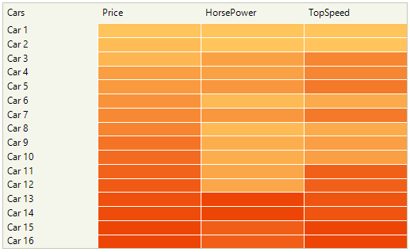
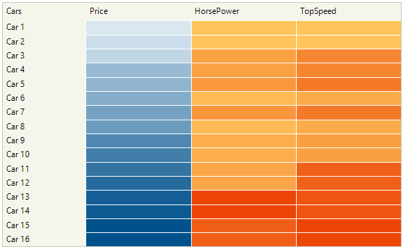
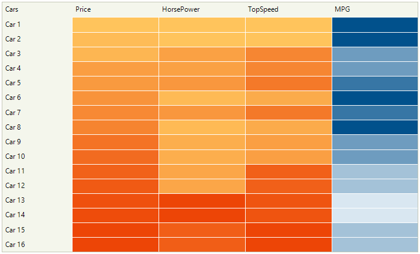
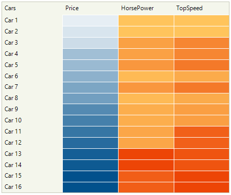

# Colorizers

This topic aims to get you familiar with all types of colorizers you may use to change the visualization of RadHeatMap. Depending on the heatmap's [Definition](), the colorizer may be different according to the data that should be displayed. By default, **RadTreeMap** uses a **HeatMapGradientColorizer** with with two **GradientStop**s.

## Colorizers in a Horizontal/Vertical Definition

In the scenario of Horizontal/Vertical Definition, the colorizer is defined in the MemberMappings of the corresponding definition.

>note The only difference between the two definitions is that for the horizontal definition each item gets a row, while the vertical – a column.

Let's start with the following Car class that will be used for the examples in this article:

{{source=..\SamplesCS\HeatMap\HeatMapDefinitions.cs region=CarClass}} 
{{source=..\SamplesVB\HeatMap\HeatMapDefinitions.vb region=CarClass}} 

````C#
public class Car
{
    public string Name { get; set; }
    public int MilesPerGallon { get; set; }
    public int TopSpeed { get; set; }
    public int Price { get; set; }
    public int HorsePower { get; set; }
} 

````
````VB.NET

Public Class Car
    Public Property Name As String
    Public Property MilesPerGallon As Integer
    Public Property TopSpeed As Integer
    Public Property Price As Integer
    Public Property HorsePower As Integer
End Class

````

{{endregion}}

Now, we will setup a HorizontalDefinition populated with cars like the following example:

{{source=..\SamplesCS\HeatMap\HeatMapDefinitions.cs region=DefaultColorizer}} 
{{source=..\SamplesVB\HeatMap\HeatMapDefinitions.vb region=DefaultColorizer}} 

````C#

public void ApplyDefaultColorizer()
{
    HorizontalDefinition horizontalDefinition1 = new HorizontalDefinition();
    horizontalDefinition1.DataSource = CreateData(); 
    horizontalDefinition1.HeaderMember = "Name";
    radHeatMap1.Definition = horizontalDefinition1;
    radHeatMap1.DescriptionContent = "Cars";

    MemberMapping memberMapping1 = new MemberMapping();
    memberMapping1.Header = "Price";
    memberMapping1.ValueMember = "Price";
    MemberMapping memberMapping2 = new MemberMapping();
    memberMapping2.Header = "HorsePower";
    memberMapping2.ValueMember = "HorsePower";
    MemberMapping memberMapping3 = new MemberMapping();
    memberMapping3.Header = "TopSpeed";
    memberMapping3.ValueMember = "TopSpeed";

    horizontalDefinition1.MemberMappings.Add(memberMapping1);
    horizontalDefinition1.MemberMappings.Add(memberMapping2);
    horizontalDefinition1.MemberMappings.Add(memberMapping3);
}


public List<Car> CreateData()
{
    var result = new List<Car>()
{
    new Car() {Name = "Car 1", Price = 20590, HorsePower = 70,  MilesPerGallon = 37, TopSpeed = 60 },
    new Car() {Name = "Car 2", Price = 21990, HorsePower = 70,  MilesPerGallon = 37, TopSpeed = 60 },
    new Car() {Name = "Car 3", Price = 23200, HorsePower = 140, MilesPerGallon = 28, TopSpeed = 110 },
    new Car() {Name = "Car 4", Price = 27500, HorsePower = 140, MilesPerGallon = 28, TopSpeed = 110 },
    new Car() {Name = "Car 5", Price = 28200, HorsePower = 160, MilesPerGallon = 31, TopSpeed = 120 },
    new Car() {Name = "Car 6", Price = 29500, HorsePower = 90,  MilesPerGallon = 35, TopSpeed = 80 },
    new Car() {Name = "Car 7", Price = 31200, HorsePower = 160, MilesPerGallon = 31, TopSpeed = 120 },
    new Car() {Name = "Car 8", Price = 32200, HorsePower = 90,  MilesPerGallon = 35, TopSpeed = 80 },
    new Car() {Name = "Car 9", Price = 35200, HorsePower = 115, MilesPerGallon = 29, TopSpeed = 90 },
    new Car() {Name = "Car 10", Price = 36700, HorsePower = 115, MilesPerGallon = 29, TopSpeed = 90 },
    new Car() {Name = "Car 11", Price = 38200, HorsePower = 130, MilesPerGallon = 24, TopSpeed = 140 },
    new Car() {Name = "Car 12", Price = 39700, HorsePower = 130, MilesPerGallon = 24, TopSpeed = 140 },
    new Car() {Name = "Car 13", Price = 41500, HorsePower = 326, MilesPerGallon = 16, TopSpeed = 150 },
    new Car() {Name = "Car 14", Price = 42200, HorsePower = 326, MilesPerGallon = 16, TopSpeed = 150 },
    new Car() {Name = "Car 15", Price = 43500, HorsePower = 276, MilesPerGallon = 25, TopSpeed = 162 },
    new Car() {Name = "Car 16", Price = 43500, HorsePower = 276, MilesPerGallon = 25, TopSpeed = 162 },
};

    return result;
} 

````
````VB.NET

Public Sub ApplyDefaultColorizer()
    Dim horizontalDefinition1 As HorizontalDefinition = New HorizontalDefinition()
    horizontalDefinition1.DataSource = CreateData()
    horizontalDefinition1.HeaderMember = "Name"
    radHeatMap1.Definition = horizontalDefinition1
    radHeatMap1.DescriptionContent = "Cars"
    Dim memberMapping1 As MemberMapping = New MemberMapping()
    memberMapping1.Header = "Price"
    memberMapping1.ValueMember = "Price"
    Dim memberMapping2 As MemberMapping = New MemberMapping()
    memberMapping2.Header = "HorsePower"
    memberMapping2.ValueMember = "HorsePower"
    Dim memberMapping3 As MemberMapping = New MemberMapping()
    memberMapping3.Header = "TopSpeed"
    memberMapping3.ValueMember = "TopSpeed"
    horizontalDefinition1.MemberMappings.Add(memberMapping1)
    horizontalDefinition1.MemberMappings.Add(memberMapping2)
    horizontalDefinition1.MemberMappings.Add(memberMapping3)
End Sub

Public Function CreateData() As List(Of Car)
    Dim result = New List(Of Car)() From {
        New Car() With {
            .Name = "Car 1",
            .Price = 20590,
            .HorsePower = 70,
            .MilesPerGallon = 37,
            .TopSpeed = 60
        },
        New Car() With {
            .Name = "Car 2",
            .Price = 21990,
            .HorsePower = 70,
            .MilesPerGallon = 37,
            .TopSpeed = 60
        },
        New Car() With {
            .Name = "Car 3",
            .Price = 23200,
            .HorsePower = 140,
            .MilesPerGallon = 28,
            .TopSpeed = 110
        },
        New Car() With {
            .Name = "Car 4",
            .Price = 27500,
            .HorsePower = 140,
            .MilesPerGallon = 28,
            .TopSpeed = 110
        },
        New Car() With {
            .Name = "Car 5",
            .Price = 28200,
            .HorsePower = 160,
            .MilesPerGallon = 31,
            .TopSpeed = 120
        },
        New Car() With {
            .Name = "Car 6",
            .Price = 29500,
            .HorsePower = 90,
            .MilesPerGallon = 35,
            .TopSpeed = 80
        },
        New Car() With {
            .Name = "Car 7",
            .Price = 31200,
            .HorsePower = 160,
            .MilesPerGallon = 31,
            .TopSpeed = 120
        },
        New Car() With {
            .Name = "Car 8",
            .Price = 32200,
            .HorsePower = 90,
            .MilesPerGallon = 35,
            .TopSpeed = 80
        },
        New Car() With {
            .Name = "Car 9",
            .Price = 35200,
            .HorsePower = 115,
            .MilesPerGallon = 29,
            .TopSpeed = 90
        },
        New Car() With {
            .Name = "Car 10",
            .Price = 36700,
            .HorsePower = 115,
            .MilesPerGallon = 29,
            .TopSpeed = 90
        },
        New Car() With {
            .Name = "Car 11",
            .Price = 38200,
            .HorsePower = 130,
            .MilesPerGallon = 24,
            .TopSpeed = 140
        },
        New Car() With {
            .Name = "Car 12",
            .Price = 39700,
            .HorsePower = 130,
            .MilesPerGallon = 24,
            .TopSpeed = 140
        },
        New Car() With {
            .Name = "Car 13",
            .Price = 41500,
            .HorsePower = 326,
            .MilesPerGallon = 16,
            .TopSpeed = 150
        },
        New Car() With {
            .Name = "Car 14",
            .Price = 42200,
            .HorsePower = 326,
            .MilesPerGallon = 16,
            .TopSpeed = 150
        },
        New Car() With {
            .Name = "Car 15",
            .Price = 43500,
            .HorsePower = 276,
            .MilesPerGallon = 25,
            .TopSpeed = 162
        },
        New Car() With {
            .Name = "Car 16",
            .Price = 43500,
            .HorsePower = 276,
            .MilesPerGallon = 25,
            .TopSpeed = 162
        }
    }
    Return result
End Function

````

{{endregion}}

>caption Default HeatMapGradientColorizer



As you may have already noticed, there is no colorizer to be seen in the provided code so far. When there is no colorizer specified, RadHeatMap uses a default one. It is a **HeatMapGradientColorizer**.

### HeatMapValueGradientColorizer

A colorizer, which contains a set of **GradientStops**. It chooses a color to be applied according to the values of the items in RadHeatMap and the colorizer’s gradient stops. Depending on the **IsAbsolute** property value, each GradientStop.**Position** value can be absolute or relative. A colorizer is relative when **IsAbsolute** is **false**, which is its default value. In this mode, the colorizer scans all values to find the smallest and greatest ones. In the same manner, these two correspond to GradientStop.**Position** 0 and 1. Also, by setting the RangeMinimum and RangeMaximum properties, you are specifying which are the actual minimum and maximum values , i.e. you are defining some values to correspond to offsets 0 and 1. In absolute mode, the offsets are set to the actual values, which are expected for the items in RadHeatMap.

>note When the same instance of any relative colorizer is applied to more than one row or column, the colorizer shares the minimum and maximum between all the assigned rows or columns.

Now, this is how a HeatMapGradientColorizer is defined for one of the MemberMappings for the definition:

{{source=..\SamplesCS\HeatMap\HeatMapDefinitions.cs region=ChangeColorizer}} 
{{source=..\SamplesVB\HeatMap\HeatMapDefinitions.vb region=ChangeColorizer}} 

````C#

HorizontalDefinition horizontalDefinition1 = new HorizontalDefinition();
horizontalDefinition1.DataSource = CreateData();
horizontalDefinition1.HeaderMember = "Name"; 

radHeatMap1.Definition = horizontalDefinition1;
radHeatMap1.DescriptionContent = "Cars";

HeatMapGradientColorizer gradientColorizer1 = new HeatMapGradientColorizer();
gradientColorizer1.GradientStops.Add(new Telerik.WinControls.Drawing.GradientStop() { Color = Color.FromArgb(255,217,231,241),Position = 0 });
gradientColorizer1.GradientStops.Add(new Telerik.WinControls.Drawing.GradientStop() { Color = Color.FromArgb(255, 1, 81, 140),Position =1 }); 

MemberMapping memberMapping1 = new MemberMapping();
memberMapping1.Header = "Price";
memberMapping1.ValueMember = "Price";
memberMapping1.Colorizer = gradientColorizer1;

MemberMapping memberMapping2 = new MemberMapping();
memberMapping2.Header = "HorsePower";
memberMapping2.ValueMember = "HorsePower";
MemberMapping memberMapping3 = new MemberMapping();
memberMapping3.Header = "TopSpeed";
memberMapping3.ValueMember = "TopSpeed";

horizontalDefinition1.MemberMappings.Add(memberMapping1);
horizontalDefinition1.MemberMappings.Add(memberMapping2);
horizontalDefinition1.MemberMappings.Add(memberMapping3); 

````
````VB.NET

        Dim horizontalDefinition1 As HorizontalDefinition = New HorizontalDefinition()
        horizontalDefinition1.DataSource = CreateData()
        horizontalDefinition1.HeaderMember = "Name"
        radHeatMap1.Definition = horizontalDefinition1
        radHeatMap1.DescriptionContent = "Cars"
        Dim gradientColorizer1 As HeatMapGradientColorizer = New HeatMapGradientColorizer()
        gradientColorizer1.GradientStops.Add(New Telerik.WinControls.Drawing.GradientStop() With {
        .Color = Color.FromArgb(255, 217, 231, 241),
        .Position = 0
    })
        gradientColorizer1.GradientStops.Add(New Telerik.WinControls.Drawing.GradientStop() With {
        .Color = Color.FromArgb(255, 1, 81, 140),
        .Position = 1
    })
        Dim memberMapping1 As MemberMapping = New MemberMapping()
        memberMapping1.Header = "Price"
        memberMapping1.ValueMember = "Price"
        memberMapping1.Colorizer = gradientColorizer1
        Dim memberMapping2 As MemberMapping = New MemberMapping()
        memberMapping2.Header = "HorsePower"
        memberMapping2.ValueMember = "HorsePower"
        Dim memberMapping3 As MemberMapping = New MemberMapping()
        memberMapping3.Header = "TopSpeed"
        memberMapping3.ValueMember = "TopSpeed"
        horizontalDefinition1.MemberMappings.Add(memberMapping1)
        horizontalDefinition1.MemberMappings.Add(memberMapping2)
        horizontalDefinition1.MemberMappings.Add(memberMapping3)

````

{{endregion}}

Here is the observed result:



### HeatMapRangeColorizer

A colorizer, which uses a set of colors, where each of them corresponds to a range. Similarly to HeatMapGradientColorizer, the **HeatMapRangeColorizer** can work in absolute and relative mode. In absolute mode, the range is specified in actual values, the ones expected for the items to have. In relative mode, the range is always between 0 and 1. The HeatMapRangeColorizer has no property which corresponds to RangeMinimum and RangeMaximum and the colorizer always looks for the smallest and greatest values.

Let’s define an absolute **HeatMapRangeColorizer** and apply it to Miles per Gallon column.

{{source=..\SamplesCS\HeatMap\HeatMapDefinitions.cs region=RangeColorizer}} 
{{source=..\SamplesVB\HeatMap\HeatMapDefinitions.vb region=RangeColorizer}} 

````C#
HorizontalDefinition horizontalDefinition1 = new HorizontalDefinition();
horizontalDefinition1.DataSource = CreateData();
horizontalDefinition1.HeaderMember = "Name";

radHeatMap1.Definition = horizontalDefinition1;
radHeatMap1.DescriptionContent = "Cars";

HeatMapRangeColorizer rangeColorizer1 = new HeatMapRangeColorizer() { IsAbsolute = true };
rangeColorizer1.Colors.Add(new HeatMapRangeColor() { Color = Color.FromArgb(255, 217, 231, 241), From = 19, To = 22 });
rangeColorizer1.Colors.Add(new HeatMapRangeColor() { Color = Color.FromArgb(255, 164, 194, 216), From = 23, To = 26 });
rangeColorizer1.Colors.Add(new HeatMapRangeColor() { Color = Color.FromArgb(255, 110, 156, 191), From = 27, To = 30 });
rangeColorizer1.Colors.Add(new HeatMapRangeColor() { Color = Color.FromArgb(255, 55, 118, 165), From = 31, To = 34 });
rangeColorizer1.Colors.Add(new HeatMapRangeColor() { Color = Color.FromArgb(255, 1, 81, 140) , From = 35, To = 40 });

MemberMapping memberMapping1 = new MemberMapping();
memberMapping1.Header = "Price";
memberMapping1.ValueMember = "Price";

MemberMapping memberMapping2 = new MemberMapping();
memberMapping2.Header = "HorsePower";
memberMapping2.ValueMember = "HorsePower";

MemberMapping memberMapping3 = new MemberMapping();
memberMapping3.Header = "TopSpeed";
memberMapping3.ValueMember = "TopSpeed";

MemberMapping memberMapping4 = new MemberMapping();
memberMapping4.Header = "MPG";
memberMapping4.ValueMember = "MilesPerGallon";
memberMapping4.Colorizer = rangeColorizer1;

horizontalDefinition1.MemberMappings.Add(memberMapping1);
horizontalDefinition1.MemberMappings.Add(memberMapping2);
horizontalDefinition1.MemberMappings.Add(memberMapping3);
horizontalDefinition1.MemberMappings.Add(memberMapping4);

````
````VB.NET

        Dim horizontalDefinition1 As HorizontalDefinition = New HorizontalDefinition()
        horizontalDefinition1.DataSource = CreateData()
        horizontalDefinition1.HeaderMember = "Name"
        radHeatMap1.Definition = horizontalDefinition1
        radHeatMap1.DescriptionContent = "Cars"
        Dim rangeColorizer1 As HeatMapRangeColorizer = New HeatMapRangeColorizer() With {
        .IsAbsolute = True
    }
        rangeColorizer1.Colors.Add(New HeatMapRangeColor() With {
        .Color = Color.FromArgb(255, 217, 231, 241),
        .From = 19,
        .[To] = 22
    })
        rangeColorizer1.Colors.Add(New HeatMapRangeColor() With {
        .Color = Color.FromArgb(255, 164, 194, 216),
        .From = 23,
        .[To] = 26
    })
        rangeColorizer1.Colors.Add(New HeatMapRangeColor() With {
        .Color = Color.FromArgb(255, 110, 156, 191),
        .From = 27,
        .[To] = 30
    })
        rangeColorizer1.Colors.Add(New HeatMapRangeColor() With {
        .Color = Color.FromArgb(255, 55, 118, 165),
        .From = 31,
        .[To] = 34
    })
        rangeColorizer1.Colors.Add(New HeatMapRangeColor() With {
        .Color = Color.FromArgb(255, 1, 81, 140),
        .From = 35,
        .[To] = 40
    })
        Dim memberMapping1 As MemberMapping = New MemberMapping()
        memberMapping1.Header = "Price"
        memberMapping1.ValueMember = "Price"
        Dim memberMapping2 As MemberMapping = New MemberMapping()
        memberMapping2.Header = "HorsePower"
        memberMapping2.ValueMember = "HorsePower"
        Dim memberMapping3 As MemberMapping = New MemberMapping()
        memberMapping3.Header = "TopSpeed"
        memberMapping3.ValueMember = "TopSpeed"
        Dim memberMapping4 As MemberMapping = New MemberMapping()
        memberMapping4.Header = "MPG"
        memberMapping4.ValueMember = "MilesPerGallon"
        memberMapping4.Colorizer = rangeColorizer1
        horizontalDefinition1.MemberMappings.Add(memberMapping1)
        horizontalDefinition1.MemberMappings.Add(memberMapping2)
        horizontalDefinition1.MemberMappings.Add(memberMapping3)
        horizontalDefinition1.MemberMappings.Add(memberMapping4)

````

{{endregion}}

Here is the observed result:



### HeatMapDesaturationColorizer

It reduces the level of saturation of a given **StartColor** depending on the HeatMapItem's value. The level of desaturation can be controlled using **From** and **To** properties. When the From property equals 0 it means that you can get a completely white color for the smallest value. If it is set to a value greater than 0, for example 0.1, the smallest value will have a really faded StartColor but not completely white. On the other hand if To is set to 0.8, you will get a somewhat faded StartColor for the greatest value. Like the other colorizers, the **HeatMapDesaturationColorizer** has relative and absolute modes which are set again through the IsAbsolute property. In relative, the colorizer looks for the smallest and greatest values from the items, or they can be set through the **RangeMinimum** and **RangeMaximum** colors. In absolute mode, these two properties have to be set or, otherwise RadHeatMap will throw an exception.

This is how HeatMapDesaturationColorizer is defined and applied:


{{source=..\SamplesCS\HeatMap\HeatMapDefinitions.cs region=DesaturationColorizer}} 
{{source=..\SamplesVB\HeatMap\HeatMapDefinitions.vb region=DesaturationColorizer}} 

````C#
HorizontalDefinition horizontalDefinition1 = new HorizontalDefinition();
horizontalDefinition1.DataSource = CreateData();
horizontalDefinition1.HeaderMember = "Name";

radHeatMap1.Definition = horizontalDefinition1;
radHeatMap1.DescriptionContent = "Cars";

HeatMapDesaturationColorizer desaturationColorizer1 = new HeatMapDesaturationColorizer()
{
    StartColor = Color.FromArgb(255,1,81,140),
    To = 0.1,
};

MemberMapping memberMapping1 = new MemberMapping();
memberMapping1.Header = "Price";
memberMapping1.ValueMember = "Price"; 
memberMapping1.Colorizer = desaturationColorizer1;

MemberMapping memberMapping2 = new MemberMapping();
memberMapping2.Header = "HorsePower";
memberMapping2.ValueMember = "HorsePower";
MemberMapping memberMapping3 = new MemberMapping();
memberMapping3.Header = "TopSpeed";
memberMapping3.ValueMember = "TopSpeed";

horizontalDefinition1.MemberMappings.Add(memberMapping1);
horizontalDefinition1.MemberMappings.Add(memberMapping2);
horizontalDefinition1.MemberMappings.Add(memberMapping3);

````
````VB.NET

        Dim horizontalDefinition1 As HorizontalDefinition = New HorizontalDefinition()
        horizontalDefinition1.DataSource = CreateData()
        horizontalDefinition1.HeaderMember = "Name"
        radHeatMap1.Definition = horizontalDefinition1
        radHeatMap1.DescriptionContent = "Cars"
        Dim desaturationColorizer1 As HeatMapDesaturationColorizer = New HeatMapDesaturationColorizer() With {
        .StartColor = Color.FromArgb(255, 1, 81, 140),
        .[To] = 0.1
    }
        Dim memberMapping1 As MemberMapping = New MemberMapping()
        memberMapping1.Header = "Price"
        memberMapping1.ValueMember = "Price"
        memberMapping1.Colorizer = desaturationColorizer1
        Dim memberMapping2 As MemberMapping = New MemberMapping()
        memberMapping2.Header = "HorsePower"
        memberMapping2.ValueMember = "HorsePower"
        Dim memberMapping3 As MemberMapping = New MemberMapping()
        memberMapping3.Header = "TopSpeed"
        memberMapping3.ValueMember = "TopSpeed"
        horizontalDefinition1.MemberMappings.Add(memberMapping1)
        horizontalDefinition1.MemberMappings.Add(memberMapping2)
        horizontalDefinition1.MemberMappings.Add(memberMapping3)

````

{{endregion}}

And the result is illustrated below:



## See Also

* [Structure]() 
* [Custom Painting]()  

