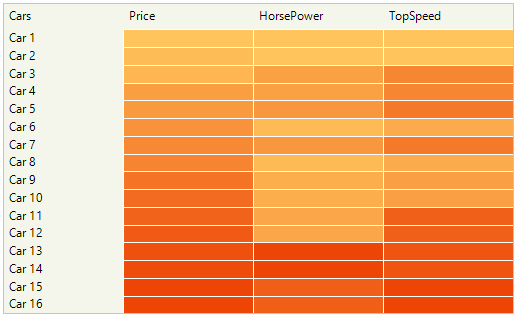
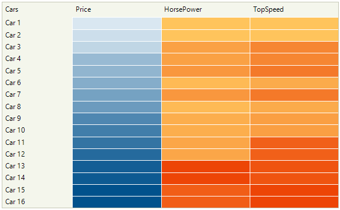
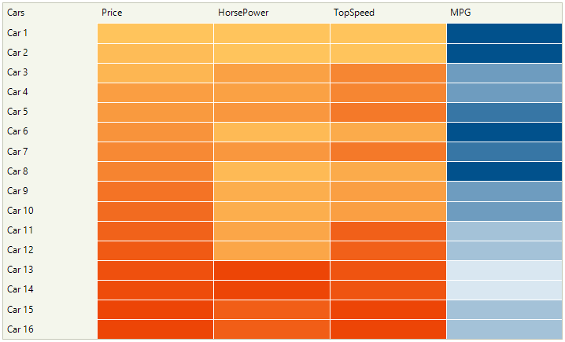
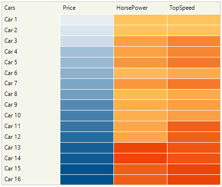

# Colorizers

This topic aims to get you familiar with all types of colorizers you may use to change the visualization of RadHeatMap. Depending on the heatmap's [Definition](), the colorizer may be different according to the data that should be displayed. By default, **RadTreeMap** uses a **HeatMapGradientColorizer** with two **GradientStop**s.

## Colorizers in a Horizontal/Vertical Definition

In the scenario of Horizontal/Vertical Definition, the colorizer is defined in the MemberMappings of the corresponding definition.

>note The only difference between the two definitions is that for the horizontal definition each item gets a row, while the vertical – a column.

Let's start with the following Car class that will be used for the examples in this article:

<snippet id='heatmap-heatmapdefinitions-carclass-cs' />
<snippet id='heatmap-heatmapdefinitions-carclass-vb' />

Now, we will setup a HorizontalDefinition populated with cars like the following example:

<snippet id='heatmap-heatmapdefinitions-defaultcolorizer-cs' />
<snippet id='heatmap-heatmapdefinitions-defaultcolorizer-vb' />

>caption Default HeatMapGradientColorizer

As you may have already noticed, there is no colorizer to be seen in the provided code so far. When there is no colorizer specified, RadHeatMap uses a default one. It is a **HeatMapGradientColorizer**.

### HeatMapValueGradientColorizer

A colorizer, which contains a set of **GradientStops**. It chooses a color to be applied according to the values of the items in RadHeatMap and the colorizer’s gradient stops. Depending on the **IsAbsolute** property value, each GradientStop.**Position** value can be absolute or relative. A colorizer is relative when **IsAbsolute** is **false**, which is its default value. In this mode, the colorizer scans all values to find the smallest and greatest ones. In the same manner, these two correspond to GradientStop.**Position** 0 and 1. Also, by setting the RangeMinimum and RangeMaximum properties, you are specifying which are the actual minimum and maximum values, i.e. you are defining some values to correspond to offsets 0 and 1. In absolute mode, the offsets are set to the actual values, which are expected for the items in RadHeatMap.

>note When the same instance of any relative colorizer is applied to more than one row or column, the colorizer shares the minimum and maximum between all the assigned rows or columns.

Now, this is how a HeatMapGradientColorizer is defined for one of the MemberMappings for the definition:

<snippet id='heatmap-heatmapdefinitions-changecolorizer-cs' />
<snippet id='heatmap-heatmapdefinitions-changecolorizer-vb' />

Here is the observed result:

### HeatMapRangeColorizer

A colorizer, which uses a set of colors, where each of them corresponds to a range. Similarly to HeatMapGradientColorizer, the **HeatMapRangeColorizer** can work in absolute and relative mode. In absolute mode, the range is specified in actual values, the ones expected for the items to have. In relative mode, the range is always between 0 and 1. The HeatMapRangeColorizer has no property which corresponds to RangeMinimum and RangeMaximum and the colorizer always looks for the smallest and greatest values.

Let’s define an absolute **HeatMapRangeColorizer** and apply it to Miles per Gallon column.

<snippet id='heatmap-heatmapdefinitions-rangecolorizer-cs' />
<snippet id='heatmap-heatmapdefinitions-rangecolorizer-vb' />

Here is the observed result:

### HeatMapDesaturationColorizer

It reduces the level of saturation of a given **StartColor** depending on the HeatMapItem's value. The level of desaturation can be controlled using **From** and **To** properties. When the From property equals 0 it means that you can get a completely white color for the smallest value. If it is set to a value greater than 0, for example 0.1, the smallest value will have a really faded StartColor but not completely white. On the other hand, if To is set to 0.8, you will get a somewhat faded StartColor for the greatest value. Like the other colorizers, the **HeatMapDesaturationColorizer** has relative and absolute modes which are set again through the IsAbsolute property. In relative, the colorizer looks for the smallest and greatest values from the items, or they can be set through the **RangeMinimum** and **RangeMaximum** colors. In absolute mode, these two properties have to be set or, otherwise, RadHeatMap will throw an exception.

This is how HeatMapDesaturationColorizer is defined and applied:

<snippet id='heatmap-heatmapdefinitions-desaturationcolorizer-cs' />
<snippet id='heatmap-heatmapdefinitions-desaturationcolorizer-vb' />

And the result is illustrated below:

## See Also

* [Structure]() 
* [Custom Painting]()  

