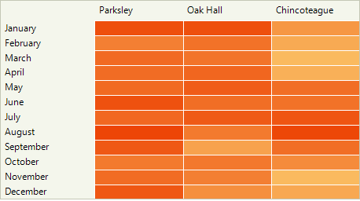

# Custom Painting

RadHeatMap renders directly its cells calculating the rectangle that each cell occupies according to the column index and row index. The control offers a convenient API that allows customizing the rendering process over the data cells and header cells. 

Let's start the example with the following initial setup:

{{source=..\SamplesCS\HeatMap\HeatMapCustomPainting.cs region=InitialState}} 
{{source=..\SamplesVB\HeatMap\HeatMapCustomPainting.vb region=InitialState}} 

````C#

	public void PopulateHeatMap()
	{
		CategoricalDefinition categoricalDefinition1 = new CategoricalDefinition();
		categoricalDefinition1.ColumnGroupMember = "District";
		categoricalDefinition1.DataSource = AddData();
		categoricalDefinition1.RowGroupMember = "Month";
		categoricalDefinition1.ValueMember = "CallsNumber";

		HeatMapGradientColorizer colorizer = new HeatMapGradientColorizer()
		{
			RangeMinimum = 2,
			RangeMaximum = 108,
			GradientStops =
			{
				new Telerik.WinControls.Drawing.GradientStop(){ Position = 0.0f , Color = ColorTranslator.FromHtml("#FFFFFFFF")},
				new Telerik.WinControls.Drawing.GradientStop(){ Position = 0.2f , Color = ColorTranslator.FromHtml("#FFFFEA84")},
				new Telerik.WinControls.Drawing.GradientStop(){ Position = 1.0f , Color = ColorTranslator.FromHtml("#FFED4506")},
			}
		};

		categoricalDefinition1.Colorizer = colorizer;
		this.radHeatMap1.Definition = categoricalDefinition1;

	}

	public BindingSource AddData()
	{
		BindingSource data = new BindingSource();
		data.Add(new PlotInfo("Parksley", "January", 103));
		data.Add(new PlotInfo("Parksley", "February", 78));
		data.Add(new PlotInfo("Parksley", "March", 89));
		data.Add(new PlotInfo("Parksley", "April", 88));
		data.Add(new PlotInfo("Parksley", "May", 89));
		data.Add(new PlotInfo("Parksley", "June", 102));
		data.Add(new PlotInfo("Parksley", "July", 90));
		data.Add(new PlotInfo("Parksley", "August", 108));
		data.Add(new PlotInfo("Parksley", "September", 98));
		data.Add(new PlotInfo("Parksley", "October", 81));
		data.Add(new PlotInfo("Parksley", "November", 88));
		data.Add(new PlotInfo("Parksley", "December", 99));

		data.Add(new PlotInfo("Oak Hall", "January", 103));
		data.Add(new PlotInfo("Oak Hall", "February", 85));
		data.Add(new PlotInfo("Oak Hall", "March", 84));
		data.Add(new PlotInfo("Oak Hall", "April", 91));
		data.Add(new PlotInfo("Oak Hall", "May", 96));
		data.Add(new PlotInfo("Oak Hall", "June", 87));
		data.Add(new PlotInfo("Oak Hall", "July", 97));
		data.Add(new PlotInfo("Oak Hall", "August", 81));
		data.Add(new PlotInfo("Oak Hall", "September", 60));
		data.Add(new PlotInfo("Oak Hall", "October", 82));
		data.Add(new PlotInfo("Oak Hall", "November", 78));
		data.Add(new PlotInfo("Oak Hall", "December", 70));

		data.Add(new PlotInfo("Chincoteague", "January", 66));
		data.Add(new PlotInfo("Chincoteague", "February", 56));
		data.Add(new PlotInfo("Chincoteague", "March", 48));
		data.Add(new PlotInfo("Chincoteague", "April", 53));
		data.Add(new PlotInfo("Chincoteague", "May", 87));
		data.Add(new PlotInfo("Chincoteague", "June", 85));
		data.Add(new PlotInfo("Chincoteague", "July", 100));
		data.Add(new PlotInfo("Chincoteague", "August", 107));
		data.Add(new PlotInfo("Chincoteague", "September", 87));
		data.Add(new PlotInfo("Chincoteague", "October", 72));
		data.Add(new PlotInfo("Chincoteague", "November", 48));
		data.Add(new PlotInfo("Chincoteague", "December", 57));

		return data;
	}
	public class PlotInfo
	{
		public PlotInfo(string district, string month, double calls)
		{
			this.District = district;
			this.Month = month;
			this.CallsNumber = calls;
		}

		public string District { get; set; }
		public string Month { get; set; }
		public double CallsNumber { get; set; }
	}

````
````VB.NET
    Public Sub PopulateHeatMap()
        Dim categoricalDefinition1 As CategoricalDefinition = New CategoricalDefinition()
        categoricalDefinition1.ColumnGroupMember = "District"
        categoricalDefinition1.DataSource = AddData()
        categoricalDefinition1.RowGroupMember = "Month"
        categoricalDefinition1.ValueMember = "CallsNumber"

        Dim colorizer As New HeatMapGradientColorizer With {
                .RangeMinimum = 2,
                .RangeMaximum = 108
            }
        colorizer.GradientStops.Add(New Telerik.WinControls.Drawing.GradientStop(ColorTranslator.FromHtml("#FFFFFFFF"), 0.0F))
        colorizer.GradientStops.Add(New Telerik.WinControls.Drawing.GradientStop(ColorTranslator.FromHtml("#FFFFEA84"), 0.2F))
        colorizer.GradientStops.Add(New Telerik.WinControls.Drawing.GradientStop(ColorTranslator.FromHtml("#FFED4506"), 1.0F))


        categoricalDefinition1.Colorizer = colorizer
        Me.radHeatMap1.Definition = categoricalDefinition1
    End Sub

    Public Function AddData() As BindingSource
        Dim data As BindingSource = New BindingSource()
        data.Add(New PlotInfo("Parksley", "January", 103))
        data.Add(New PlotInfo("Parksley", "February", 78))
        data.Add(New PlotInfo("Parksley", "March", 89))
        data.Add(New PlotInfo("Parksley", "April", 88))
        data.Add(New PlotInfo("Parksley", "May", 89))
        data.Add(New PlotInfo("Parksley", "June", 102))
        data.Add(New PlotInfo("Parksley", "July", 90))
        data.Add(New PlotInfo("Parksley", "August", 108))
        data.Add(New PlotInfo("Parksley", "September", 98))
        data.Add(New PlotInfo("Parksley", "October", 81))
        data.Add(New PlotInfo("Parksley", "November", 88))
        data.Add(New PlotInfo("Parksley", "December", 99))
        data.Add(New PlotInfo("Oak Hall", "January", 103))
        data.Add(New PlotInfo("Oak Hall", "February", 85))
        data.Add(New PlotInfo("Oak Hall", "March", 84))
        data.Add(New PlotInfo("Oak Hall", "April", 91))
        data.Add(New PlotInfo("Oak Hall", "May", 96))
        data.Add(New PlotInfo("Oak Hall", "June", 87))
        data.Add(New PlotInfo("Oak Hall", "July", 97))
        data.Add(New PlotInfo("Oak Hall", "August", 81))
        data.Add(New PlotInfo("Oak Hall", "September", 60))
        data.Add(New PlotInfo("Oak Hall", "October", 82))
        data.Add(New PlotInfo("Oak Hall", "November", 78))
        data.Add(New PlotInfo("Oak Hall", "December", 70))
        data.Add(New PlotInfo("Chincoteague", "January", 66))
        data.Add(New PlotInfo("Chincoteague", "February", 56))
        data.Add(New PlotInfo("Chincoteague", "March", 48))
        data.Add(New PlotInfo("Chincoteague", "April", 53))
        data.Add(New PlotInfo("Chincoteague", "May", 87))
        data.Add(New PlotInfo("Chincoteague", "June", 85))
        data.Add(New PlotInfo("Chincoteague", "July", 100))
        data.Add(New PlotInfo("Chincoteague", "August", 107))
        data.Add(New PlotInfo("Chincoteague", "September", 87))
        data.Add(New PlotInfo("Chincoteague", "October", 72))
        data.Add(New PlotInfo("Chincoteague", "November", 48))
        data.Add(New PlotInfo("Chincoteague", "December", 57))
        Return data
    End Function

    Public Class PlotInfo
        Public Sub New(ByVal district As String, ByVal month As String, ByVal calls As Double)
            Me.District = district
            Me.Month = month
            Me.CallsNumber = calls
        End Sub

        Public Property District As String
        Public Property Month As String
        Public Property CallsNumber As Double
    End Class 

````

{{endregion}}

The achieved result is illustrated below:


## CellPainting 

Handling the **CellPainting** event offers full control over the rendering process for a particular cell. The **HeatMapCellPaintingEventArgs** gives you access to the Graphics object and you can draw a hover rectangle like demonstrated below:

{{source=..\SamplesCS\HeatMap\HeatMapCustomPainting.cs region=HoverCellPainting}} 
{{source=..\SamplesVB\HeatMap\HeatMapCustomPainting.vb region=HoverCellPainting}} 

````C#

private void RadHeatMap1_CellPainting(object sender, HeatMapCellPaintingEventArgs e)
{
    CellIndex hoverIndex = this.radHeatMap1.HoveredCellIndex;
    if (e.Index == hoverIndex)
    {
        // Draw dark background below the cell, so the hover effect with transparency is clearly visible
        e.Graphics.FillRectangle(Brushes.Black, e.Bounds);

        e.BorderColor = e.BackColor;
        e.BackColor = Color.FromArgb(225, e.BackColor);
    }
    else if (e.ColumnIndex == hoverIndex.ColumnIndex || e.RowIndex == hoverIndex.RowIndex)
    {
        // Draw dark background below the cell, so the hover effect with transparency is clearly visible
        e.Graphics.FillRectangle(Brushes.Black, e.Bounds);
        e.BackColor = Color.FromArgb(220, e.BackColor);
    }
}

````
````VB.NET

Private Sub RadHeatMap1_CellPainting(ByVal sender As Object, ByVal e As HeatMapCellPaintingEventArgs)
    Dim hoverIndex As CellIndex = Me.radHeatMap1.HoveredCellIndex

    If e.Index = hoverIndex Then
        e.Graphics.FillRectangle(Brushes.Black, e.Bounds)
        e.BorderColor = e.BackColor
        e.BackColor = Color.FromArgb(225, e.BackColor)
    ElseIf e.ColumnIndex = hoverIndex.ColumnIndex OrElse e.RowIndex = hoverIndex.RowIndex Then
        e.Graphics.FillRectangle(Brushes.Black, e.Bounds)
        e.BackColor = Color.FromArgb(220, e.BackColor)
    End If
End Sub

````

{{endregion}}


The **CellPainted** event occurs when a cell has already been painted.

>note RadHeatMap offers the **DisplayCellText** property which enables the cell's text once it is set to true.

## HeaderCellPainting

The **HeaderCellPainting** event allows you to draw over the header cells in a similar way like for the data cells with values: 

{{source=..\SamplesCS\HeatMap\HeatMapCustomPainting.cs region=HoverHeaderPainting}} 
{{source=..\SamplesVB\HeatMap\HeatMapCustomPainting.vb region=HoverHeaderPainting}} 

````C#

private void RadHeatMap1_HeaderCellPainting(object sender, HeatMapHeaderCellPaintingEventArgs e)
{
    CellIndex selectedIndex = this.radHeatMap1.SelectedCellIndex;
    if (e.ColumnIndex == selectedIndex.ColumnIndex || e.RowIndex == selectedIndex.RowIndex)
    {
        e.BackColor = Color.FromArgb(this.radHeatMap1.Definition.GetColor(selectedIndex));
        e.ForeColor = this.radHeatMap1.Definition.GetForeColor(e.BackColor);
    }
    else if (e.Index == this.radHeatMap1.HoveredCellIndex)
    {
        // Get first cell of the row/column and extract its bacoground and foreground colors.
        int rowIndex = e.RowIndex;
        int columnIndex = e.ColumnIndex;
        if (e.RowIndex == -1) // header cells have -1 index.
        {
            // Column header
            rowIndex = 0;
        }

        if (e.ColumnIndex == -1) // header cells have -1 index.
        {
            // Row header
            columnIndex = 0;
        }

        // If both row and column indices are -1, we are hovering the Description content cell,
        // which is positioned in the corner between row and column header cells.                
        CellIndex index = new CellIndex(rowIndex, columnIndex);
        e.BackColor = Color.FromArgb(this.radHeatMap1.Definition.GetColor(index));
        e.ForeColor = this.radHeatMap1.Definition.GetForeColor(e.BackColor);
    }
}

````
````VB.NET

Private Sub RadHeatMap1_HeaderCellPainting(ByVal sender As Object, ByVal e As HeatMapHeaderCellPaintingEventArgs)
    Dim selectedIndex As CellIndex = Me.radHeatMap1.SelectedCellIndex

    If e.ColumnIndex = selectedIndex.ColumnIndex OrElse e.RowIndex = selectedIndex.RowIndex Then
        e.BackColor = Color.FromArgb(Me.radHeatMap1.Definition.GetColor(selectedIndex))
        e.ForeColor = Me.radHeatMap1.Definition.GetForeColor(e.BackColor)
    ElseIf e.Index = Me.radHeatMap1.HoveredCellIndex Then
        Dim rowIndex As Integer = e.RowIndex
        Dim columnIndex As Integer = e.ColumnIndex

        If e.RowIndex = -1 Then
            rowIndex = 0
        End If

        If e.ColumnIndex = -1 Then
            columnIndex = 0
        End If

        Dim index As CellIndex = New CellIndex(rowIndex, columnIndex)
        e.BackColor = Color.FromArgb(Me.radHeatMap1.Definition.GetColor(index))
        e.ForeColor = Me.radHeatMap1.Definition.GetForeColor(e.BackColor)
    End If
End Sub

````

{{endregion}}




The **HeaderCellPainted** event occurs when a row/column header cell has already been painted.

## See Also

* [Structure]()  
* [Colorizers]()

