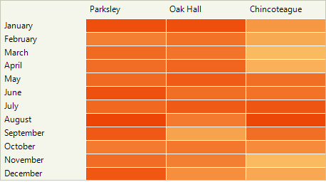

# Custom Painting

RadHeatMap renders directly its cells calculating the rectangle that each cell occupies according to the column index and row index. The control offers a convenient API that allows customizing the rendering process over the data cells and header cells. 

Let's start the example with the following initial setup:

<snippet id='heatmap-heatmapcustompainting-initialstate-cs' />
<snippet id='heatmap-heatmapcustompainting-initialstate-vb' />

The achieved result is illustrated below:

## CellPainting 

Handling the **CellPainting** event offers full control over the rendering process for a particular cell. The **HeatMapCellPaintingEventArgs** gives you access to the Graphics object and you can draw a hover rectangle like demonstrated below:

<snippet id='heatmap-heatmapcustompainting-hovercellpainting-cs' />
<snippet id='heatmap-heatmapcustompainting-hovercellpainting-vb' />

The **CellPainted** event occurs when a cell has already been painted.

>note RadHeatMap offers the **DisplayCellText** property which enables the cell's text once it is set to true.

## HeaderCellPainting

The **HeaderCellPainting** event allows you to draw over the header cells in a similar way like for the data cells with values: 

<snippet id='heatmap-heatmapcustompainting-hoverheaderpainting-cs' />
<snippet id='heatmap-heatmapcustompainting-hoverheaderpainting-vb' />

The **HeaderCellPainted** event occurs when a row/column header cell has already been painted.

## See Also

* [Structure]()  
* [Colorizers]()

