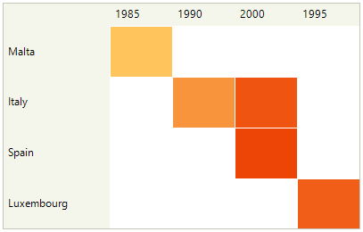
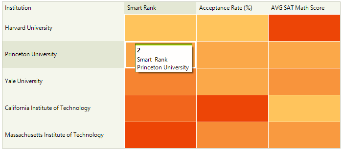
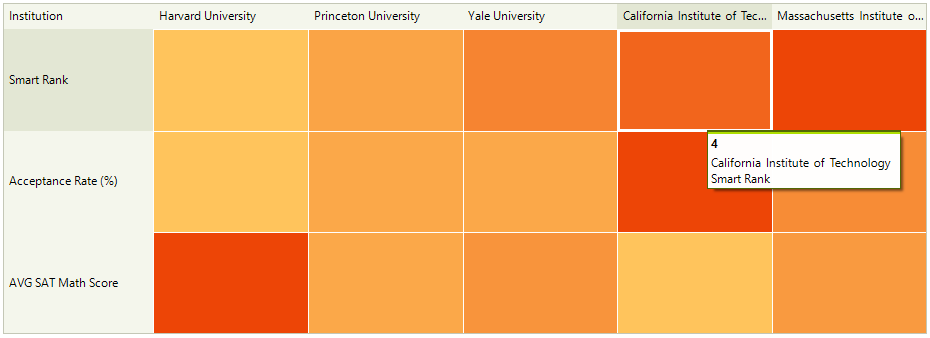

# Definition Types

You can visualize the data differently based on the heat map definition. There are two main definitions types - Categorical and Horizontal/Vertical. 

## CategoricalDefinition

Used to group the data by rows and columns. It has a single colorizer (**HeatMapGradientColorizer** with two **GradientStop**s) for all content cells. The cells are colorized by their value which is extracted from the ValueMember field. The **CategoricalDefinition** requires the following properties to be setup for proper data binding:

* **ColumnGroupMember**: Gets or sets the name of the property which determines the column-category of a cell. 
* **RowGroupMember**: Gets or sets the name of the property which determines the row-category of a cell. 
* **ValueMember**: Gets or sets the name of the property which determines the value of a cell. 
* **DataSource**: Specifies the data collection.

{{source=..\SamplesCS\HeatMap\HeatMapDefinitions.cs region=CategoricalDefinition}} 
{{source=..\SamplesVB\HeatMap\HeatMapDefinitions.vb region=CategoricalDefinition}} 

````C#
DataTable countryInfoTable = new DataTable();
countryInfoTable.Columns.Add("Country", typeof(string));
countryInfoTable.Columns.Add("Year", typeof(int));
countryInfoTable.Columns.Add("HDI", typeof(float));

countryInfoTable.Rows.Add("Malta", 1985, 0.720);
countryInfoTable.Rows.Add("Italy", 1990, 0.764);
countryInfoTable.Rows.Add("Spain", 2000, 0.839);
countryInfoTable.Rows.Add("Italy", 2000, 0.825);
countryInfoTable.Rows.Add("Luxembourg", 1995, 0.816);

CategoricalDefinition categoricalDefinition1 = new CategoricalDefinition();
categoricalDefinition1.ColumnGroupMember = "Year";
categoricalDefinition1.DataSource = countryInfoTable;
categoricalDefinition1.RowGroupMember = "Country";
categoricalDefinition1.ValueMember = "HDI";

this.radHeatMap1.Definition = categoricalDefinition1;
     
````
````VB.NET

Dim countryInfoTable As DataTable = New DataTable()
countryInfoTable.Columns.Add("Country", GetType(String))
countryInfoTable.Columns.Add("Year", GetType(Integer))
countryInfoTable.Columns.Add("HDI", GetType(Single))
countryInfoTable.Rows.Add("Malta", 1985, 0.72)
countryInfoTable.Rows.Add("Italy", 1990, 0.764)
countryInfoTable.Rows.Add("Spain", 2000, 0.839)
countryInfoTable.Rows.Add("Italy", 2000, 0.825)
countryInfoTable.Rows.Add("Luxembourg", 1995, 0.816)
Dim categoricalDefinition1 As CategoricalDefinition = New CategoricalDefinition()
categoricalDefinition1.ColumnGroupMember = "Year"
categoricalDefinition1.DataSource = countryInfoTable
categoricalDefinition1.RowGroupMember = "Country"
categoricalDefinition1.ValueMember = "HDI"
Me.radHeatMap1.Definition = categoricalDefinition1

````

{{endregion}} 




## HorizontalDefinition

Each column is represented by a **MemberMapping**. The latter has **Header**, **ValueMember** and **Colorizer** properties that allow you to have different value member and colorizer for each column of data. The default Colorizer created for the MemberMapping is a **HeatMapGradientColorizer** with two **GradientStop**s.

{{source=..\SamplesCS\HeatMap\HeatMapDefinitions.cs region=HorizontalDefinition}} 
{{source=..\SamplesVB\HeatMap\HeatMapDefinitions.vb region=HorizontalDefinition}} 

````C#

DataTable institutionTable = new DataTable();
institutionTable.Columns.Add("Name", typeof(string));
institutionTable.Columns.Add("SmartRank", typeof(double));
institutionTable.Columns.Add("AcceptanceRate",typeof(double));
institutionTable.Columns.Add("AverageSATMathScore", typeof(double));
institutionTable.Rows.Add("Harvard University", 1,8, 27594);
institutionTable.Rows.Add("Princeton University",2,10,7724);
institutionTable.Rows.Add("Yale University", 3, 10, 11701);
institutionTable.Rows.Add("California Institute of Technology",4,17,2175);
institutionTable.Rows.Add("Massachusetts Institute of Technology", 5,12,10566);

HorizontalDefinition horizontalDefinition1 = new HorizontalDefinition(); 
horizontalDefinition1.DataSource = institutionTable;
horizontalDefinition1.HeaderMember = "Name";
radHeatMap1.Definition = horizontalDefinition1;
radHeatMap1.DescriptionContent = "Institution";
radHeatMap1.RowHeaderWidth = 250;

MemberMapping memberMapping1 = new MemberMapping();
memberMapping1.Header = "Smart Rank";
memberMapping1.ValueMember = "SmartRank";
MemberMapping memberMapping2 = new MemberMapping();
memberMapping2.Header = "Acceptance Rate (%)";
memberMapping2.ValueMember = "AcceptanceRate";
MemberMapping memberMapping3 = new MemberMapping();
memberMapping3.Header = "AVG SAT Math Score";
memberMapping3.ValueMember = "AverageSATMathScore";

horizontalDefinition1.MemberMappings.Add(memberMapping1);
horizontalDefinition1.MemberMappings.Add(memberMapping2);
horizontalDefinition1.MemberMappings.Add(memberMapping3);
        
````
````VB.NET

Dim institutionTable As DataTable = New DataTable()
institutionTable.Columns.Add("Name", GetType(String))
institutionTable.Columns.Add("SmartRank", GetType(Double))
institutionTable.Columns.Add("AcceptanceRate", GetType(Double))
institutionTable.Columns.Add("AverageSATMathScore", GetType(Double))
institutionTable.Rows.Add("Harvard University", 1, 8, 27594)
institutionTable.Rows.Add("Princeton University", 2, 10, 7724)
institutionTable.Rows.Add("Yale University", 3, 10, 11701)
institutionTable.Rows.Add("California Institute of Technology", 4, 17, 2175)
institutionTable.Rows.Add("Massachusetts Institute of Technology", 5, 12, 10566)
Dim horizontalDefinition1 As HorizontalDefinition = New HorizontalDefinition()
horizontalDefinition1.DataSource = institutionTable
horizontalDefinition1.HeaderMember = "Name"
radHeatMap1.Definition = horizontalDefinition1
radHeatMap1.DescriptionContent = "Institution"
radHeatMap1.RowHeaderWidth = 250
Dim memberMapping1 As MemberMapping = New MemberMapping()
memberMapping1.Header = "Smart Rank"
memberMapping1.ValueMember = "SmartRank"
Dim memberMapping2 As MemberMapping = New MemberMapping()
memberMapping2.Header = "Acceptance Rate (%)"
memberMapping2.ValueMember = "AcceptanceRate"
Dim memberMapping3 As MemberMapping = New MemberMapping()
memberMapping3.Header = "AVG SAT Math Score"
memberMapping3.ValueMember = "AverageSATMathScore"
horizontalDefinition1.MemberMappings.Add(memberMapping1)
horizontalDefinition1.MemberMappings.Add(memberMapping2)
horizontalDefinition1.MemberMappings.Add(memberMapping3)

````

{{endregion}}



## VerticalDefinition

It is like the horizontal definition, but here the MemberMappings are oriented by rows. 

{{source=..\SamplesCS\HeatMap\HeatMapDefinitions.cs region=VerticalDefinition}} 
{{source=..\SamplesVB\HeatMap\HeatMapDefinitions.vb region=VerticalDefinition}} 

````C#

DataTable institutionTable = new DataTable();
institutionTable.Columns.Add("Name", typeof(string));
institutionTable.Columns.Add("SmartRank", typeof(double));
institutionTable.Columns.Add("AcceptanceRate", typeof(double));
institutionTable.Columns.Add("AverageSATMathScore", typeof(double));
institutionTable.Rows.Add("Harvard University", 1, 8, 27594);
institutionTable.Rows.Add("Princeton University", 2, 10, 7724);
institutionTable.Rows.Add("Yale University", 3, 10, 11701);
institutionTable.Rows.Add("California Institute of Technology", 4, 17, 2175);
institutionTable.Rows.Add("Massachusetts Institute of Technology", 5, 12, 10566);

VerticalDefinition verticalDefinition1 = new VerticalDefinition();
verticalDefinition1.DataSource = institutionTable;
verticalDefinition1.HeaderMember = "Name";
radHeatMap1.Definition = verticalDefinition1;
radHeatMap1.DescriptionContent = "Institution";
radHeatMap1.RowHeaderWidth = 150;

MemberMapping memberMapping1 = new MemberMapping();
memberMapping1.Header = "Smart Rank";
memberMapping1.ValueMember = "SmartRank";
MemberMapping memberMapping2 = new MemberMapping();
memberMapping2.Header = "Acceptance Rate (%)";
memberMapping2.ValueMember = "AcceptanceRate";
MemberMapping memberMapping3 = new MemberMapping();
memberMapping3.Header = "AVG SAT Math Score";
memberMapping3.ValueMember = "AverageSATMathScore";

verticalDefinition1.MemberMappings.Add(memberMapping1);
verticalDefinition1.MemberMappings.Add(memberMapping2);
verticalDefinition1.MemberMappings.Add(memberMapping3);    

````
````VB.NET

Dim institutionTable As DataTable = New DataTable()
institutionTable.Columns.Add("Name", GetType(String))
institutionTable.Columns.Add("SmartRank", GetType(Double))
institutionTable.Columns.Add("AcceptanceRate", GetType(Double))
institutionTable.Columns.Add("AverageSATMathScore", GetType(Double))
institutionTable.Rows.Add("Harvard University", 1, 8, 27594)
institutionTable.Rows.Add("Princeton University", 2, 10, 7724)
institutionTable.Rows.Add("Yale University", 3, 10, 11701)
institutionTable.Rows.Add("California Institute of Technology", 4, 17, 2175)
institutionTable.Rows.Add("Massachusetts Institute of Technology", 5, 12, 10566)
Dim verticalDefinition1 As VerticalDefinition = New VerticalDefinition()
verticalDefinition1.DataSource = institutionTable
verticalDefinition1.HeaderMember = "Name"
radHeatMap1.Definition = verticalDefinition1
radHeatMap1.DescriptionContent = "Institution"
radHeatMap1.RowHeaderWidth = 150
Dim memberMapping1 As MemberMapping = New MemberMapping()
memberMapping1.Header = "Smart Rank"
memberMapping1.ValueMember = "SmartRank"
Dim memberMapping2 As MemberMapping = New MemberMapping()
memberMapping2.Header = "Acceptance Rate (%)"
memberMapping2.ValueMember = "AcceptanceRate"
Dim memberMapping3 As MemberMapping = New MemberMapping()
memberMapping3.Header = "AVG SAT Math Score"
memberMapping3.ValueMember = "AverageSATMathScore"
verticalDefinition1.MemberMappings.Add(memberMapping1)
verticalDefinition1.MemberMappings.Add(memberMapping2)
verticalDefinition1.MemberMappings.Add(memberMapping3)

````

{{endregion}}



## See Also

* [Structure]() 

