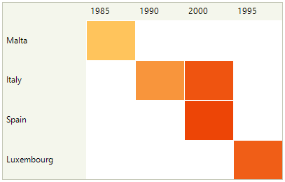
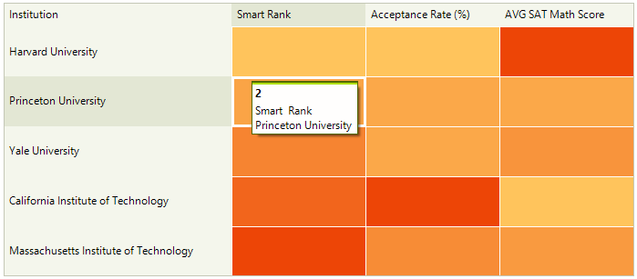

# Definition Types

You can visualize the data differently based on the heat map definition. There are two main definition types - Categorical and Horizontal/Vertical. 

## CategoricalDefinition

Used to group the data by rows and columns. It has a single colorizer (**HeatMapGradientColorizer** with two **GradientStop**s) for all content cells. The cells are colorized by their value which is extracted from the ValueMember field. The **CategoricalDefinition** requires the following properties to be setup for proper data binding:

* **ColumnGroupMember**: Gets or sets the name of the property which determines the column-category of a cell. 
* **RowGroupMember**: Gets or sets the name of the property which determines the row-category of a cell. 
* **ValueMember**: Gets or sets the name of the property which determines the value of a cell. 
* **DataSource**: Specifies the data collection.

<snippet id='heatmap-heatmapdefinitions-categoricaldefinition-cs' />
<snippet id='heatmap-heatmapdefinitions-categoricaldefinition-vb' />

## HorizontalDefinition

Each column is represented by a **MemberMapping**. The latter has **Header**, **ValueMember** and **Colorizer** properties that allow you to have different value members and colorizer for each column of data. The default Colorizer created for the MemberMapping is a **HeatMapGradientColorizer** with two **GradientStop**s.

<snippet id='heatmap-heatmapdefinitions-horizontaldefinition-cs' />
<snippet id='heatmap-heatmapdefinitions-horizontaldefinition-vb' />

## VerticalDefinition

It is like the horizontal definition, but here the MemberMappings are oriented by rows. 

<snippet id='heatmap-heatmapdefinitions-verticaldefinition-cs' />
<snippet id='heatmap-heatmapdefinitions-verticaldefinition-vb' />

## See Also

* [Structure]() 

