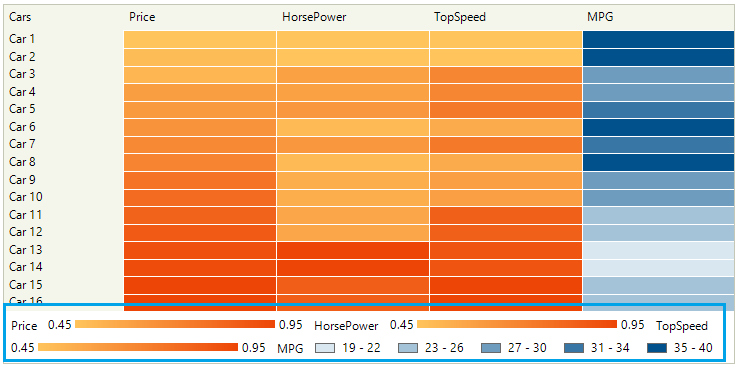
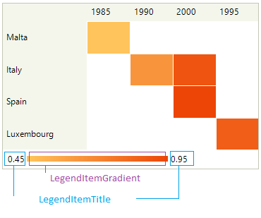
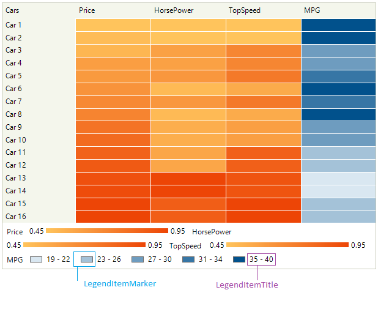

# Legend

As of R2 2023 SP1 RadHeatMap supports legend items. The **HeatMapLegendElement** generates its items by default. This behavior can be controlled by the **AutoGenerateItems** property that is offered by the legend element. Set the RadHeatMap.**ShowLegend** property to **true** to enable the legend:



## Structure

The **HeatMapLegendElement** consists of a **LegendTitleElement** and a **WrapLayoutPanel** that contains a collection of legend item elements. Depending on the heatmap [definition](), the appropriate legend item element is created. When using a **CategoricalDefinition**, one LegendGradientItemElement is created. For the case with a MemberDefinition (either **HorizontalDefinition** or **VerticalDefinition**), a **LegendItemHeaderElement** and a **LegendGradientItemElement** is created for each mapping like it is demonstrated in the above image.

* **LegendGradientItemElement**: contains two **LegendItemTitle**s (representing the **FromElement** and **ToElement** that displays the "From" and "To" values respectively) , **LegendItemGradient**.

>caption LegendGradientItemElement



>note The LegendGradientItemElement.**ValueFormat** property allows you to format how the from/to values are formatted.

* **LegendRangeItemElement**: used with a **HeatMapRangeColorizer**. It contains a **LegendItemTitle** and a **LegendItemMarker** with the respective from/to values.

>caption LegendRangeItemElement



## Public Legend API

|Property|Description|
|----|----|
|**AutoGenerateItems**|Gets or sets a value indicating whether to generate legend items automatically. If true (default value), the legend items are automatically created when the RadHeatMap.**ShowLegend** property is set to true. The VisualItemCreating event is fired for each created item. If false, the legend items are not created and the developer adds them programmatically.|
|**PanelElement**|Gets the panel element used for organizing the legend items.|
|**TitleElement**|Gets the title element.|
|**LegendTitle**|Gets or sets the legend title text.|
|**TitlePosition**|Gets or sets the position of the legend title.|
|**ValueFormat**|Gets or sets the format for numeric values.|

 

## Customizing the Legend

The LegendElement.**VisualItemCreating** event allows you to control whether a legend item will be created and settings to be initialized:

####  Legend

{{source=..\SamplesCS\HeatMap\HeatMapDefinitions.cs region=DisplayLegend}} 
{{source=..\SamplesVB\HeatMap\HeatMapDefinitions.vb region=DisplayLegend}} 

````C#
        public void DisplyLegend()
        {
            this.radHeatMap1.LegendElement.VisualItemCreating += this.LegendElement_VisualItemCreating;
            this.radHeatMap1.ShowLegend = true;
        }

        private void LegendElement_VisualItemCreating(object sender, Telerik.WinControls.UI.HeatMap.LegendItemElementCreatingEventArgs e)
        {
            if (e.ItemElement is LegendGradientItemElement gradientElement)
            {
                gradientElement.From = 0.45;
                gradientElement.To = 0.95;
            }
        }

````
````VB.NET

    Public Sub DisplyLegend()
        AddHandler Me.radHeatMap1.LegendElement.VisualItemCreating, AddressOf Me.LegendElement_VisualItemCreating
        Me.radHeatMap1.ShowLegend = True
    End Sub

    Private Sub LegendElement_VisualItemCreating(ByVal sender As Object, ByVal e As Telerik.WinControls.UI.HeatMap.LegendItemElementCreatingEventArgs)
        Dim gradientElement As LegendGradientItemElement = TryCast(e.ItemElement, LegendGradientItemElement)

        If gradientElement IsNot Nothing Then
            gradientElement.From = 0.45
            gradientElement.[To] = 0.95
        End If
    End Sub
````

{{endregion}}


## See Also

* [Structure]()
* [Getting Started]()
* [Data Binding]()

