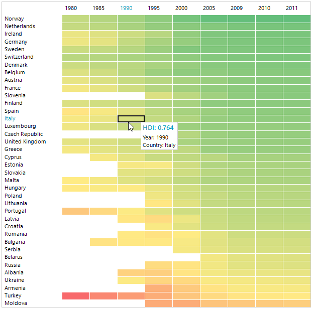

# WinForms HeatMap Overview

**RadHeatMap** can be used to visualize numeric data in a matrix like representation along two axes. Its purpose is to present the data in colored rectangles where the color of each represents the rectangle's value and makes it quite easy to perceive and compare all values.

## Key Features

* **Different visualization set up mechanisms**: You can visualize the data differently based on the heat map definition. There are two definitions types - **Categorical** and **Horizontal/Vertical**. Read more about this in the [Definition Types]() article.

* **Colorizers**: Each colorizer produces a collection of colors. RadHeatMap applies these colors to its children according to their values.  You can choose from the following list of available colorizers to customize the way your HeatMap looks:
	* **HeatMapGradientColorizer**: Represents a colorizer, which contains a set of GradientStops. It chooses the color to be applied to the RadHeatMap item's value and colorizer's gradient stops. Each GradientStop.Offset value can be absolute or relative (between 0 and 1) depending on the IsAbsolute property value.
	* **HeatMapRangeColorizer**: Represents a colorizer, which contains a set of HeatMapRangeColor objects.It chooses the brush to be applied according to the cell's value and the From and To values of each HeatMapRangeColor. The values of each HeatMapRangeColor can be absolute or relative (between 0 and 1) depending on the IsAbsolute property value.
	* **HeatMapGradientColorizer**: Represents a colorizer, which reduces the level of saturation of a given StartColor depending on the HeatMapItem value. The level of desaturation can be controlled using From and To properties. 
Read more about this in the [Colorizers]() article.

* **Selection**: The control provides a visual selection of items. Read more about this in the [Selection]() article.

* **Tooltips and Screentips**: RadHeatMap supports tooltips for its items. You can specify a tooltip template and display the details of the item itself. Read more about this in the [ToolTip]() article.

* **Row/Column Headers customization**: You can easily customize the labels inside the row/column headers. 

* **Labels**: You can show labels in the cells generated for the plotted data. 

* **Custom panting**: RadHeatMap allows you to customize the appearance of the control as well as its elements.

>tip Get started with the control with its [Getting Started]() help article that shows how to use it in a basic scenario.

## See Also

* [Structure]() 

