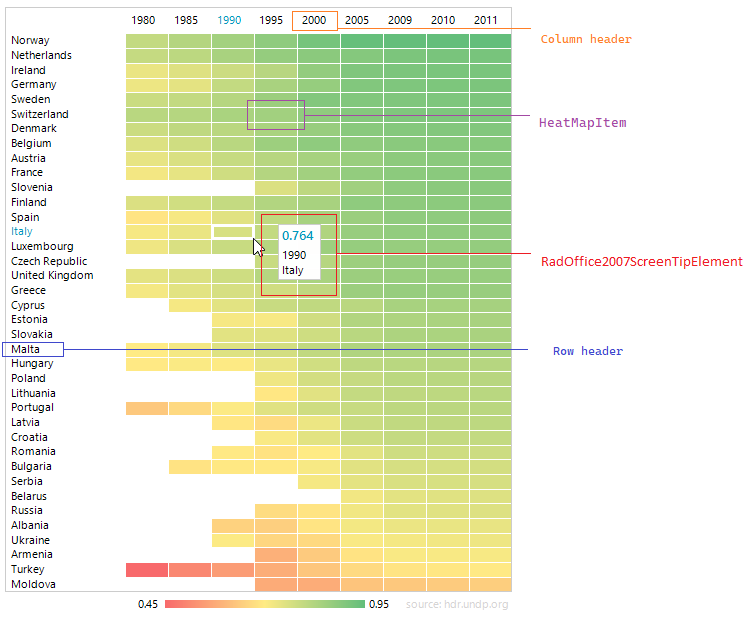
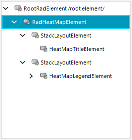

# Structure

This article describes the inner structure and organization of the elements which build **RadHeatMap**. 

**RadHeatMapElement** is the main element that contains one StackLayoutElement that holds the **HeatMapTitleElement** and another **StackLayoutElement** that holds the **HeatMapLegendElement**. 

The **HeatMapLegendElement** consists of a **LegendTitleElement**, and a **WrapLayoutPanel**.

RadHeatMap doesn't use visual elements but renders its cells directly according to the calculated rectangles. Every colored cell is represented by a **HeatMapItem** with a value. According to the applied colorizer, the cell rectangle is filled with the appropriate color. 

 
## Elements Hierarchy

## See Also

* [Structure]() 

