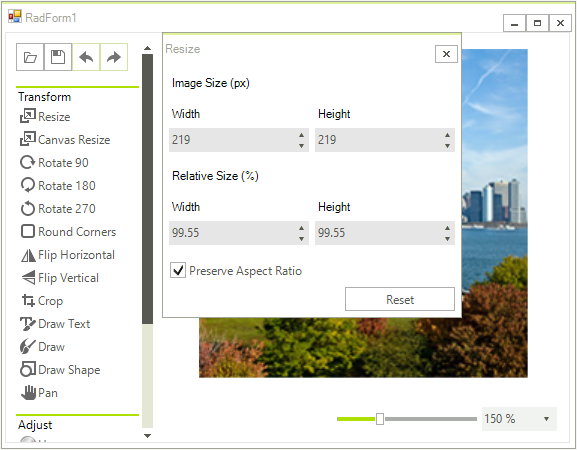

# Dialog factory

**RadImageEditor** uses **ImageEditorDialogFactory** to create objects that represent the dialogs. It requires only the **CreateDialog** method's implementation.

>note Make sure that a reference to **Telerik.WinControls.UI.ImageEditor.Dialogs** library is included in your project.
>

This factory is very useful when you want to create a custom dialog. You just need to create a custom factory that inherits from the **ImageEditorDialogFactory** and override the **CreateDialog** method in order to customize the default look of the dialog. For example, if you want to customize the **ResizeDialog** and set the checked state of the Preserve Aspect Ratio checkbox which by default is unchecked. 

````C#
public class CustomImageEditorDialogFactory : ImageEditorDialogFactory
{
    public override ImageEditorBaseDialog CreateDialog(Type type, RadImageEditorElement imageEditorElement)
    {
        ImageEditorBaseDialog dialog = base.CreateDialog(type, imageEditorElement);
        if (dialog is ResizeDialog)
        {
            ((RadCheckBox)dialog.Controls[0].Controls["radCheckBoxAspectRation"]).Checked = true;

        }
        return dialog;
    }
}

````
````VB.NET
Public Class CustomImageEditorDialogFactory
    Inherits ImageEditorDialogFactory

    Public Overrides Function CreateDialog(ByVal type As Type, ByVal imageEditorElement As RadImageEditorElement) As ImageEditorBaseDialog
        Dim dialog As ImageEditorBaseDialog = MyBase.CreateDialog(type, imageEditorElement)

        If TypeOf dialog Is ResizeDialog Then
            (CType(dialog.Controls(0).Controls("radCheckBoxAspectRation"), RadCheckBox)).Checked = True
        End If

        Return dialog
    End Function
End Class

```` 
Then, you need to apply this custom factory to your **RadImageEditor**:

````C#
this.radImageEditor1.ImageEditorElement.DialogFactory = new CustomImageEditorDialogFactory();

````
````VB.NET
Me.RadImageEditor1.ImageEditorElement.DialogFactory = New CustomImageEditorDialogFactory()

```` 
