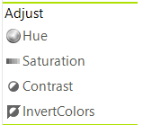
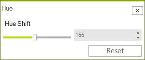
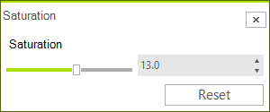
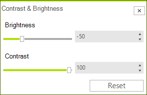
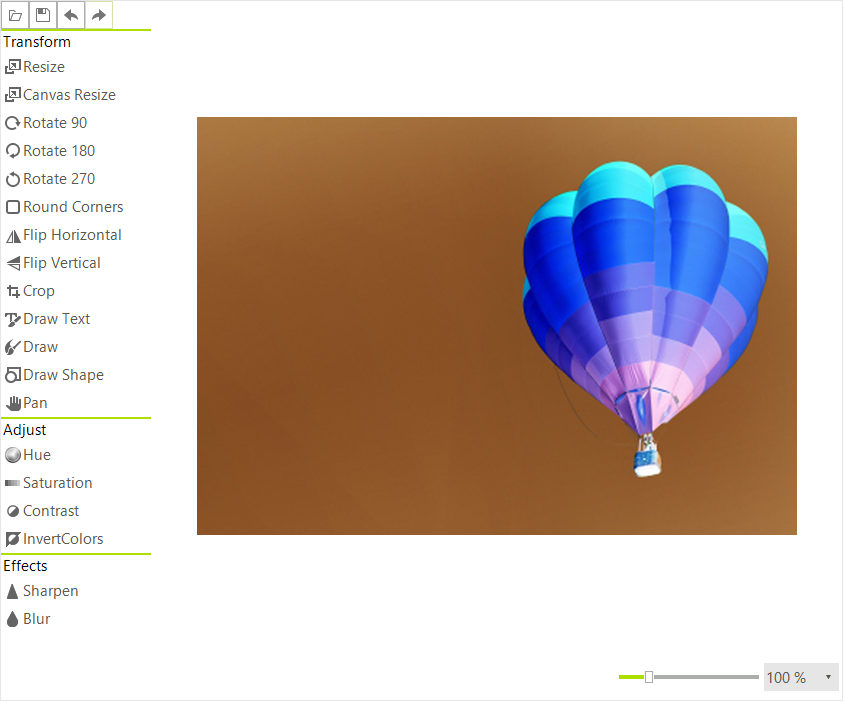

# Adjustments

__RadImageEditor__ supports the following image adjustments.

* [Hue](#hue-adjustment)
* [Saturation](#saturation-adjustment)
* [Contrast](#contrast-and-brightness-adjustment)
* [Invert Colors](#invert-colors) 

>caption Figure 1: Adjust section

# Hue adjustment

The Hue can be adjusted with the respective dialog, the values can be from 0 to 360.

>caption Figure 2: Hue Dialog

This can be done in the code behind as well.

<snippet id='image-editor-imageeditorfeatures-hue-cs' />
<snippet id='image-editor-imageeditorfeatures-hue-vb' />

# Saturation adjustment

The Saturation can be adjusted with the respective dialog the values can be from -100 to 100.

>caption Figure 3: Saturation Dialog

To do this programmatically use the __SetSaturation__ method.

<snippet id='image-editor-imageeditorfeatures-sat-cs' />
<snippet id='image-editor-imageeditorfeatures-sat-vb' />

# Contrast and Brightness adjustment

The Contrast and Brightness can be adjusted with the respective dialog the values can be from -100 to 100.

>caption Figure 4: Brightness and Contrast Dialog

This can be done in the code behind as well.

<snippet id='image-editor-imageeditorfeatures-contrast-cs' />
<snippet id='image-editor-imageeditorfeatures-contrast-vb' />

# Invert Colors

The Invert Color button just inverts the colors in the image pixel by pixel.
 
>caption Figure 5: Inverted Colors

This action can be performed in code with the following method.

<snippet id='image-editor-imageeditorfeatures-invert-cs' />
<snippet id='image-editor-imageeditorfeatures-invert-vb' />

# See Also

* [Getting Started]()
* [Structure]()
* [Properties and Events]()
