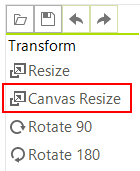
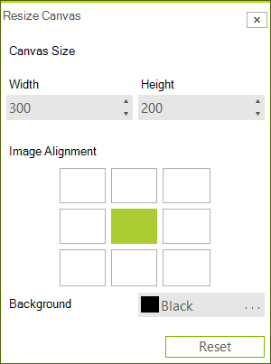

# Canvas Resize via UI

You can use the __Canvas Resize__ button which will open the canvas resize dialog. In the dialog you can set the alignment, the size, and the BackColor.




## Canvas Resize Programmatically

The following snippet shows how you can use the __ResizeCanvas__ method. You will need to specify the size, the alignment, and the BackColor.

#### Use the ResizeCanvas method

{{source=..\SamplesCS\ImageEditor\ImageEditorFeatures.cs region=Canvas}} 
{{source=..\SamplesVB\ImageEditor\ImageEditorFeatures.vb region=Canvas}}
````C#
radImageEditor1.ImageEditorElement.ResizeCanvas(500, 500, ContentAlignment.BottomRight, Color.Red);
radImageEditor1.ImageEditorElement.SaveState();

````
````VB.NET
radImageEditor1.ImageEditorElement.ResizeCanvas(500, 500, ContentAlignment.BottomRight, Color.Red)
radImageEditor1.ImageEditorElement.SaveState()

```` 


{{endregion}}

# See Also

* [Getting Started]()
* [Structure]()
* [Properties and Events]()
