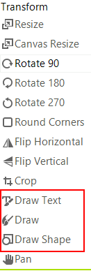
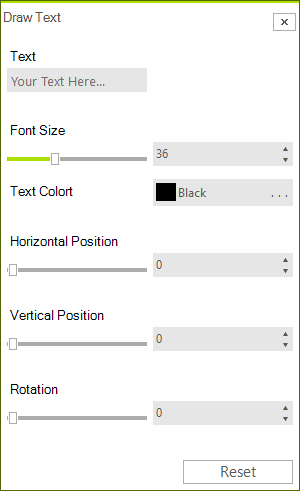
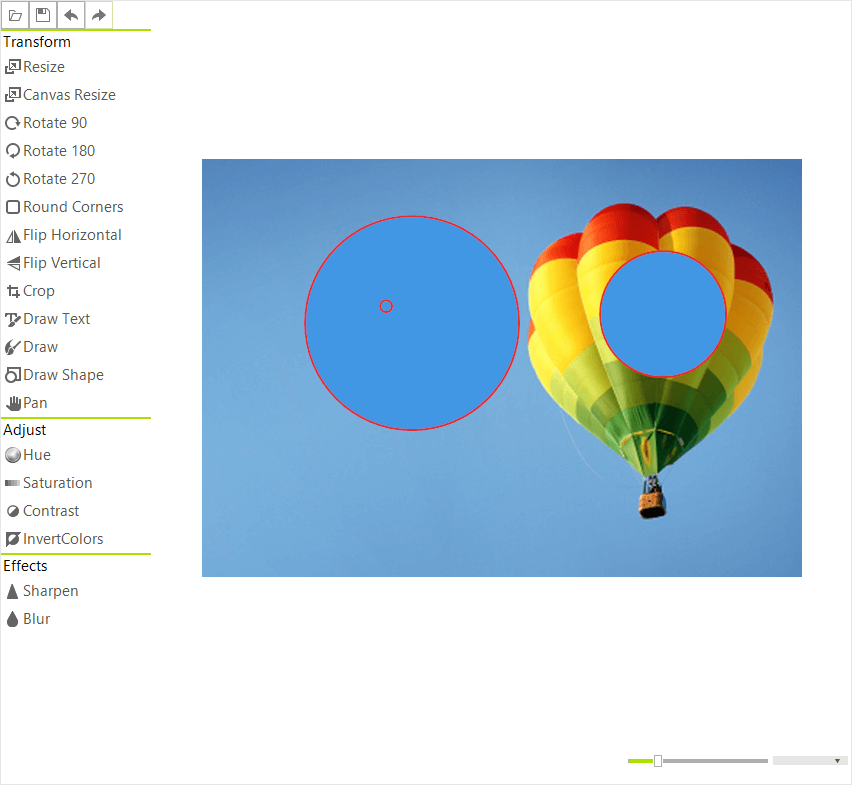
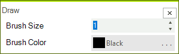

# Drawing

There are 3 options that you can use to draw on the image.

* [Draw Text](#draw-text)
* [Draw Shape](#draw-shape)
* [Draw with a Pen](#draw-with-a-pen)

>caption Figure 1: Draw Buttons




## Draw Text

To draw text click the button and the __DrawText__ dialog will be shown. In it you need to provide the text and set various other options.

>caption Figure 2: DrawText Dialog




### Drawing text programmatically

The following snippet shows how you can add text using the RadImageEditor API.

{{source=..\SamplesCS\ImageEditor\ImageEditorFeatures.cs region=DrawText}} 
{{source=..\SamplesVB\ImageEditor\ImageEditorFeatures.vb region=DrawText}}
````C#
radImageEditor1.ImageEditorElement.DrawString("Test", 12, Color.Red, 200, 200, 120);
radImageEditor1.ImageEditorElement.SaveState();

````
````VB.NET
radImageEditor1.ImageEditorElement.DrawString("Test", 12, Color.Red, 200, 200, 120)
radImageEditor1.ImageEditorElement.SaveState()

````


{{endregion}}

## Draw Shape

When the Draw Shape button is pressed the DrawShape dialog appears. In this dialog you can specify the type and the size of the shape. You can set its colors as well. 

>caption Figure 3: DrawShape Dialog


Once you are ready with the settings you can draw your shape with the mouse.

>caption Figure 4: Drawing Shapes



### Draw Shape Programmatically

To draw a shape in the code behind you need to provide a path. The bellow code demonstrates how you ca create a RoundRectShape: 

{{source=..\SamplesCS\ImageEditor\ImageEditorFeatures.cs region=DrawShape}} 
{{source=..\SamplesVB\ImageEditor\ImageEditorFeatures.vb region=DrawShape}}
````C#
RoundRectShape shape = new RoundRectShape();
Rectangle rect = new Rectangle(0, 0, 100, 100);
var path = shape.CreatePath(rect);
radImageEditor1.ImageEditorElement.DrawShape(path, Color.Red, Color.Green, 3);
radImageEditor1.ImageEditorElement.SaveState();

````
````VB.NET
Dim shape As New RoundRectShape()
Dim rect As New Rectangle(0, 0, 100, 100)
Dim path = shape.CreatePath(rect)
radImageEditor1.ImageEditorElement.DrawShape(path, Color.Red, Color.Green, 3)
radImageEditor1.ImageEditorElement.SaveState()

````


{{endregion}}

## Draw with a Pen

When the Draw button is pressed the Draw dialog appears. In this dialog you can specify the size and the color of the brush. One you are done you can directly star drawing on the image surface. 

>caption Figure 1: Draw Dialog




# See Also

* [Getting Started]()
* [Structure]()
* [Properties and Events]()