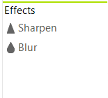
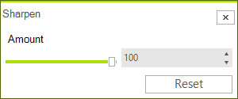
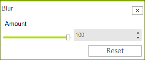

# Effects

Currently, RadImageEditor supports the following effects.

* [Sharpen](#sharpen)
* [Blur](#blur)

# Sharpen

Once you click the Sharpen button the sharpen dialog will appear and you will be able to apply the effect.

This can be performed programmatically as well. The following snippet shows how you can apply the Sharpen effect.

<snippet id='image-editor-imageeditorfeatures-sharp-cs' />
<snippet id='image-editor-imageeditorfeatures-sharp-vb' />

# Blur

Once you click the Blur button the blur dialog will appear and you will be able to apply the effect.

This can be performed programmatically as well. The following snippet shows how you can apply the Blur effect.

<snippet id='image-editor-imageeditorfeatures-blur-cs' />
<snippet id='image-editor-imageeditorfeatures-blur-vb' />

# See Also

* [Getting Started]()
* [Structure]()
* [Properties and Events]()
