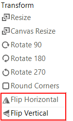

# Flip via the UI

You can use the rotate buttons to directly rotate the image. No dialog is shown in this case.

## Flip Programmatically

The following spinet shows how you can access and use the __RotateFlip__ method.

#### Flip programmatically

<snippet id='image-editor-imageeditorfeatures-flip-cs' />
<snippet id='image-editor-imageeditorfeatures-flip-vb' />

# See Also

* [Getting Started]()
* [Structure]()
* [Properties and Events]()
