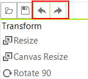

# History

__RadImageEditor__ has a history stack, which records each command that is executed on the image currently loaded in the control. This is convenient, as it allows past actions to be reversed and re-applied whenever needed.

Undo/Redo commands can be executed from the UI.

You can use the methods as well.

<snippet id='image-editor-imageeditorfeatures-undoredo-cs' />
<snippet id='image-editor-imageeditorfeatures-undoredo-vb' />

# See Also

* [Getting Started]()
* [Structure]()
* [Properties and Events]()
