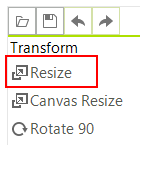
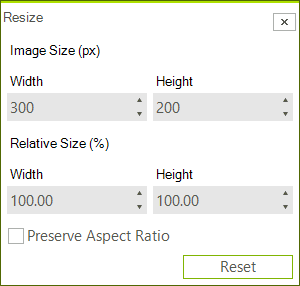

# Resize using the UI

You can use the __Resize__ button which will open the resize dialog. In this dialog you can enter the new size of the image.





# Resize Programmatically

You can resize an image that is loaded inside the image editor with code as well. This can be achieved with the Resize method. The following snippet demonstrates this.

#### Resize Programmatically

{{source=..\SamplesCS\ImageEditor\ImageEditorFeatures.cs region=Resize}} 
{{source=..\SamplesVB\ImageEditor\ImageEditorFeatures.vb region=Resize}}
````C#
radImageEditor1.ImageEditorElement.Resize(500, 500);
radImageEditor1.ImageEditorElement.SaveState();

````
````VB.NET
radImageEditor1.ImageEditorElement.Resize(500, 500)
radImageEditor1.ImageEditorElement.SaveState()

```` 


{{endregion}}
 
