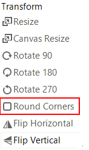
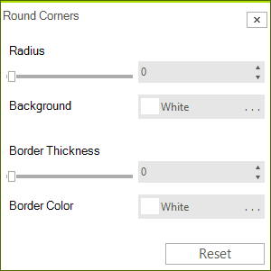

# Round Corners via UI

You round the corners by showing the round corners dialog and set the __Radius__, the __Border Thickness__ and their colors. 




# Round Corners Programmatically

The following snippet shows how you can round the corners with the RoundCorners method. 

#### Round Corners in code.

{{source=..\SamplesCS\ImageEditor\ImageEditorFeatures.cs region=Corners}} 
{{source=..\SamplesVB\ImageEditor\ImageEditorFeatures.vb region=Corners}}
````C#
radImageEditor1.ImageEditorElement.RoundCorners(100, Color.Red, 2, Color.Green);
radImageEditor1.ImageEditorElement.SaveState();

````
````VB.NET
radImageEditor1.ImageEditorElement.RoundCorners(100, Color.Red, 2, Color.Green)
radImageEditor1.ImageEditorElement.SaveState()

```` 


{{endregion}}

# See Also

* [Getting Started]()
* [Structure]()
* [Properties and Events]()
