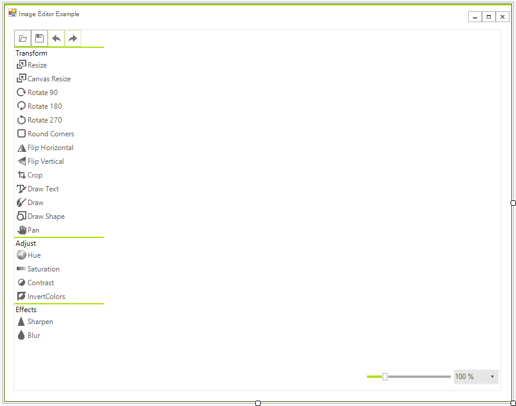

# Getting Started

__RadImageEditor__ control encapsulates the entire image editing logic. In order to use it in your application you have to add references to:

* Telerik.WinControls

* Telerik.WinControls.UI

* TelerikCommon

The control offers a set of operations you can perform on an image which is loaded in the editor. 

>important Since **R3 2018** `Save` button behaves like `Save As`.

To use the __RadImageEditor__ just drop it from the toolbox on your form. The control already contains UI for editing the image. Once your application is started you can click the open button and load image in the control.

# See Also

* [Structure]()
* [Properties and Events]()
* [How to Get Click Coordinates Relative to the Image]()
* [How to Edit a Multi-page TIFF Image]()