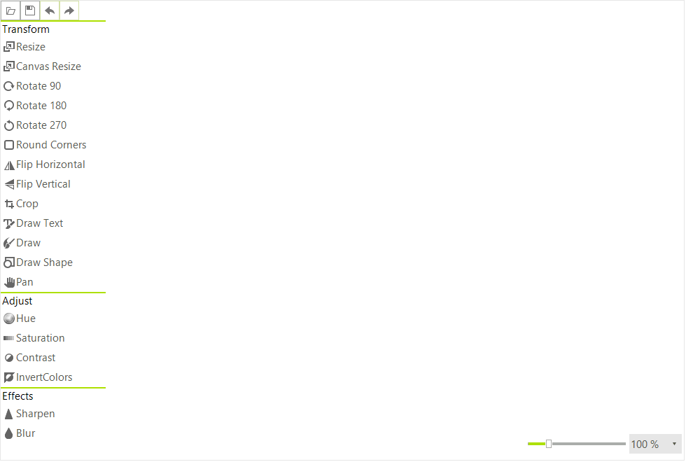

# WinForms ImageEditor Overview

__RadImageEditor__ is a control that can be used to preview and edit images in different file formats. It is meant to be used as a stand-alone control, but has also been integrated in __RadRichTextBox__.





## Key Features

* [Crop]() 
* [Canvas Resize]() 
* [Round Corners (including border)]() 
* [Hue Shift]() 
* [Saturation]() 
* [Contrast (and brightness)]()  
* [Sharpen and Blur]() 
* [Rotating and Flipping]() 
* [Typing]() 
* [Drawing]() 
* [Panning]() 

## Supported Formats

For import: 

* JPEG 
* PNG 
* BMP
* TIFF
* GIF
* ICO

For export: 

* JPEG
* PNG
* BMP
* TIFF
* GIF

# See Also

* [Getting Started]()
* [Structure]()
* [Properties and Events]()
