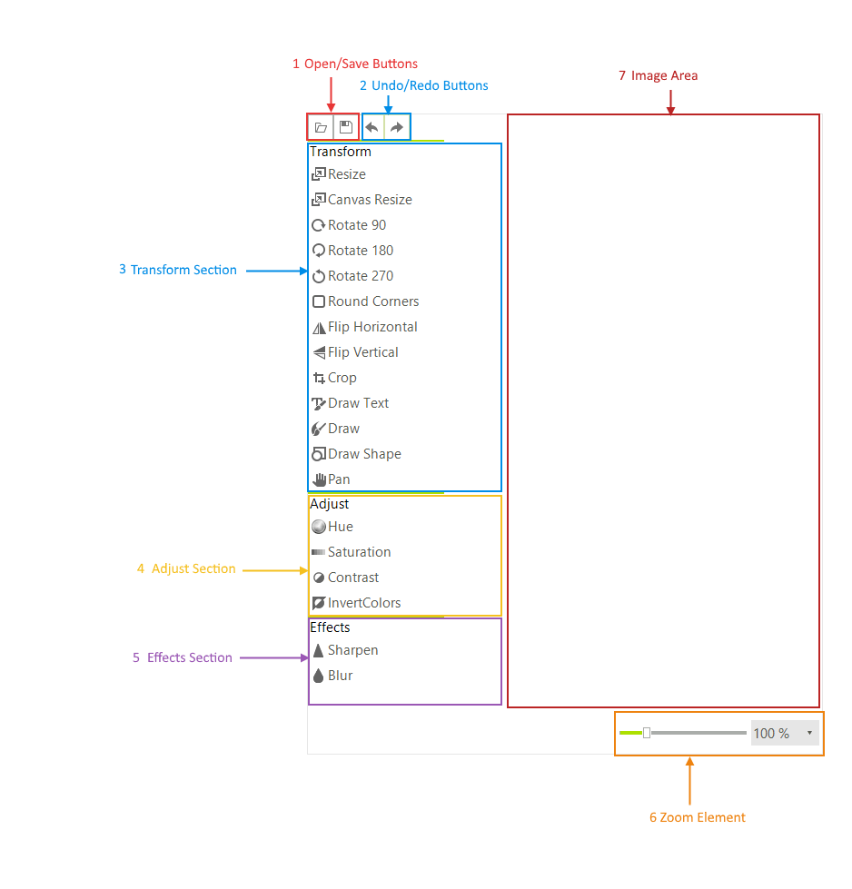
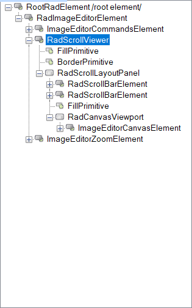

# Element Structure

This article shows the ImageEditor structure and elements hierarchy.

## Structure

>caption Figure 1: RadImageEditor Structure

1. __Open/Save buttons:__ These buttons allows you to open an existing image and save the current changes.  
2. __Undo/Redo buttons:__ Use these buttons to undo/redo a specific action.
3. __Transform section:__ The buttons in this section allows you to transform or add content to the image. 
4. __Adjust section:__ This section allows you to change the colors in the image. 
5. __Effects section:__ This section allows you to add some effects.
6. __Zoom Element:__ You can zoom with this control.
7. __Image Area:__ This area shows the image along with any applied changes. 

## Elements Hierarchy

>caption Figure 2: RadImageEditor Elements Hierarchy.

# See Also

* [Getting Started]()
* [Properties and Events]()
* [How to Add Custom Buttons to RadImageEditor]()
