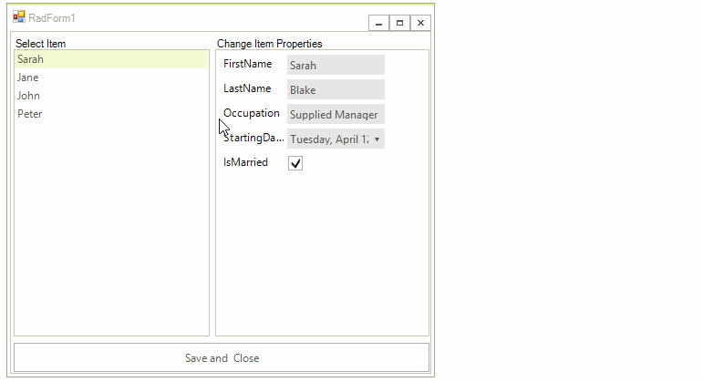

# Customizing Appearance

This article demonstrates how you can customize the appearance of the __RadLayoutControl__ and its items.

## Customizing RadLayoutControl

You can use the __PreviewRectangleFill__ and __PreviewRectangleStroke__  properties to customize the drag and drop preview rectangle fill and stroke.

#### Setting Fill and Stroke

<snippet id='layoutcontrol-customizelayoutcontrol-fillstroke-cs' />
<snippet id='layoutcontrol-customizelayoutcontrol-fillstroke-vb' />

>caption Figure 1:Changed Fill and Stroke

## Customizing Items

* __LayoutControlLabelItem:__ The following snipped shows how you can change the font and the __BackColor__ of this item.

#### Change BackColor and Font

<snippet id='layoutcontrol-customizelayoutcontrol-labelitem-cs' />
<snippet id='layoutcontrol-customizelayoutcontrol-labelitem-vb' />

* __LayoutControlSeparatorItem:__ By default this item shows only a single line, however you can customize its __Thickness__ and __BackColor__.

#### Customize Separator Item

<snippet id='layoutcontrol-customizelayoutcontrol-separator-cs' />
<snippet id='layoutcontrol-customizelayoutcontrol-separator-vb' />

* __LayoutControlSplitterItem:__ By default this element does not draw its fill. The following snippet shows how you can change its __BackColor__ and __Thickness__.

#### Customize Splitter Item

<snippet id='layoutcontrol-customizelayoutcontrol-splitter-cs' />
<snippet id='layoutcontrol-customizelayoutcontrol-splitter-vb' />

* __LayoutControlGroupItem:__ The following code shows how you can access and customize the group item header.

#### Customize Group Header

<snippet id='layoutcontrol-customizelayoutcontrol-group-cs' />
<snippet id='layoutcontrol-customizelayoutcontrol-group-vb' />

* __LayoutControlTabbedGroup:__ This item gives you access to the underlying TabStrip, this way you can customize its appearance.

#### Customize Tabs

<snippet id='layoutcontrol-customizelayoutcontrol-tab-cs' />
<snippet id='layoutcontrol-customizelayoutcontrol-tab-vb' />

# See Also

* [Design Time]()
* [Properties, Methods and Events]()
* [Customize Layout Mode]()
