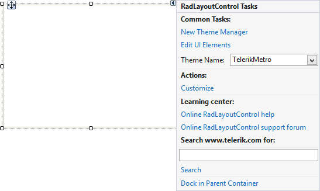
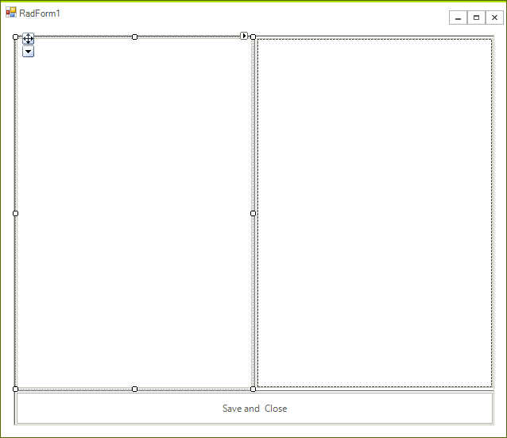
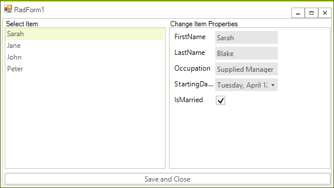

# Getting Started with WinForms LayoutControl

In this article, you will learn how to use __RadLayoutControl__. 

## Adding Telerik Assemblies Using NuGet

To use `RadLayoutControl` when working with NuGet packages, install the `Telerik.UI.for.WinForms.AllControls` package. The [package target framework version may vary]().

Read more about NuGet installation in the [Install using NuGet Packages]() article.

>tip With the 2025 Q1 release, the Telerik UI for WinForms has a new licensing mechanism. You can learn more about it [here]().

## Adding Assembly References Manually

When dragging and dropping a control from the Visual Studio (VS) Toolbox onto the Form Designer, VS automatically adds the necessary assemblies. However, if you're adding the control programmatically, you'll need to manually reference the following assemblies:

* __Telerik.Licensing.Runtime__
* __Telerik.WinControls__
* __Telerik.WinControls.UI__
* __TelerikCommon__

The Telerik UI for WinForms assemblies can be install by using one of the available [installation approaches](). 

## Defining the RadLayoutControl

The example below shows how you can create a layout that will fill the entire form and will be resized along with it.

1\. First drag and drop the control on the form. Set its __Dock__ property to *Fill* (figure 1 shows how you can do that from the smart tag). The control will be responsible for the entire form layout and the other controls will be placed inside it.
            
>caption Figure 1: Dock In Parent Container

2\. Add __RadListView__ to the layout control it will take the entire space because it is the only control in the layout panel, then add __RadDataEntry__ to the right part of the panel. The final step of the layout creation is to add a close button to the bottom of the form. Figure 3 shows the desired layout at this step.
            
>caption Figure 2: Sample Layout

3\. Let’s add some functionality to our new form. The following snippet shows how you can bind the two controls and close the form when the button is clicked. Additionally you can show text above the __RadDataEntry__ and __RadListView__. For this purpose you can just use the items text. Detailed information about the used properties is available in the [Items]() article. Figure 3 shows the final layout. If you now try to resize the form, you will see that the controls in __RadLayoutControl__ grow and shrink proportionally.

<snippet id='layoutcontrol-gettingstartedform-formcode-cs' />
<snippet id='layoutcontrol-gettingstartedform-formcode-vb' />

>caption Figure 3: Final Layout

## See Also

 * [Items]()
 * [Properties, Methods and Events]()
 * [Customizing Appearance]()

## Telerik UI for WinForms Learning Resources
* [Telerik UI for WinForms LayoutControl Component](https://www.telerik.com/products/winforms/layoutcontrol.aspx)
* [Getting Started with Telerik UI for WinForms Components](https://docs.telerik.com/devtools/winforms/getting-started/first-steps)
* [Telerik UI for WinForms Setup](https://docs.telerik.com/devtools/winforms/installation-and-upgrades/installing-on-your-computer)
* [Telerik UI for WinForms Converter](https://www.telerik.com/products/winforms/documentation/ai-coding-assistant/converter/converter)
* [Telerik UI for WinForms Visual Studio Templates](https://docs.telerik.com/devtools/winforms/visual-studio-integration/visual-studio-templates)
* [Deploy Telerik UI for WinForms Applications](https://docs.telerik.com/devtools/winforms/deployment-and-distribution/application-deployment)
* [Telerik UI for WinForms Virtual Classroom(Training Courses for Registered Users)](https://learn.telerik.com/learn/course/external/view/elearning/17/telerik-ui-for-winforms)
* [Telerik UI for WinForms License Agreement)](https://www.telerik.com/purchase/license-agreement/winforms-dlw-s)

