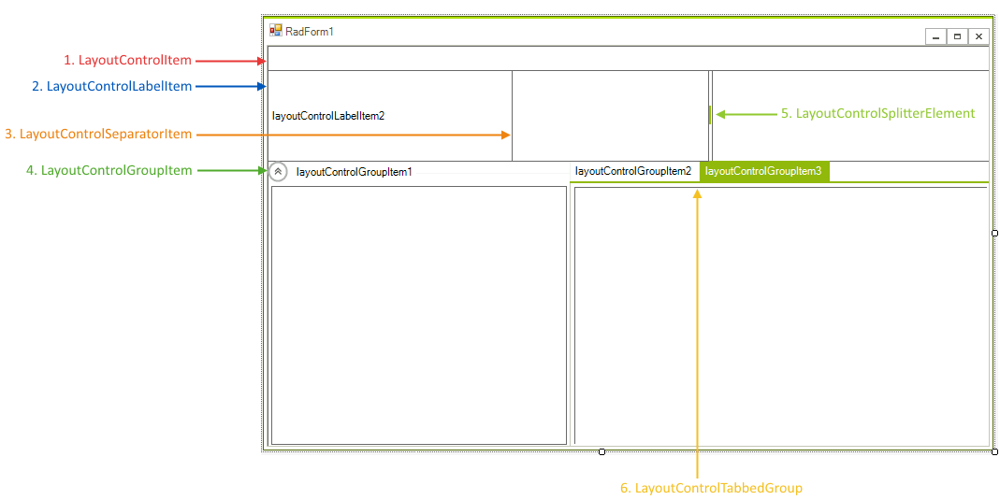

# Items

This article explains how the different types of items supported in __RadLayoutControl__ can be used. The items types are shown in Figure1.
        
>caption Figure 1: Item Types

1. __LayoutControlItem:__ This item holds the controls added to a __RadLayoutControl__. Each control is added to an item and then the item is added to the layout control. This grants you control over the control sizing and position. The most important properties are:
  * __MinSize:__ Gets or sets the item’s minimum size.
  * __MaxSize:__ Gets or sets the item’s maximum size.
  * __DrawText:__ specifies if the item's text should be drawn.
  * __TextPosition:__ Gets or set the text position according to the hosted control.
  * __TextSizeMode:__ Controls the size mode of the item's text part. The possible values are *ProportionalSize* (the text is resized proportionally) and *FixedSize* (the text size is fixed). Depending on this value the corresponding size property is used.
  * __TextProportionalSize:__ Gets or sets the proportional text size when the proportional size mode is used.
  * __TextFixedSize:__ Gets or sets the text size when the fixed size mode is used.
2. __LayoutControlLabelItem:__ Basic item that allows displaying text and/or image.
3. __LayoutControlSeparatorItem:__ Stands as a separator, its orientation is determined by the position it is placed in. You can use the __Thickness__ property to set the item width.        
4. __LayoutControlGroupItem:__ A group with a header and another layout container inside of it, can be collapsed, has its own Items collection. Its most important properties are:
  * __HeaderElement:__ Gives access to the underlying CollapsiblePanelHeaderElement. 
  * __HeaderHeight:__ Gets or set the header height.
  * __IsExpanded:__ Indicates if the group is expanded.
  * __TextAlignment:__ Gets or set the header text alignment.
  * __ShowHeaderLine:__ With this property you can hide the horizontal line in the group header.
5. __LayoutControlSplitterItem:__ This item allows the resizing of the containers on its both ends. You can set its width with the __Thickness__ property.
6. __LayoutControlTabbedGroup:__ Holds LayoutControlGroupItems and allows switching between them in a tabbed interface. Its most important properties are:
  * __TabStrip:__ Gives access to the tabs. This way you can change their properties.
  * __ItemGroups:__ This is the collection which holds the underlying groups.
  * __SelectedGroup:__ Gets or sets the selected group.

# See Also

* [Getting Started]()         
* [Properties, Methods and Events]()
* [Customizing Appearance]()
