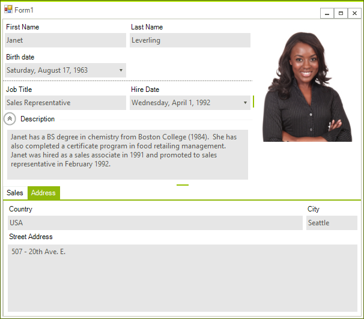

# LayoutControl

With __RadLayoutControl__ you can quickly design and arrange your controls in complex layouts and it will automatically keep the layout consistent at run-time. __RadLayoutControl__ has an intuitive and straight-forward design time experience. When resizing the form, it keeps its layout consistent by proportionally resizing the controls in it while considering their *MinSize* and *MaxSize* settings. __RadLayoutControl__ also allows end-user customizations and Save/Load layout via the *Customize* context menu.





>caption Figure 1: RadLayoutControl

The below list shows the main features of the control.

* Create complex layouts where the controls are automatically resized according to the current available size.

* Arrange the controls in the form at runtime - your users will be able to rearrange the controls according to their needs.

* Save and load the layout.

* Group the underlying controls in tabs.

* Expand/Collapse groups.
            
# See Also

* [Items]()
* [Design Time]()
* [Getting Started]()         
