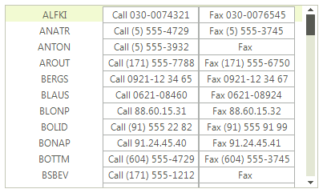
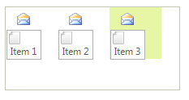
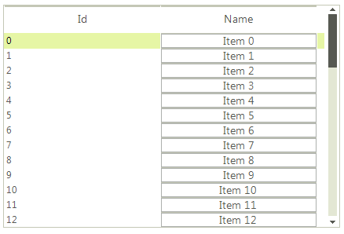

# Custom items
 
__RadListView__ allows you to create and use your own custom visual items. This article demonstrates how to achieve it.
	    

## Custom items in ListView ViewType

This can be done by making use of the __VisualItemCreating__ event. The following example demonstrates creating a visual item with two buttons in it.

>caption Figure 1: Custom SimpleListViewVisualItem



First let's create a custom visual item by inheriting from the __SimpleListViewVisualItem__ class:

#### Creating custom item

{{source=..\SamplesCS\ListView\ListViewCustomItems.cs region=CustomItem}} 
{{source=..\SamplesVB\ListView\ListViewCustomItems.vb region=CustomItem}} 

````C#
    
public class MyCustomVisualItem : SimpleListViewVisualItem
{
    private RadButtonElement buttonElement1;
    private RadButtonElement buttonElement2;
    private LightVisualElement contentElement;
    private StackLayoutPanel stackLayout;
        
    protected override void CreateChildElements()
    {
        base.CreateChildElements();
        
        this.stackLayout = new StackLayoutPanel();
        this.stackLayout.Orientation = Orientation.Horizontal;
        this.stackLayout.EqualChildrenWidth = true;
        this.stackLayout.ShouldHandleMouseInput = false;
        this.stackLayout.NotifyParentOnMouseInput = true;
        
        this.contentElement = new LightVisualElement();
        this.contentElement.StretchHorizontally = true;
        this.contentElement.MinSize = new Size(120, 0);
        this.contentElement.ShouldHandleMouseInput = false;
        this.contentElement.NotifyParentOnMouseInput = true;
        this.stackLayout.Children.Add(this.contentElement);
        
        this.buttonElement1 = new RadButtonElement();
        this.buttonElement1.Text = "Button1";
        this.stackLayout.Children.Add(this.buttonElement1);
        
        this.buttonElement2 = new RadButtonElement();
        this.buttonElement2.Text = "Button2";
        this.stackLayout.Children.Add(this.buttonElement2);
    
        this.Children.Add(this.stackLayout);
    }
        
    protected override void SynchronizeProperties()
    {
        base.SynchronizeProperties();
    
        this.Text = "";
        this.contentElement.Text = Convert.ToString(this.Data["Name"]);
        this.buttonElement1.Text = "Call " + Convert.ToString(this.Data["Phone"]);
        this.buttonElement2.Text = "Fax " + Convert.ToString(this.Data["Fax"]);
    }
            
    protected override Type ThemeEffectiveType
    {
        get
        {
            return typeof(SimpleListViewVisualItem);
        }
    }
}

````
````VB.NET
    
Public Class MyCustomVisualItem
Inherits SimpleListViewVisualItem
    Private buttonElement1 As RadButtonElement
    Private buttonElement2 As RadButtonElement
    Private contentElement As LightVisualElement
    Private stackLayout As StackLayoutPanel
    Protected Overrides Sub CreateChildElements()
        MyBase.CreateChildElements()
        Me.stackLayout = New StackLayoutPanel()
        Me.stackLayout.Orientation = Orientation.Horizontal
        Me.stackLayout.EqualChildrenWidth = True
        Me.stackLayout.ShouldHandleMouseInput = False
        Me.stackLayout.NotifyParentOnMouseInput = True
        Me.contentElement = New LightVisualElement()
        Me.contentElement.StretchHorizontally = True
        Me.contentElement.MinSize = New Size(120, 0)
        Me.contentElement.ShouldHandleMouseInput = False
        Me.contentElement.NotifyParentOnMouseInput = True
        Me.stackLayout.Children.Add(Me.contentElement)
        Me.buttonElement1 = New RadButtonElement()
        Me.buttonElement1.Text = "Button1"
        Me.stackLayout.Children.Add(Me.buttonElement1)
        Me.buttonElement2 = New RadButtonElement()
        Me.buttonElement2.Text = "Button2"
        Me.stackLayout.Children.Add(Me.buttonElement2)
        Me.Children.Add(Me.stackLayout)
    End Sub
    Protected Overrides Sub SynchronizeProperties()
        MyBase.SynchronizeProperties()
        Me.Text = ""
        Me.contentElement.Text = Convert.ToString(Me.Data("Name"))
        Me.buttonElement1.Text = "Call " + Convert.ToString(Me.Data("Phone"))
        Me.buttonElement2.Text = "Fax " + Convert.ToString(Me.Data("Fax"))
    End Sub
    Protected Overrides ReadOnly Property ThemeEffectiveType() As Type
        Get
            Return GetType(SimpleListViewVisualItem)
        End Get
    End Property
End Class

````

{{endregion}} 

To use the newly created items, you should handle the __VisualItemCreating__ event as shown below:

#### Use the custom item

{{source=..\SamplesCS\ListView\ListViewCustomItems.cs region=UseCustomItem}} 
{{source=..\SamplesVB\ListView\ListViewCustomItems.vb region=UseCustomItem}} 

````C#
        
void radListView1_VisualItemCreating(object sender, ListViewVisualItemCreatingEventArgs e)
{
    if (this.radListView1.ViewType == ListViewType.ListView)
    {
        e.VisualItem = new MyCustomVisualItem();
    }
}

````
````VB.NET
Private Sub radListView1_VisualItemCreating(ByVal sender As Object, ByVal e As ListViewVisualItemCreatingEventArgs)
    If Me.RadListView1.ViewType = ListViewType.ListView Then
        e.VisualItem = New MyCustomVisualItem()
    End If
End Sub

````

{{endregion}} 

## Custom items in IconsView ViewType

>caption Figure 2: Custom IconListViewVisualItem



We should create a custom visual item inheriting the __IconListViewVisualItem__. The following example demonstrates how to add custom elements to the IconListViewVisualItem.__Children__ collection:

#### Creating custom item

{{source=..\SamplesCS\ListView\ListViewCustomItems.cs region=CustomIconListViewVisualItem}} 
{{source=..\SamplesVB\ListView\ListViewCustomItems.vb region=CustomIconListViewVisualItem}} 

````C#
        
public class MyCustomIconListViewVisualItem :IconListViewVisualItem       
{
    protected override Type ThemeEffectiveType     
    { 
        get    
        { 
            return typeof(IconListViewVisualItem);     
        }
    }
    
    LightVisualElement imageElement = new LightVisualElement();
    RadButtonElement buttonElement = new RadButtonElement();
    StackLayoutElement stack = new StackLayoutElement();
        
    protected override void CreateChildElements()
    {
        base.CreateChildElements();
        
        stack.Orientation = Orientation.Vertical;
        imageElement.Image = Image.FromFile(@"..\..\Resources\email.png");
        buttonElement.Image = Image.FromFile(@"..\..\Resources\file.png");
        buttonElement.TextImageRelation = System.Windows.Forms.TextImageRelation.ImageAboveText;
    
        stack.Children.Add(imageElement);
        stack.Children.Add(buttonElement);
        this.Children.Add(stack);
    }
    
    protected override void SynchronizeProperties()
    {
        base.SynchronizeProperties();
        this.Text = string.Empty;
        this.buttonElement.Text = this.Data.Text;
    }
}

````
````VB.NET
Public Class MyCustomIconListViewVisualItem
Inherits IconListViewVisualItem
    Protected Overrides ReadOnly Property ThemeEffectiveType() As Type
        Get
            Return GetType(IconListViewVisualItem)
        End Get
    End Property
    Private imageElement As LightVisualElement
    Private buttonElement As RadButtonElement
    Private stack As StackLayoutElement
    Protected Overrides Sub CreateChildElements()
        MyBase.CreateChildElements()
        stack = New StackLayoutElement()
        imageElement = New LightVisualElement()
        buttonElement = New RadButtonElement()
        stack.Orientation = Orientation.Vertical
        imageElement.Image = Image.FromFile("..\..\Resources\email.png")
        buttonElement.Image = Image.FromFile("..\..\Resources\file.png")
        buttonElement.TextImageRelation = System.Windows.Forms.TextImageRelation.ImageAboveText
        stack.Children.Add(imageElement)
        stack.Children.Add(buttonElement)
        Me.Children.Add(stack)
    End Sub
    Protected Overrides Sub SynchronizeProperties()
        MyBase.SynchronizeProperties()
        Me.Text = String.Empty
        Me.buttonElement.Text = Me.Data.Text
    End Sub
End Class

````

{{endregion}} 

To use the newly created item, you should subscribe to the __VisualItemCreating__ event and replace the default item with your custom one: 

{{source=..\SamplesCS\ListView\ListViewCustomItems.cs region=UseCustomIconItem}} 
{{source=..\SamplesVB\ListView\ListViewCustomItems.vb region=UseCustomIconItem}} 

````C#
        
void VisualItemCreating(object sender, ListViewVisualItemCreatingEventArgs e)
{
    if (this.radListView1.ViewType == ListViewType.IconsView)
    {
        e.VisualItem = new MyCustomIconListViewVisualItem();
    }
}

````
````VB.NET
Private Sub VisualItemCreating(sender As Object, e As ListViewVisualItemCreatingEventArgs)
    If Me.RadListView1.ViewType = ListViewType.IconsView Then
        e.VisualItem = New MyCustomIconListViewVisualItem()
    End If
End Sub

````

{{endregion}} 

## Custom items in DetailsView ViewType

Since the *DetailsView* provides a grid-like interface, it displays a cell for each data field. In order to create custom cells you need to subscribe to the __CellCreating__ event and replace the default __DetailListViewDataCellElement__ with your own cell implementation.

>caption Figure 3: Custom DetailListViewDataCellElement



First let's populate __RadListView__ with items and set its __ViewType__ property to *DetailsView*:

{{source=..\SamplesCS\ListView\ListViewCustomItems.cs region=FillData}} 
{{source=..\SamplesVB\ListView\ListViewCustomItems.vb region=FillData}} 

````C#
radListView1.ViewType = ListViewType.DetailsView;
DataTable dt = new DataTable();
dt.Columns.Add("Id", typeof(int));
dt.Columns.Add("Name", typeof(string));
for (int i = 0; i < 50; i++)
{
    dt.Rows.Add(i, "Item " + i);
}
this.radListView1.DataSource = dt;

````
````VB.NET
RadListView1.ViewType = ListViewType.DetailsView
Dim dt As New DataTable()
dt.Columns.Add("Id", GetType(Integer))
dt.Columns.Add("Name", GetType(String))
For i As Integer = 0 To 49
    dt.Rows.Add(i, "Item " & i.ToString())
Next
Me.RadListView1.DataSource = dt

````

{{endregion}} 
 
Now let`s create our custom cell element containing a __RadButtonElement__. Additionally, we should inherit the __DetailListViewDataCellElement__ class:

{{source=..\SamplesCS\ListView\ListViewCustomItems.cs region=CustomCell}} 
{{source=..\SamplesVB\ListView\ListViewCustomItems.vb region=CustomCell}} 

````C#
    
public class CustomDetailListViewDataCellElement : DetailListViewDataCellElement
{
    private RadButtonElement button;
    
    public CustomDetailListViewDataCellElement(DetailListViewVisualItem owner,
        ListViewDetailColumn column) : base(owner, column)
    {
    }
        
    protected override void CreateChildElements()
    {
        base.CreateChildElements();
    
        this.button = new RadButtonElement();
        this.Children.Add(this.button);
    }
        
    protected override Type ThemeEffectiveType
    {
        get
        {
            return typeof(DetailListViewHeaderCellElement);
        }
    }
        
    public override void Synchronize()
    {
        base.Synchronize();
        this.Text = "";
        DataRowView rowView = this.Row.DataBoundItem as DataRowView;
        this.button.Text = rowView.Row["Name"].ToString();
    }
        
    public override bool IsCompatible(ListViewDetailColumn data, object context)
    {
        if (data.Name != "Name")
        {
            return false;
        }
        return base.IsCompatible(data, context);
    }
}

````
````VB.NET
    
Public Class CustomDetailListViewDataCellElement
Inherits DetailListViewDataCellElement
    Private button As RadButtonElement
    Public Sub New(owner As DetailListViewVisualItem, column As ListViewDetailColumn)
        MyBase.New(owner, column)
    End Sub
    Protected Overrides Sub CreateChildElements()
        MyBase.CreateChildElements()
        Me.button = New RadButtonElement()
        Me.Children.Add(Me.button)
    End Sub
    Protected Overrides ReadOnly Property ThemeEffectiveType() As Type
        Get
            Return GetType(DetailListViewHeaderCellElement)
        End Get
    End Property
    Public Overrides Sub Synchronize()
        MyBase.Synchronize()
        Me.Text = ""
        Dim rowView As DataRowView = TryCast(Me.Row.DataBoundItem, DataRowView)
        Me.button.Text = rowView.Row("Name").ToString()
    End Sub
    Public Overrides Function IsCompatible(data As ListViewDetailColumn, context As Object) As Boolean
        If data.Name <> "Name" Then
            Return False 
        End If
        Return MyBase.IsCompatible(data, context)
    End Function
End Class

````

{{endregion}} 

Finally, we should handle the __CellCreating__ event and substitute the default cell element with our own:

{{source=..\SamplesCS\ListView\ListViewCustomItems.cs region=ReplaceCell}} 
{{source=..\SamplesVB\ListView\ListViewCustomItems.vb region=ReplaceCell}} 

````C#
        
private void radListView1_CellCreating(object sender, ListViewCellElementCreatingEventArgs e)
{
    DetailListViewDataCellElement cell = e.CellElement as DetailListViewDataCellElement;
    if (cell != null && cell.Data.Name == "Name")
    {
        e.CellElement = new CustomDetailListViewDataCellElement(cell.RowElement, e.CellElement.Data);
    }
}

````
````VB.NET
Private Sub radListView1_CellCreating(sender As Object, e As ListViewCellElementCreatingEventArgs)
    Dim cell As DetailListViewDataCellElement = TryCast(e.CellElement, DetailListViewDataCellElement)
    If cell IsNot Nothing AndAlso cell.Data.Name = "Name" Then
        e.CellElement = New CustomDetailListViewDataCellElement(cell.RowElement, e.CellElement.Data)
    End If
End Sub

````

{{endregion}} 


