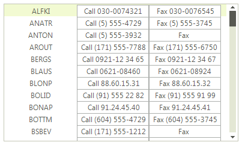
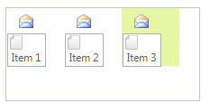
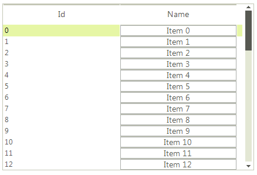

# Custom items
 
__RadListView__ allows you to create and use your own custom visual items. This article demonstrates how to achieve it.
	    

## Custom items in ListView ViewType

This can be done by making use of the __VisualItemCreating__ event. The following example demonstrates creating a visual item with two buttons in it.

>caption Figure 1: Custom SimpleListViewVisualItem

First let's create a custom visual item by inheriting from the __SimpleListViewVisualItem__ class:

#### Creating custom item

<snippet id='listview-listviewcustomitems-customitem-cs' />
<snippet id='listview-listviewcustomitems-customitem-vb' />

To use the newly created items, you should handle the __VisualItemCreating__ event as shown below:

#### Use the Custom Item

<snippet id='listview-listviewcustomitems-usecustomitem-cs' />
<snippet id='listview-listviewcustomitems-usecustomitem-vb' />

## Custom items in IconsView ViewType

>caption Figure 2: Custom IconListViewVisualItem

We should create a custom visual item inheriting the __IconListViewVisualItem__. The following example demonstrates how to add custom elements to the IconListViewVisualItem.__Children__ collection:

#### Creating custom item

<snippet id='listview-listviewcustomitems-customiconlistviewvisualitem-cs' />
<snippet id='listview-listviewcustomitems-customiconlistviewvisualitem-vb' />

To use the newly created item, you should subscribe to the __VisualItemCreating__ event and replace the default item with your custom one: 

<snippet id='listview-listviewcustomitems-usecustomiconitem-cs' />
<snippet id='listview-listviewcustomitems-usecustomiconitem-vb' />

## Custom Items in DetailsView ViewType

Since the *DetailsView* provides a grid-like interface, it displays a cell for each data field. In order to create custom cells you need to subscribe to the __CellCreating__ event and replace the default __DetailListViewDataCellElement__ with your own cell implementation.

>caption Figure 3: Custom DetailListViewDataCellElement

First let's populate __RadListView__ with items and set its __ViewType__ property to *DetailsView*:

<snippet id='listview-listviewcustomitems-filldata-cs' />
<snippet id='listview-listviewcustomitems-filldata-vb' />

Now let`s create our custom cell element containing a __RadButtonElement__. Additionally, we should inherit the __DetailListViewDataCellElement__ class:

<snippet id='listview-listviewcustomitems-customcell-cs' />
<snippet id='listview-listviewcustomitems-customcell-vb' />

Due to the virtualization mechanism of the RadListView control, the default cell of the control is compatible with all columns. When the control is scrolled, the default cell could override the custom one. To apply the custom cell when the control is scrolled is necessary to create another __DetailListViewDataCellElement__ which is not compatible with your custom item.

<snippet id='listview-listviewcustomitems-defaultcell-cs' />
<snippet id='listview-listviewcustomitems-defaultcell-vb' />

Finally, we should handle the __CellCreating__ event and substitute the default cell element with our own or return the default cell for the other columns:

<snippet id='listview-listviewcustomitems-replacecell-cs' />
<snippet id='listview-listviewcustomitems-replacecell-vb' />

