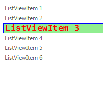
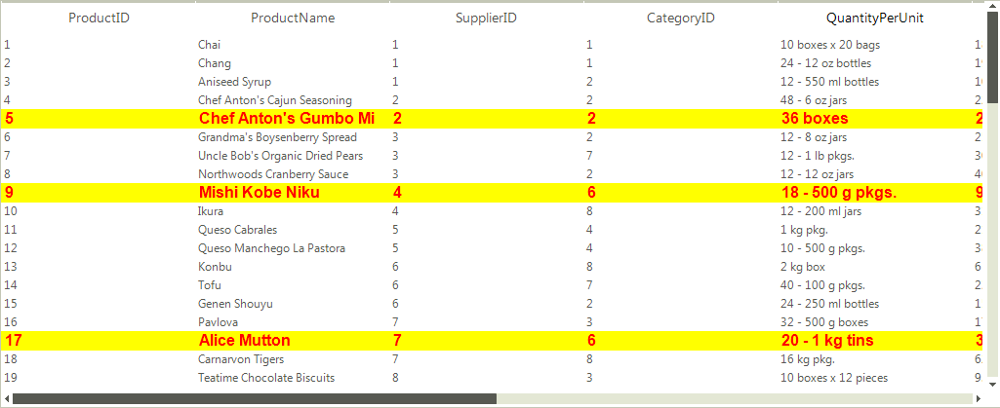

# Formatting Items

Depending on the **ViewType**, **RadListView** provides a convenient way for customizing the items.

## Formatting items in ListView and IconsView modes 

Items appearance in __RadListView__ can be customized by making use of the __VisualItemFormatting__ event. The following example, demonstrates how you can change the color of an item which is being selected.

>note By using this event to customize the items appearance, you should always provide an else clause,  where you reset the appearance settings which you have introduced. This is necessary since __RadListView__ uses data virtualization, which might lead to unpredicted appearance results when items are being reused.

>caption Figure 1: Customizing items in the VisualItemFormatting event

#### Customizing items when using the VisualItemFormatting event

<snippet id='listview-listviewformattingitems-visualitemformatting-cs' />
<snippet id='listview-listviewformattingitems-visualitemformatting-vb' />

## Formatting cells in DetailsView mode

The __DetailsView__ of __RadListView__ provides a grid-like interface for displaying items with more than one data field. It is possible to customize each cell element, using the __CellFormatting__ event.

>note Cell elements are created only for currently visible cells and they are being reused, when scrolling. In order to prevent applying the formatting to other cell elements, all applied styles should be reset for the rest of the cell elements.

Let’s assume that the __RadListView__ is bound to the *Products* table from the *Northwind* database. The code snippet below demonstrates how to apply different colors and font for the data cells in the control, considering the *“Discontinued”* cell’s value:

>caption Figure 2: Customizing cells when using the CellFormatting event

#### Customizing cells when using the CellFormatting event

<snippet id='listview-listviewformattingitems-cellformatting-cs' />
<snippet id='listview-listviewformattingitems-cellformatting-vb' />

>note In order to customize the header cells, the __e.CellElement__ property should be cast to the **DetailListViewHeaderCellElement** type.

<snippet id='listview-listviewformattingitems-headerformatting-cs' />
<snippet id='listview-listviewformattingitems-headerformatting-vb' />

# See Also

* [Accessing and Customizing Elements]()		

