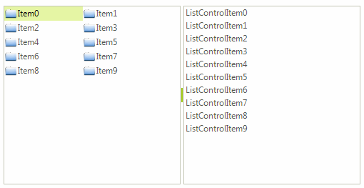
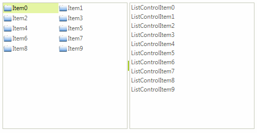

# Combining RadDragDropService and OLE drag-and-drop

This article demonstrates a sample approach how to achieve drag and drop functionality between __RadListView__ and __RadListControl__. For this purpose, we will use a combination between the __RadDragDropService__, supported by the __RadListView__ control, and the OLE drag-and-drop, which is supported by all controls from the Telerik UI for WinForms suite.      

Let’s assume that our __RadListView__ is in bound mode and its __ViewType__ property is set to *IconsView*. The __RadListControl__ is populated manually with items. Set the __AllowDrop__ property to *true*  for both of the controls. Additionally, you need to set the RadListView.__AllowDragDrop__ property to *true* as well.

#### Populating with data

<snippet id='listview-dragdroplistviewlistcontrol-populatewithdata-cs' />
<snippet id='listview-dragdroplistviewlistcontrol-populatewithdata-vb' />

## Drag and drop from RadListView to RadListControl using RadDragDropService

>caption Figure 1: Drag and drop from RadListView to RadListControl using RadDragDropService

To implement drag and drop functionality for this scenario, we will use the ListViewElement.__DragDropService__, which is a derivative of the In the __PreviewDragOver__ event allow dropping over a __RadListElement__. The __PreviewDragDrop__  event performs the actual inserting of the dragged item into the RadListControl.__Items__ collection:

#### Handling the RadDragDropService's events

<snippet id='listview-dragdroplistviewlistcontrol-listviewtolistcontrol-cs' />
<snippet id='listview-dragdroplistviewlistcontrol-listviewtolistcontrol-vb' />

## Drag and drop from RadListControl to RadListView using the OLE drag-and-drop

>caption Figure 2: Drag and drop from RadListControl to RadListView using the OLE drag-and-drop

1\. Firstly, we should start the drag and drop operation using the RadListControl.__MouseMove__ event when the left mouse button is pressed. We should keep the mouse down location in the RadListControl.__MouseDown__ event. Afterwards, allow dragging over the __RadListView__ via the __Effect__ argument of the __DragEventArgs__  in the RadListView.__DragEnter__ event handler:

#### Starting the drag and drop operation

<snippet id='listview-dragdroplistviewlistcontrol-listcontroltolistviewstart-cs' />
<snippet id='listview-dragdroplistviewlistcontrol-listcontroltolistviewstart-vb' />

2\. In the RadListView.__DragDrop__ event you need to get the location of the mouse and convert it to a point that the __RadListView__ can use to get the element underneath the mouse. Afterwards, insert the dragged item on the specific position. We should reset the stored mouse down location as well:

#### Handle the drop operation

<snippet id='listview-dragdroplistviewlistcontrol-listcontroltolistviewdragdrop-cs' />
<snippet id='listview-dragdroplistviewlistcontrol-listcontroltolistviewdragdrop-vb' />

# See Also

* [Drag and Drop in bound mode]()
* [Drag and Drop from another control]()
* [Drag and Drop using RadDragDropService]()	

