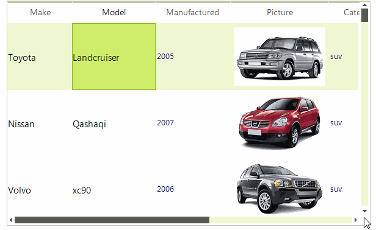

# DetailListViewDragDropService

When **RadListView** is in *DetailsView* it provides a grid-like interface for displaying items with more than one data fields. In this mode it displays columns and supports columns rearranging by the **DetailListViewDragDropService**. In order to enable columns reordering, the **AllowColumnReorder** property must be set to *true*. The service can be accessed by the DetailListViewElement.**ColumnDragDropService** property.

>caption Figure 1: Reorder columns

As a descendant of [RadDragDropService](), **DetailListViewDragDropService** exposes the same events as its parent. Thus, you can customize the default functionality according to the specific requirements.

# See Also

* [RadDragDropService]()	
* [Drag and Drop using RadDragDropService]()

