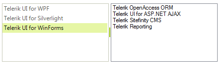
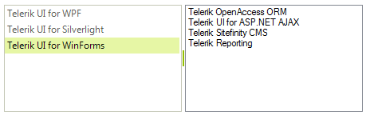

# Drag and Drop from another control

__RadListView__  supports drag and drop functionality from another control, such as dragging and dropping items from a Microsoft **ListBox**. It is necessary to set the __AllowDrop__ property to *true* for both of the controls.

## Drag and drop from ListBox to RadListView

>caption Figure 1 Drag and drop from ListBox to RadListView

1\. Firstly, we should start the drag and drop operation, using the ListBox.__MouseMove__ event when the left mouse button is pressed. We should keep the mouse down location in the ListBox.__MouseDown__ event. Afterwards, allow dragging over the __RadListView__  via the __Effect__ argument of the __DragEventArgs__ in the RadListView.__DragEnter__ event handler:

#### Starting a drag and drop operation

<snippet id='listview-dragdropfromanothercontrol-listboxtolistviewstart-cs' />
<snippet id='listview-dragdropfromanothercontrol-listboxtolistviewstart-vb' />

2\. In the RadListView.__DragDrop__ event handler you need to get the location of the mouse and convert it to a point that __RadListView__ can use to get the target item underneath the mouse. Afterwards, insert the dragged item at the specific position in the RadListView.__Items__ collection and remove it from the ListBox. We should reset the stored mouse down location as well.

#### Handling drop operation

<snippet id='listview-dragdropfromanothercontrol-listboxtolistviewdragdrop-cs' />
<snippet id='listview-dragdropfromanothercontrol-listboxtolistviewdragdrop-vb' />

## Drag and drop from RadListView to ListBox

>caption Figure 2: Drag and drop from RadListView to ListBox

1\. In order to enable dragging an item from the __RadListView__ and dropping it onto the **ListBox**, it is necessary to use the RadListView.__MouseDown__ and the RadListView.__MouseMove__ events to start the drag and drop operation. In the ListBox.__DragOver__ event you should allow the drop operation:

#### Starting a drag and drop operation

<snippet id='listview-dragdropfromanothercontrol-listviewtolistboxstart-cs' />
<snippet id='listview-dragdropfromanothercontrol-listviewtolistboxstart-vb' />

2\. Finally, perform the exact drag and drop operation via inserting a new item in the **ListBox** in the __DragDrop__ event. We should reset the stored mouse down location as well:

#### Handling the drop operation

<snippet id='listview-dragdropfromanothercontrol-listviewtolistboxdrop-cs' />
<snippet id='listview-dragdropfromanothercontrol-listviewtolistboxdrop-vb' />

# See Also

* [Drag and Drop in bound mode]()
* [Drag and Drop using RadDragDropService]()	
* [Combining RadDragDropService and OLE drag-and-drop]()	

