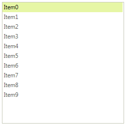

# Drag and Drop in bound mode

When __RadListView__ is in bound mode, it does not support drag and drop functionality out of the box due to the specificity of the data source. However, this can be easily achieved by using the built-in __ListViewDragDropService__. You only need to handle events, emanating from this service.

>caption Figure 1: Drag and drop in bound mode

1\. Let’s start with populating the __RadListView__ with data. For this purpose we will create a class **Item** and fill a **BindingList** with items:

<snippet id='listview-dragdropinboundmode-createitem-cs' />
<snippet id='listview-dragdropinboundmode-createitem-vb' />

2\. In order to enable the drag and drop functionality, set the RadListView.__AllowDragDrop__ property to *true*:

<snippet id='listview-dragdropinboundmode-enabledragdrop-cs' />
<snippet id='listview-dragdropinboundmode-enabledragdrop-vb' />

3\. Use the ListViewElement.DragDropService.__PreviewDragStart__ event to get the dragged item. Subscribe to the ListViewElement.DragDropService.__PreviewDragOver__ event, which allows you to control on what targets the item, being dragged, can be dropped on:

<snippet id='listview-dragdropinboundmode-dragstartover-cs' />
<snippet id='listview-dragdropinboundmode-dragstartover-vb' />

4\. The last event we need to handle in our implementation is the ListViewElement.DragDropService.__PreviewDragDrop__ event. This is where we will initiate the actual physical move of the item from one position to another. Implement the handler as follows:

<snippet id='listview-dragdropinboundmode-dragdrop-cs' />
<snippet id='listview-dragdropinboundmode-dragdrop-vb' />

# See Also

* [Drag and Drop from another control]()
* [Drag and Drop using RadDragDropService]()	
* [Combining RadDragDropService and OLE drag-and-drop]()	

