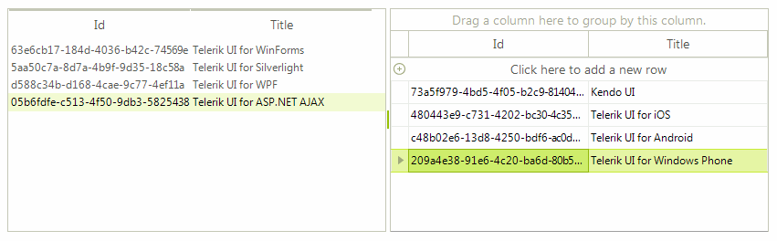
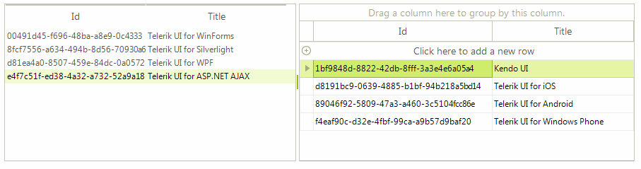

# Drag and Drop using RadDragDropService

This article will guide you through the process of achieving drag and drop functionality from __RadListView__ to __RadGridView__ and vice versa. For this purpose, we will use the __RadDragDropService__, supported by both of the controls. Let’s assume that the __RadListView__  is in unbound mode and the __ViewType__ property is set to *DetailsView*. The __RadGridView__ is bound to a DataTable with identical columns as the manually added ones to the __RadListView__.

#### Populating with data

<snippet id='listview-dragdropraddragdropservice-populatewithdata-cs' />
<snippet id='listview-dragdropraddragdropservice-populatewithdata-vb' />

## Drag and Drop from RadGridView to RadListView

>caption Figure 1: Drag and Drop from RadGridView to RadListView

1\. The first thing we need to do is to start the __RadGridView__’s drag and drop service when a user clicks on a row with the left mouse down. For this purpose, we should create a custom [grid behavior]():

#### Starting a drag and drop operation

<snippet id='listview-dragdropraddragdropservice-rowbehavior-cs' />
<snippet id='listview-dragdropraddragdropservice-rowbehavior-vb' />

2\. Next, we should register this behavior in our grid:

#### Register the custom row behavior

<snippet id='listview-dragdropraddragdropservice-registerrowbehavior-cs' />
<snippet id='listview-dragdropraddragdropservice-registerrowbehavior-vb' />

3\. It is necessary to subscribe to the __PreviewDragStart__, __PreviewDragOver__ and __PreviewDragDrop__ events of the grid’s __RadDragDropService__. The __PreviewDragStart__ event is fired once the drag and drop service on the grid is started. We should notify the service that the drag and drop operation can move forward. In the __PreviewDragOver__  event you can control on what targets to allow dropping the dragged row. The __PreviewDragDrop__ event performs the actual move of the row from the __RadGridView__ to the __RadListView__.

#### Handling the RadDragDropService's events

<snippet id='listview-dragdropraddragdropservice-gridviewtolistview-cs' />
<snippet id='listview-dragdropraddragdropservice-gridviewtolistview-vb' />

## Drag and Drop from RadListView to RadGridView

>caption Figure 2: Drag and Drop from RadListView to RadGridView

1\. In order to enable dragging an item from the __RadListView__ and dropping it onto the __RadGridView__, it is necessary to set the RadListView.__AllowDragDrop__ property to *true*.

#### Subscribing to the RadDragDropService's events

<snippet id='listview-dragdropraddragdropservice-wirelistviewserviceevents-cs' />
<snippet id='listview-dragdropraddragdropservice-wirelistviewserviceevents-vb' />

2\. To implement drag and drop functionality for this scenario, we will use the ListViewElement.__DragDropService__, which is a derivative of the __RadDragDropService__ . Subscribe to its __PreviewDragOver__  and __PreviewDragDrop__ events. In the __PreviewDragOver__ event allow dropping over a row element or over the table element. The __PreviewDragDrop__ event performs the actual inserting of the dragged item into the __RadGridView__’s data source:

#### Handling the RadDragDropService's events

<snippet id='listview-dragdropraddragdropservice-listviewtogridview-cs' />
<snippet id='listview-dragdropraddragdropservice-listviewtogridview-vb' />

# See Also

* [Drag and Drop in bound mode]()
* [Drag and Drop from another control]()
* [Combining RadDragDropService and OLE drag-and-drop]()	

