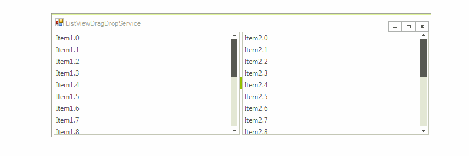

# ListViewDragDropService

**RadListView** handles the whole drag and drop operation by its **ListViewDragDropService**. It exposes the following public properties:

* **DraggedItem**: Gets the dragged item.

* **DraggedItems**: Gets the dragged items when multiple selection is enabled.

* **Owner**: Gets the **RadListViewElement** to which the service is attached.

## Drag and Drop in Unbound Mode

The following steps demonstrates how to populate two **RadListViews** with items in unbound mode and enable the drag and drop functionality between them:

1\. Add two **RadListViews** on your form and add some items via the *ListViewDataItem Collection Editor*. 
2\. Set the **AllowDragDrop** property to *true* for both of the **RadListViews** either at design time in the *Properties* section of Visual Studio or via code at run time.
3\. Run the application and try to reorder the items within the **RadListView** itself and between the two **RadListView** controls.

>caption Figure 1: Drag and drop in unbound mode

## Drag and drop in bound mode by using ListViewDragDropService

When **RadListView** is in bound mode, drag and drop functionality is not supported out of the box because of the specificity of the **DataSource** collection of the source and target list view. However, such a functionality can be easily achieved by the **ListViewDragDropService**.

As a descendant of [RadDragDropService](), **ListViewDragDropService** handles the whole drag and drop operation. The **PreviewDragOver** event allows you to control on what targets the item(s) being dragged can be dropped on. The **PreviewDragDrop** event allows you to get a handle on all the aspects of the drag and drop operation, the source (drag) list view, the destination (target) control, as well as the item being dragged. This is where we will initiate the actual physical move of the item(s) from one **RadListView** to the target control. A sample implementation is demonstrated in the [Drag and Drop using RadDragDropService]() help article.

# See Also

* [RadDragDropService]()	
* [Drag and Drop using RadDragDropService]()

