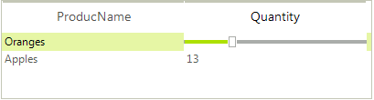

# Custom Editors

This article demonstrates a sample approach how to create and replace the default editor with a track bar editor to allow editing numeric values.

>caption Figure 1: Custom track bar editor

#### Custom editor

<snippet id='listview-listviewcheckboxesandeditors-myeditor-cs' />
<snippet id='listview-listviewcheckboxesandeditors-myeditor-vb' />

Here is the sample code snippet how to replace the default editor with the custom one handling the **EditorRequired** event:

#### Replace default editor

<snippet id='listview-listviewcheckboxesandeditors-replaceeditor-cs' />
<snippet id='listview-listviewcheckboxesandeditors-replaceeditor-vb' />

# See Also

* [Default Editors]()		
* [Editors Overview]()

