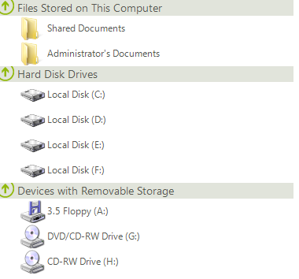
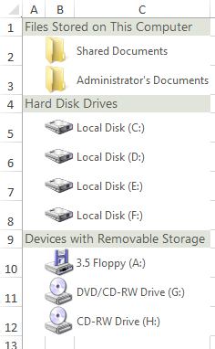
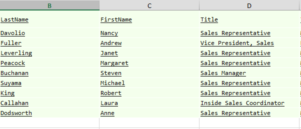
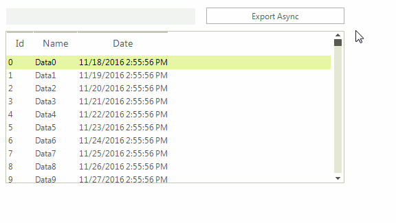

# Spread Export

__ListViewSpreadExport__ utilizes our [RadSpreadProcessing](http://docs.telerik.com/devtools/document-processing/libraries/radspreadprocessing/overview)  libraries to export the contents of __RadListView__ to *xlsx, csv, pdf* and *txt* formats. 

>note As of **R3 2020 SP1** ListViewSpreadExport also supports exporting to *xls*.

The list view is exported according to the current **ViewType**. All three view types can be exported. This article will explain in details the **SpreadExport**'s abilities and will demonstrate how you can use it.

* [Exporting Data](#exporting-data)

* [Async Spread Export](#async-spread-export)

Here is how the following __RadListView__, looks when it is exported.
      
>caption Figure 1: Before and after export

>note The spread export functionality is located in the __TelerikExport.dll__ assembly. You need to include the following namespace in order to access the types contained in TelerikExport:
* Telerik.WinControls.TelerikExport
>

>important Since this functionality is using the [RadSpreadProcessingLibrary](http://docs.telerik.com/devtools/document-processing/libraries/radspreadprocessing/overview) you need to reference the following assemblies as well:
* Telerik.Windows.Documents.Core
* Telerik.Windows.Documents.Fixed
* Telerik.Windows.Documents.Spreadsheet
* Telerik.Windows.Documents.Spreadsheet.FormatProviders.OpenXml
* Telerik.Windows.Documents.Spreadsheet.FormatProviders.Pdf
* Telerik.Windows.Maths
* Telerik.Windows.Zip
>

## Exporting Data

To use the spread export functionality, an instance of the __ListViewSpreadExport__ object should be created, passing as a parameter the __RadListView__ instance to export. Afterwards, the __RunExport__ method will trigger the export process. The latter method accepts as parameter a filename of the file to be exported.

You should pass an instance of a [SpreadExportRenderer]() to the export method as well.

<snippet id='listview-spreadexportcode-export-cs' />
<snippet id='listview-spreadexportcode-export-vb' />

The __RunExport__ method has several overloads allowing the user to export using a stream as well:

####  Running export synchronously using a stream

<snippet id='listview-spreadexportcode-streamrunexport-cs' />
<snippet id='listview-spreadexportcode-streamrunexport-vb' />

## Properties

* __ExportFormat__: Defines the format the **RadListView** will be exported to. The available values are __Xslx, Pdf, Csv, Txt__. The default value of the property is __Xslx__, hence if not other specified, the exporter will export to __Xslx__.

* __ExportVisualSettings__: Allows you to export the visual settings (themes) to the exported file. **RadListView** will also export all formatting to the Excel file.

* __SheetMaxRows__: Тhe exporter splits the data on separate sheets if the number of rows is greater than the Excel maximum. You can control the maximum number of rows through this __SheetMaxRows__ property. Available options are:

* __1048576__: Max rows for Excel 2007 and above

* __65536 (default)__: Max rows for previous versions of Excel. This is the default setting.

* __SheetName__: Defines the sheet name of the sheet to export to. If your data is large enough to be split on more than one sheets, then the export method adds index to the names of the next sheets.

* __FileExportMode__: This property determines whether the data will be exported into an existing or a new file. If new is chosen and such exists it will be overridden. Available options are:

	* __NewSheetInExistingFile__: This option will create a new sheet in an already existing file.

	* __CreateOrOverrideFile__: Creates new or overrides an existing file.

* __ExportImages:__ Gets or sets a value indicating whether to export images.

* __ExportChildItemsGrouped:__ Gets or sets a value indicating whether to export hierarchy and group child rows grouped.

* __CollapsedItemOption:__ Gets or sets a value indicating how children of collapsed items are exported.

## Events

* __CellFormatting__: This event is used to format the cells to be exported. The event arguments provide:

* __DataItem__: Gives you access to the underling __ListViewDataItem__ item.

* __ExportCell__: Allows you to set the styles of the exported cell.

* __RowIndex__: The index of the currently exported row. Here is an example of formatting the exported list view:

<snippet id='listview-spreadexportcode-formatting-cs' />
<snippet id='listview-spreadexportcode-formatting-vb' />

>caption Figure 2: Export using formatting

* __ExportCompleted__: This event is triggered when the export operation completes.

## Async Spread Export

__RadListView__ provides functionality for asynchronous spread export. This feature can be utilized by calling the __RunExportAsync__ method on the __ListViewSpreadExport__ object.

>caution If the __ExportVisualSettings__ property is set to *true* the UI can be freezed at some point. This is expected since exporting the visual settings requires creating visual elements for all items and updating the exported control UI.
>

The following example will demonstrate how the async spread export feature can be combined with a __RadProgressBar__ control to deliver better user experience.
        
>caption Fig.3 Exporting Data Asynchronously

1\. The following code shows how you can subscribe to the notification events and start the async export operation.

<snippet id='listview-spreadexportcode-asyncexport-cs' />
<snippet id='listview-spreadexportcode-asyncexport-vb' />

2\. Handle the notification events and report progress.

<snippet id='listview-spreadexportcode-reportprogress-cs' />
<snippet id='listview-spreadexportcode-reportprogress-vb' />

The __RunExportAsync__ method has several overloads allowing the user to export using a stream as well:

####  Running export asynchronously using a stream

<snippet id='listview-spreadexportcode-streamrunexportasync-cs' />
<snippet id='listview-spreadexportcode-streamrunexportasync-vb' />

## Async Export Methods and Events

__Methods__

The following methods of the __ListViewSpreadExport__ class are responsible for exporting the data.

* __RunExportAsync__: Starts an export operation which runs in a background thread.

* __CancelExportAsync__: Cancels an export operation.

__Events__

The following events provide information about the state of the export operation.

* __AsyncExportProgressChanged__: Occurs when the progress of an asynchronous export operation changes.

* __AsyncExportCompleted__: Occurs when an async export operation is completed.
