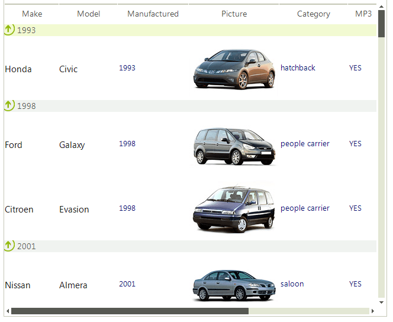

# Features

Since **RadListView** uses the powerful data layer used also by [RadGridView]() and [RadListControl](), it supports out of the box sorting, filtering and grouping operations. Every operation is achieved by adding the appropriate descriptor (__FilterDescriptor__, __SortDescriptor__ or __GroupDescriptor__) to the respective descriptors collection of **RadListView** (__FilterDescriptors__ and __GroupDescriptors__).

>note When a descriptor is created, the first required argument is a __PropertyName__ . This property name is used to find a column in the __Columns__ collection of **RadListView** and execute the desired operation over this column. If such does not exists,the operation is executed for the __Value__ property of the items.
>

Another interesting feature of **RadListView** is the support of a kinetic scrolling, which makes the control convenient for usage of applications deployed on Kiosks. Enabling this feature is as simple as setting the __EnableKineticScrolling__ property to *true*.
        
# See Also

* [Filtering]()	
* [Grouping]()	
* [Sorting]()
